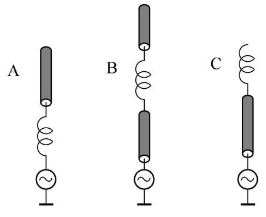
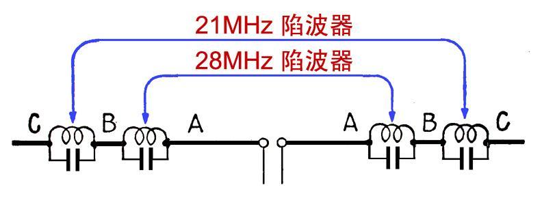
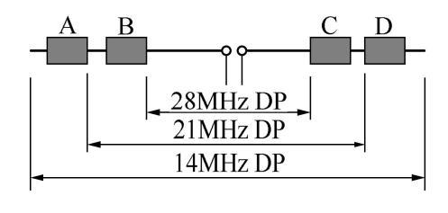
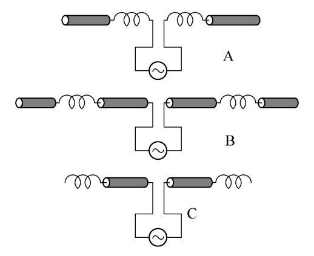
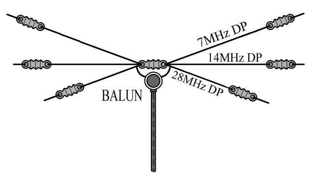
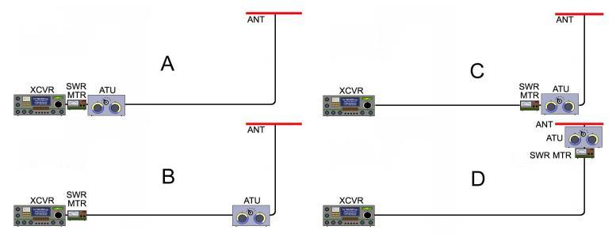
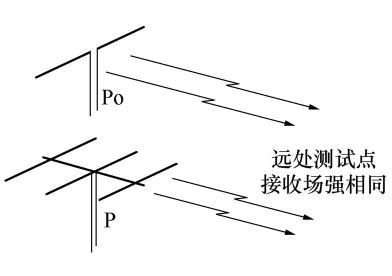
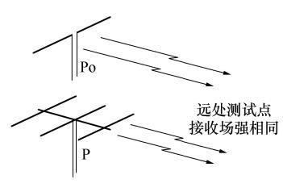

# 第 3 章题库　收发信机、天线与馈线（318 题）

## 3.1　中继、双工器与周边设备

**1. （单选｜3.1.2｜LK0858）** 业余中继台上下行共用一副天线时，需要在接收机、发信机和天线之间插入一个：
- ✅ A. 双工器（duplexer）
- 　 B. 收发信转换开关
- 　 C. 功率分配器（power divider）
- 　 D. 环形器（circulator）

> 答案：**A**

**2. （单选｜3.1.2｜LK0859）** 业余中继台上下行共用一副天线时，需要在接收机、发射机与天线之间插入一个双工器。其基本构造和作用为：
- ✅ A. 一组滤波器；阻止中继台发射的信号反馈进入中继台的接收机
- 　 B. 一组半导体开关；在中继台发射时关断中继台的接收机
- 　 C. 一个匹配网络；使天线、中继发射机、中继接收机三者之间都满足阻抗匹配关系
- 　 D. 一个环形器；使信号只能沿中继发射机-天线-中继接收机的方向行进

> 答案：**A**

**3. （单选｜3.1.2｜LK0860）** 在架设业余中继台之前必须调查台址附近有没有其他频率的发射机，其信号强到可以在中继台的接收机中与中继台的下行信号产生三阶互调，并且互调产物落入中继台的上行频率范围内。如果中继台的上、下行频率分别为 fR和 fT，则可能造成这种三阶互调干扰的频率fX可以计算为：
- ✅ A. 2fT - fR 或 (fT + fR ) / 2
- 　 B. fT - fR 或 fT + fR
- 　 C. 2（fT - fR） 或 2(fT + fR )
- 　 D. 2fT 或 2fR

> 答案：**A**

**4. （单选｜3.1.2｜LK0855）** 某业余中继台的发射机常被断断续续的干扰信号激发，其中夹杂模糊不清的话音。根据覆盖区域内其他业余电台守听，出现问题时上行频率上并无其他电台在工作。则：
- ✅ A. 这可能是中继台附近另外两部发射机的强信号在中继台的接收机中产生了等同于上行频率的互调干扰，打开了静噪
- 　 B. 这肯定是中继台接收机受到了人为恶意干扰
- 　 C. 这可能是中继台接收机发生了寄生振荡
- 　 D. 这可能是中继台发射机发生了寄生振荡

> 答案：**A**

**5. （单选｜3.1.2｜LK0856）** 某 FM业余中继台的发射机一旦被上行信号启动就会持续发射，即使上行信号消失也不停止。可能的原因是：
- ✅ A. 中继台上下行隔离不良，中继台自身发射的信号窜入了中继台的接收机，造成自锁
- 　 B. 肯定受到了人为恶意干扰
- 　 C. 中继台接收机电源电压不稳
- 　 D. 中继台发射机电源电压不稳

> 答案：**A**

**6. （单选｜3.1.2｜LK0857）** FM业余中继台的发射机可以被上行信号正常启动。但是在上行信号消失后，该台常会继续发射一段时间，或长或短，其中夹杂模糊不清的语音。可能的原因是：
- ✅ A. 中继台的下行信号与附近其他发射机的信号在中继台接收机中产生了等同于上行频率的互调干扰
- 　 B. 肯定是受到了人为恶意干扰
- 　 C. 中继台接收机电源电压不稳
- 　 D. 中继台发射机电源电压不稳

> 答案：**A**

**7. （单选｜3.1.3｜LK1122）** 如果进行 SSB或 CW通联时周边环境嘈杂，哪种设备可以替代电台上的扬声器，改善话音抄收？
- ✅ A. 耳机
- 　 B. 低通滤波器
- 　 C. 视频显示器
- 　 D. 吊杆胖话筒

> 答案：**A**

**8. （单选｜3.1.3｜LK0249）** 全功能小型收发信机的面板上常有缩写为“NB”和“SQL”的功能，它们有什么不同？
- ✅ A. NB为“抑噪”，切除高于平均信号的大幅度突发脉冲噪声；SQL为“静噪”，信噪比达不到一定水平时自动关闭音频输出
- 　 B. NB和 SQL都是指“抑噪”，收不到有用信号时自动关断背景噪声
- 　 C. NB和 SQL都是指“静噪”，切除高于平均信号的大幅度突发脉冲噪声
- 　 D. NB和 SQL都是指“静噪”，收不到带有预期的特定控制信号时自动关断音频输出

> 答案：**A**

**9. （单选｜3.1.3｜LK1132）** 某些车辆的火花塞辐射脉冲干扰。这可能导致收信机的 AGC过早起控，使正在接收的SSB或 CW信号受到压制，进而影响听抄。遇到这种情况，你应当如何设置你的电台？
- ✅ A. 打开电台的抑噪（NB）功能
- 　 B. 降低静噪（SQL）阀值
- 　 C. 将频率稍稍调偏一点儿
- 　 D. 反复调节电台的 RIT旋钮

> 答案：**A**

**10. （单选｜3.1.3｜LK0369）** 全功能小型收发信机面板上的“MODE”代表什么功能：
- ✅ A. 用来切换工作方式，比如 FM、LSB、USB和 CW等
- 　 B. 用来切换静噪方式，比如 CTCSS和 DCS等
- 　 C. 用来切换接收机的工作方式，比如射频直采和低中频超外差等
- 　 D. 用来切换监听方式，比如单耳音频、双耳音频和 CW立体声等

> 答案：**A**

**11. （单选｜3.1.3｜LK0253）** 收发信机面板上的符号 ATT代表什么功能？
- ✅ A. 收信机输入衰减器，在接收大信号时接入，使信号不致过大而使前级电路过载
- 　 B. 自动天线调谐，对天线电路的电压驻波比进行检测并进行自动补偿，以维持最小驻波比
- 　 C. 发信自动电平控制，对射频输出电平进行检测并反馈控制，以维持其在适当限度之内
- 　 D. 发信自动音量控制，对音频输入电平进行检测并反馈控制，以维持其在适当限度之内

> 答案：**A**

**12. （单选｜3.1.3｜LK0254）** 收发信机面板上的符号 AGC代表什么功能？
- ✅ A. 收信机自动增益控制，对中频级信号电平进行检测并反馈控制，防止电路过载
- 　 B. 收信自动音量控制，对音频输出电平进行检测并反馈控制，以维持其在适当限度之内
- 　 C. 自动天线调谐，对天线电路的电压驻波比进行检测并进行自动补偿，以维持最小驻波比
- 　 D. 发信自动电平控制，对射频输出电平进行检测并反馈控制，以维持其在适当限度之内

> 答案：**A**

**13. （单选｜3.1.3｜LK0853）** 既然全功能收信机具有 AGC功能，那为什么好多机型还要装设衰减（ATT）开关？
- ✅ A. 特强带外信号可以阻塞接收机的前级电路，致使器件非线性工作，产生失真和互调。此时需在接收机的前端电路之前加入衰减器，并用开关控制其切入与否
- 　 B. 通常，增益控制旋钮的控制范围不够宽，加入 ATT开关可以拓展增益控制范围
- 　 C. 如果遭遇特强带内干扰，那么打开 ATT就可防止过大的音量损坏扬声器或耳机了
- 　 D. 这可以防止本台发射机的强信号损坏本台的接收机电路

> 答案：**A**

**14. （多选｜3.1.3｜LK1180）** 关于接收机的“过载”现象，以下描述正确的是：
- ✅ A. 输入信号过于强大以至机内电路饱和阻塞，严重时会损坏接收机前端电路的元器件
- ✅ B. 启用接收机的 ATT功能可消除或缓解过载
- 　 C. 接收机消耗的电流过大，致使电源出现过载现象。情况严重时供电装置会烧毁
- 　 D. 减小接收机的喇叭音量，可缓解过载现象

> 答案：**A、B**

**15. （单选｜3.1.3｜LK0268）** 应关闭接收机 AGC功能的情况是：
- ✅ A. 有用微弱信号和强干扰同时出现时
- 　 B. 接收微弱信号时
- 　 C. 接收特强信号时
- 　 D. 有用强信号中夹杂着微弱干扰

> 答案：**A**

**16. （单选｜3.1.3｜LK0269）** 应选择较短的 AGC时间常数的情况是：
- ✅ A. 接收 FM/FSK/PSK等包络幅度恒定的信号
- 　 B. 接收 SSB和 AM等正常信号的包络幅度不断变化的信号
- 　 C. 将接收机应用于“比幅度法规”测向时
- 　 D. 有用微弱信号和强干扰同时出现时

> 答案：**A**

**17. （单选｜3.1.3｜LK0270）** 应选择较长的 AGC时间常数的情况是：
- ✅ A. 接收 SSB和 AM等正常信号的包络幅度不断变化的信号
- 　 B. 接收 FM/FSK/PSK等包络幅度恒定的信号遇到变化很快的传播衰落时
- 　 C. 将接收机应用于“比幅度法规”测向时
- 　 D. 有用微弱信号和强干扰同时出现时

> 答案：**A**

**18. （单选｜3.1.3｜LK0256）** 多数小型全功能收发信机的面板上都可以看到符号 PRE，其代表什么功能？
- ✅ A. 收信机前置放大器，在接收微弱信号时接入（此时某些技术指标可能低于额定值）
- 　 B. 自动天线调谐，对天线电路的电压驻波比进行检测并进行自动补偿，以维持最小驻波比
- 　 C. 发信自动电平控制，对射频输出电平进行检测并反馈控制，以维持其在适当限度之内
- 　 D. 发信语音压缩，对音频输入电平进行检测并反馈控制，以提升语音包络幅度较小的部分

> 答案：**A**

**19. （单选｜3.1.3｜LK0251）** 收发信机面板上的符号 ALC代表什么功能？
- ✅ A. 发信自动电平控制，对射频输出电平进行检测并反馈控制，以维持其在适当限度之内
- 　 B. 发信自动音量控制，对音频输入电平进行检测并反馈控制，以维持其在适当限度之内
- 　 C. 自动天线调谐，对天线电路的电压驻波比进行检测并进行自动补偿，以维持最小驻波比
- 　 D. 自动频率控制，对发射频率的漂移进行检测并反馈控制，以维持准确的工作频率

> 答案：**A**

**20. （单选｜3.1.3｜LK1029）** 在单边带发信机中，发信自动电平控制（ALC）的主要作用是：
- ✅ A. 防止过驱动导致调制失真或引发电路故障
- 　 B. 改善发信机的频率稳定度
- 　 C. 自动实现天线电路的阻抗匹配
- 　 D. 防止话筒过于灵敏带来背景噪声

> 答案：**A**

**21. （单选｜3.1.3｜LK1030）** 业余电台进行单边带话音通信时，如果对方反映虽然己方的讲话基本可辨，但是在话音的间隙中夹杂嘈杂的背景噪声。这时应当：
- ✅ A. 调低发射机的话筒增益。如果发射机带有语音压缩处理功能，则应尝试调低控制深度
- 　 B. 调低发射机的射频输出功率
- 　 C. 调整发射机的天线匹配电路
- 　 D. 调整发射机的 ALC控制深度

> 答案：**A**

**22. （单选｜3.1.3｜LK1129）** 即使打开了发射机的 ALC，将话筒的增益调得过高仍可能导致：
- ✅ A. 发出的信号失真
- 　 B. 发射机的功率提升
- 　 C. 发射机的频率漂移变大
- 　 D. 天线的驻波比增加

> 答案：**A**

**23. （单选｜3.1.3｜LX）** 为什么使用单边带收发信机发送 AFSK 信号时需要关闭 ALC？
- ✅ A. ALC增加 AFSK信号的失真，抬升误码率
- 　 B. ALC使发射功率失控，导致发射机故障
- 　 C. ALC使信号的极性反转，致使无法解码
- 　 D. ALC影响 AFSK信号的频响，使音色变差

> 答案：**A**

**24. （单选｜3.1.3｜LK0250）** 单边带发信机的语音压缩功能有什么作用？
- ✅ A. 压低较强语音信号的幅度、提升较弱信号的幅度，改善较弱的语音在接收端的信噪比
- 　 B. 压低较弱语音信号的幅度、提升较强信号的幅度，增加语音的动态范围和抑扬顿挫感
- 　 C. 压低语音信号的低频分量，提升高频分量，增加信号的带宽，使高音更加细腻
- 　 D. 压缩信号所占用的频谱宽度，提高无线电频谱的利用率

> 答案：**A**

**25. （单选｜3.1.3｜LK0257）** 收发信机面板上的符号 PROC代表什么功能？
- ✅ A. 发信语音压缩，对音频输入电平进行检测并反馈控制，以使包络幅度较小语音获得提升
- 　 B. 收信机前置放大器，在接收微弱信号时接入（此时某些技术指标可能低于额定值）
- 　 C. 自动天线调谐，对天线电路的电压驻波比进行检测并进行自动补偿，以维持最小驻波比
- 　 D. 发信自动电平控制，对射频输出电平进行检测并反馈控制，以维持其在适当限度之内

> 答案：**A**

**26. （单选｜3.1.3｜LX）** 发信时，若话音压缩调整不当可能带来什么问题?
- ✅ A. 可能产生很多互调成分，影响对方收信时的辨识度
- 　 B. 可能使话音严重失真，但是不影响对方电台的收信
- 　 C. 可能发射很大的交流声
- 　 D. 可能使话筒过载损坏

> 答案：**A**

**27. （单选｜3.1.3｜LX）** 为什么用单边带收发信机发送 AFSK 信号时应关闭语音压缩功能？
- ✅ A. 语音压缩可能导致信号的包络畸变，破坏基带特征，抬升误码率
- 　 B. 经语音压缩处理的信号，其相位变化已不存在，本质上无法解码
- 　 C. 经语音压缩处理的信号，其幅度变化已不存在，本质上无法解码
- 　 D. 语音压缩提升信号的峰均比，易导致发射机功率放大器过热损坏

> 答案：**A**

**28. （单选｜3.1.3｜LK0233）** 业余电台以发射的方法测量发射功率和天线驻波比时必须留意并做到的是：
- ✅ A. 先将频率设置到无人使用的空闲频率、偏离常用的热点频率
- 　 B. 先将天线的发射方向指向正北
- 　 C. 先将收发信机的语音压缩功能打开
- 　 D. 话筒离嘴距离在 2公分以上，电键按键时间不短于 5秒钟

> 答案：**A**

**29. （单选｜3.1.3｜LK0234）** 单边带业余电台测试检查天线驻波比需要发射平稳的连续信号。文明的作法是：
- ✅ A. 将电台设为 CW方式并按下电键。或者，将电台设为 AM或 FM方式并按下 PTT键（不对话筒说话）以产生连续载波。测试结束后设回 SSB方式
- 　 B. 将电台设为 SSB方式，用平稳的气流对话筒吹口哨
- 　 C. 将电台设为 SSB方式，深呼吸后用平稳的气流对话筒发长音“啊”
- 　 D. 将电台设为 SSB方式，深呼吸后用平稳的气流对话筒发长音“嘻”

> 答案：**A**

**30. （单选｜3.1.3｜LK0252）** 收发信机面板上的符号 AT或者 TUNE代表什么功能？
- ✅ A. 自动天线调谐，对天线电路的电压驻波比进行检测并进行自动补偿，以维持最小驻波比
- 　 B. 发信自动音量控制，对音频输入电平进行检测并反馈控制，以维持其在适当限度之内
- 　 C. 发信自动电平控制，对射频输出电平进行检测并反馈控制，以维持其在适当限度之内
- 　 D. 自动频率控制，对发射频率的漂移进行检测并反馈控制，以维持准确的工作频率

> 答案：**A**

**31. （单选｜3.1.3｜LK0271）** 使用射频/中频增益和音频增益分开控制的通信接收机进行收听时，可以这样设置：
- ✅ A. 信号特弱时尽量把射频/中频增益开到最大，信号特强时尽量把音频增益开到最大，然后从低到高调整另一个增益以得到适当的音量
- 　 B. 信号特弱时尽量把音频增益开到最大，信号特强时尽量把射频/中频增益开到最大，然后从低到高调整另一个增益以得到适当的音量
- 　 C. 任何情况下都应将射频/中频增益放在中间位置，然后从低到高调整音频增益以得到适当的音量
- 　 D. 任何情况下都应将音频增益放在中间位置，然后从低到高调整射频/中频增益以得到适当的音量

> 答案：**A**

**32. （单选｜3.1.3｜LX）** HF通信与 VHF或 UHF通信相比，最大的不同是什么？
- ✅ A. HF通信依靠电离层的反射
- 　 B. HF传播更为稳定，衰落小
- 　 C. HF天线体积小
- 　 D. HF更适合远距离宽带通信

> 答案：**A**

**33. （单选｜3.1.3｜LK1126）** 下面哪种方法可以减小话筒或耳机用音频电缆可能感生的射频电流？
- ✅ A. 在电缆外面穿套铁氧体磁环
- 　 B. 在电缆芯线中串联低通滤波器
- 　 C. 在电缆前端添置话筒放大器
- 　 D. 在电缆芯线中串联带通滤波器

> 答案：**A**

## 3.2　收发信机面板（RIT / SDR）

**34. （单选｜3.2.1｜LK0264）** 业余收发信机面板上 RIT的中文名称及其代表的意义是：
- ✅ A. 接收增量调谐，在接收频率的主调谐不变的基础上，对接收频率进行附加微调
- 　 B. 发射增量调谐，在发射频率的主调谐不变的基础上，对发射频率进行附加微调
- 　 C. 异频收发，接收和发射使用互相独立的频率
- 　 D. 清除信道频率存贮器的所有数据

> 答案：**A**

**35. （单选｜3.2.1｜LK0265）** 业余收发信机面板上 XIT的中文名称及其代表的意义是：
- ✅ A. 发射增量调谐，在发射频率的主调谐不变的基础上，对发射频率进行附加微调
- 　 B. 接收增量调谐，在接收频率的主调谐不变的基础上，对接收频率进行附加微调
- 　 C. 异频收发，接收和发射使用互相独立的频率
- 　 D. 清除信道频率存贮器的所有数据

> 答案：**A**

**36. （单选｜3.2.1｜LK0266）** 业余收发信机面板上 SPLIT的中文名称及其代表的意义是：
- ✅ A. 异频收发，接收和发射使用互相独立的频率
- 　 B. 发射增量调谐，在发射频率的主调谐不变的基础上，对发射频率进行附加微调
- 　 C. 接收增量调谐，在接收频率的主调谐不变的基础上，对接收频率进行附加微调
- 　 D. 清除信道频率存贮器的所有数据

> 答案：**A**

**37. （多选｜3.2.1｜LK0861）** 业余电台的异频收发操作方式（SPLIT）主要适用于什么场景？
- ✅ A. 大量电台持续地同时回答本台的呼叫，造成严重的信号堆叠（pile-up）。此时可要求各台在高于本台主载波大约 2-5kHz的频率上异频抢答，以免各台都无法听清本台的信号
- ✅ B. 双方处于不同的国际无线电分区，工作频段或方式存在一定差异，但是需要相互通联
- 　 C. 两个业余电台不想让其他业余电台听到完整的对话内容
- 　 D. 某个业余电台使用了独立的收信和发信设备，且确实无法使之同频工作

> 答案：**A、B**

**38. （单选｜3.2.1｜LK1133）** 下列哪项功能可以使听上去声调偏高或偏低的 SSB或 CW信号变得正常？
- ✅ A. RIT
- 　 B. 中频带宽选择
- 　 C. SQL控制深度
- 　 D. AGC释放速度

> 答案：**A**

**39. （单选｜3.2.1｜LX）** 有些收发信机带有 CW-R功能，可以反转接收等幅电报时所用的边带。该功能有利于：
- ✅ A. 减少或消除其他信号的干扰。
- 　 B. 产生 CW信号的相反边带，以显著抵消噪声干扰
- 　 C. 使相同接收带宽内的信号容量翻一番
- 　 D. 防止误触电键，意外发出信号

> 答案：**A**

**40. （单选｜3.2.1｜LX）** 有些收发信机带有 QSK功能，即“全插入”或“full break-in”。具体含义是：
- ✅ A. 该机接收机可以在所发电码的间隙中接收信号
- 　 B. 操作员需要在每次发送结束时手动切换收发开关
- 　 C. 激活该功能可以提高自动键控器的发送速度
- 　 D. 激活该功能可以提高发射机的输出功率

> 答案：**A**

**41. （单选｜3.2.1｜LX）** 具有多种带宽选择的接收机有什么优点？
- ✅ A. 可以为所用的通联方式选择适合的接收带宽，提高收信信噪比
- 　 B. 可以为同时运行的多个并行接收机分配不同的带宽间隔
- 　 C. 可以同时接收相同带宽的不同调制方式的信号
- 　 D. 可以为每种带宽分别指配独立接收机，同时守听不同的信号

> 答案：**A**

**42. （多选｜3.2.1｜LK0704）** 业余通信接收机的中频滤波器带宽有 100Hz、400Hz、2.7kHz和 6kHz几档选择。如果要为接收 CW、SSB、AM和 FT8方式的信号选择合适的档位，应该依次为：
- ✅ A. CW选用 100Hz或 400Hz
- ✅ B. SSB选用 2.7kHz
- ✅ C. AM选用 6kHz
- 　 D. FT8选用 400Hz

> 答案：**A、B、C**

**43. （单选｜3.2.1｜LX）** 我们总是希望接收机的接收带宽与当前操作方式下的必要带宽相匹配。这是因为：
- ✅ A. 可以获得最佳的收信信噪比
- 　 B. 可以得到最佳的接收机输入阻抗
- 　 C. 可以最大化接收机的动态范围
- 　 D. 可以看到波段内更多的信号活动，更利于收获 DX通联

> 答案：**A**

**44. （单选｜3.2.1｜LK1178）** 参加 VHF业余无线电竞赛或进行 EME通信实验时，我们可能需要为接收机添置外置式射频前置放大器。这种设备通常应安装在整个收发信系统的什么地方？
- ✅ A. 在天线与接收机之间
- 　 B. 在发射机功放的后面
- 　 C. 在发射机和天调之间
- 　 D. 在接收机音频输出端

> 答案：**A**

**45. （单选｜3.2.1｜LK1123）** 用来增强滤除杂散发射的外置低通滤波器应装在业余无线电设备的什么地方？
- ✅ A. 发信机与天线之间
- 　 B. 发信机与收信机之间
- 　 C. 发信机与电源之间
- 　 D. 发信机与话筒之间

> 答案：**A**

**46. （单选｜3.2.1｜LK0685）** 开展多人多机 HF竞赛时，为了尽力预防发射机的谐波干扰工作在倍频频段的接收机，我们可在发射机与天线之间串联一个与操作波段相匹配的 LC低通或带通滤波器。关于这样的滤波器，以下说法正确的是：
- ✅ A. 滤波器的阶数越高，抑制倍频干扰的效果越好
- 　 B. 滤波器的阶数越低，抑制倍频干扰的效果越好
- 　 C. 滤波器的阶数越高，损耗的功率越小
- 　 D. 滤波器的阶数越高，耐受的功率越大

> 答案：**A**

**47. （多选｜3.2.1｜LK1181）** 短截线滤波器有时也叫分支线滤波器（coax stub），是利用馈线制作的带通或带阻滤波器，时有见于业余无线电比赛设施中。对于这种滤波器，以下描述正确的有：
- ✅ A. 40米波段的 1/4波长（电长度）末端短路同轴电缆：通过 40米和 15米信号，短路 20米和 10米波段的谐波
- ✅ B. 40米波段的 1/4波长（电长度）末端开路同轴电缆：通过 20米和 10米信号，短路 40米和 15米波段的谐波
- 　 C. 40米波段的 1/2波长（电长度）末端短路同轴电缆：通过 40米和 15米信号，短路 20米和 10米波段的谐波
- 　 D. 40米波段的 1/2波长（电长度）末端开路同轴电缆：通过 20米和 10米信号，短路 40米和 10米波段的谐波

> 答案：**A、B**

**48. （单选｜3.2.1｜LX）** 某些收发信机具有 RX ANT接口。这种接口是用来：
- ✅ A. 连接一副独立的接收天线
- 　 B. 连接外部的独立接收机
- 　 C. 通过 3dB耦合器连至发射天线
- 　 D. 通过前置放大器连至发射天线

> 答案：**A**

**49. （多选｜3.2.1｜LX）** 某些收发信机内置了辅助接收机，主要用于：
- ✅ A. 使用独立的接收天线以任意频率独立调谐，实现异频操作
- ✅ B. 使用独立的接收天线与主接收机同频工作，实现分集接收
- 　 C. 将 I/Q基带信号输出至耳机接口，以实现独立的 RTTY解码
- 　 D. 将中频信号输出至 IF接口，以连接独立的波段频谱显示器

> 答案：**A、B**

**50. （多选｜3.2.1｜LX）** 分集接收用多个接收机同时捕获同一信号，以获取更完整的信息并使信号更易辩识。但是，为收发信机的辅助接收机架设用于分集接收的独立接收天线时需注意：
- ✅ A. 这种天线应距主天线远一些；例如，至少 1个工作波长
- ✅ B. 这种天线的极化最好与主天线正交；例如，分别使用水平和垂直天线
- 　 C. 为捕获更多信息，我们要为这种天线安装前置放大器
- 　 D. 如果天线是宽带的，我们必须为其安装外置式波段预选器

> 答案：**A、B**

**51. （单选｜3.2.2｜LX）** 参加比赛或进行 DX 联络时，我们或许需要一台独立运行的 SDR 接收机来辅助 CW 或FT8解码软件的运行，以获取更多系数，提高通联成绩。如果这类接收机是使用 USB接口的便携产品，我们需为之准备：
- ✅ A. PC机、SDR接收机软件、CW或 FT8等解码软件，以及分流音频数据流的桥接软件
- 　 B. C/C++、Python或 Rust等开发环境，为编写 SDR软件做好准备
- 　 C. Octave或 Anaconda等科学计算/大规模数据处理软件，为编写解码模块做好准备
- 　 D. 带 USB接口的示波器或频谱仪，以将 SDR接收机接入，并将所收信号做可视化展示

> 答案：**A**

## 3.3　天线基础：增益、驻波比与极化

**52. （单选｜3.3.1｜LK0420）** 发射天线的作用是：
- ✅ A. 把发射机输出的射频信号转化为无线电波
- 　 B. 利用天线的增益放大发射机的输出功率
- 　 C. 将发射机输出的射频信号转化为音频信号
- 　 D. 将发射机输出的射频信号转化为红外线

> 答案：**A**

**53. （单选｜3.3.1｜LK0421）** 接收天线的作用是：
- ✅ A. 把空间的无线电波转化为接收机中的射频电信号
- 　 B. 利用天线的增益放大空间的无线电波并将之传向接收机
- 　 C. 将空间的无线电波转化为接收机中的音频信号
- 　 D. 将空间的无线电波转化为红外线

> 答案：**A**

**54. （多选｜3.3.1｜LK0926）** 关于天线的增益，以下说法正确的是：
- ✅ A. 待测天线最大辐射方向上的辐射功率密度与基准天线对应值的比值
- ✅ B. 与参考天线相比，被测天线在某个方向上使信号增强的程度
- 　 C. 天线辐射的电波功率与输入到天线的射频功率之比
- 　 D. 天线发热耗散的功率与输入到天线的射频功率之比

> 答案：**A、B**

**55. （单选｜3.3.1｜LK0929）** 以 dBi为单位的天线增益是指：
- ✅ A. 待测天线最大辐射方向上的辐射功率密度与理想点源天线对应值之比的 dB值
- 　 B. 待测天线最大辐射方向上的辐射功率密度与半波长偶极天线对应值之比的 dB值
- 　 C. 待测天线最大辐射方向上的辐射功率密度与 1/4波长地网天线对应值之比的 dB值
- 　 D. 待测天线最大辐射方向及其（180°）反方向的辐射功率密度测量值之比的 dB值

> 答案：**A**

**56. （单选｜3.3.1｜LK0976）** 什么是“理想点源天线”？对业余无线电又有什么意义？
- ✅ A. 存在于理论中的一种小到一个点，可将发射机输出的全部射频能量都转化为各向同性且均匀辐射的电磁波的假想天线；用作比较实际天线辐射性能的一种全向基准天线
- 　 B. 一种用于专业通信的增益极高的专用天线，在业余无线电中没有应用价值
- 　 C. 仅用于无线电测试的一种标准接收天线，发射效果不佳，对业余无线电无用
- 　 D. 一种带宽近乎无限的高级天线的专利名称，业余无线电业务不需要宽带天线

> 答案：**A**

**57. （单选｜3.3.1｜LK0930）** 以 dBd为单位的天线增益是指：
- ✅ A. 待测天线最大辐射方向上的辐射功率密度与半波长偶极天线对应值之比的 dB值
- 　 B. 待测天线最大辐射方向上的辐射功率密度与理想点源天线对应值之比的 dB值
- 　 C. 待测天线最大辐射方向上的辐射功率密度与 1/4波长垂直天线对应值之比的 dB值
- 　 D. 待测天线最大辐射方向及其（180°）反方向的辐射功率密度测量值之比的 dB值

> 答案：**A**

**58. （单选｜3.3.1｜LK1112）** 半波振子是能够辐射电波的一种实用天线。为了获得最低输入阻抗，人们通常从中点为这种振子馈电。这就构成了具有两个 1/4波长不同电极性区域的谐振偶极天线，亦称半波长偶极天线。这种天线的增益规定为 0dBd。那么相比理想点源天线，其增益为：
- ✅ A. 2.15dBi
- 　 B. 6dBi
- 　 C. 3dBi
- 　 D. 1.64dBi

> 答案：**A**

**59. （单选｜3.3.1｜LK0931）** 某商品天线说明书给出的天线增益指标以 dB为单位。其意义为：
- ✅ A. 该指标未指明计算方法和所用基准，缺乏参考价值
- 　 B. 待测天线最大辐射方向上的辐射功率密度与理想点源天线对应值之比的 dB值
- 　 C. 待测天线最大辐射方向上的辐射功率密度与 1/4波长垂直天线对应值之比的 dB值
- 　 D. 待测天线最大辐射方向及其（180°）反方向的辐射功率密度测量值之比的 dB值

> 答案：**A**

**60. （单选｜3.3.1｜LK0918）** 我们之所以称垂直接地天线为“全向天线”，是因为：
- ✅ A. 这种天线在水平方向上没有指向性
- 　 B. 这种天线在垂直方向上没有指向性
- 　 C. 这种天线的 E面和 H面方向图均为正圆
- 　 D. 这种天线辐射各向同性的球面波

> 答案：**A**

**61. （单选｜3.3.1｜LK0904）** 如需垂直接地天线在大体为零仰角的水平发射方向上具有主辐射瓣并可以与同轴电缆直接耦合，则振子长度应选为：
- ✅ A. 1/4波长
- 　 B. 1/2波长
- 　 C. 1/8波长
- 　 D. 3/2波长

> 答案：**A**

**62. （多选｜3.3.1｜LK0919）** 关于振子长度为 1/4波长的垂直接地天线的最大辐射方向，以下描述正确的是：
- ✅ A. 在水平方向上是全向的
- ✅ B. 在垂直方向上有指向性，且辐射仰角稍大于 0°
- 　 C. 其 E面方向图为“8”字形
- 　 D. 其 H面方向图为“8”字形

> 答案：**A、B**

**63. （多选｜3.3.1｜LK1215）** 关于大多数手持电台随附的“橡胶天线”，以下说法正确的是：
- ✅ A. 就电台的一般持握方式而言，电波的垂直极化分量要强一些
- ✅ B. 相对于全尺寸天线，“橡胶天线”的发射与接收增益都低一些
- 　 C. 如果橡胶护套内的天线是螺旋加感的，则电波是旋转极化的
- 　 D. 如果橡胶护套某处开裂，则振子会迅速解体，天线随即报废

> 答案：**A、B**

**64. （单选｜3.3.1｜LX）** 在车内使用手持电台和俗称“橡胶天线”的柔性天线进行通信可能遇到什么问题？
- ✅ A. 车体的屏蔽作用影响信号强度
- 　 B. 大量电波反射回天线，抬升 SWR
- 　 C. 影响电台散热
- 　 D. 行车噪声影响通话质量

> 答案：**A**

**65. （单选｜3.3.1｜LX）** 如果架设天线时发现场地附近有电线等市电供电装置，你该怎么办？
- ✅ A. 应确保在风雨中意外掉落的天线部件不落入供电装置的安全距离内。例如，35千伏及以下电压时至少 1米
- 　 B. 应确保供电装置带来的电源噪声不会影响电台接收弱信号的能力。通常，这个距离应至少 10倍于工作波长
- 　 C. 必须防止通信和供电两套系统之间发生打火拉弧事故。经验上讲，按照每千伏 1毫米算出的间距是足够的
- 　 D. 应确保天线转动到平行于供电系统的电线时，电线不会成为反射单元，即，应至少保持1/4波长以上距离

> 答案：**A**

**66. （单选｜3.3.1｜LK0925）** 垂直接地天线（GP）由电气长度为 1/4波长的垂直振子加上一个“镜像地平面”构成，因十分简洁而被大量应用于手持和车载业余通信。但是，这种天线的工作有效性往往不如理论预计的那么完美，特别是在波长较长的波段。造成这种情况的原因及改善方法是：
- ✅ A. 缺乏有效接地镜像；GP天线必须有足够大的导电平面以形成振子镜像，否则谐振频率和阻抗都与理论值有出入。为此，应尽量用大面积金属导体与天线/馈线的接地端相连
- 　 B. 1/4波长垂直振子显然是太短了。改成 1/2波长即可解决问题
- 　 C. 1/4波长垂直振子显然是太短了。在振子当中串联加感线圈即可解决问题
- 　 D. 天线与电缆直接相连，匹配不佳。在天线和电缆之间加接“巴伦”即可解决问题

> 答案：**A**

**67. （单选｜3.3.1｜LX）** 关于天线的加载，以下描述正确的是
- ✅ A. 为天线振子串联电感线圈，延长振子的电气长度
- 　 B. 为车载天线增添弹簧减震器
- 　 C. 为柔性不足的天线基座增加螺旋式延长器
- 　 D. 为八木天线的拉纤加接弹性张力器

> 答案：**A**

**68. （单选｜3.3.1｜LK0944）** 谐振的垂直接地天线的振子长度最短也要 1/4波长。如果架设天线时因条件受限而不得不将振子缩短，那么在振子之中串入电感可以补偿失去的感抗，使天线谐振在所需频率上。为了提高发射效率，应在振子的什么位置串入电感需根据架设条件择优确定。下图给出三种加感方案。假设振子（灰色部分）均等长，则 A、B、C三种方案按发射效率可排列为：

- ✅ A. C-顶部加感，B-中部加感，A-底部加感
- 　 B. A-底部加感，B-中部加感，C-顶部加感
- 　 C. A-底部加感，C-顶部加感，B-中部加感
- 　 D. B-中部加感，A-底部加感，C-顶部加感

> 答案：**A**

**69. （单选｜3.3.1｜LK0206）** 甲天线增益 6.15dBi，乙天线增益 1dBd。若两副天线按同样条件架设并用同样功率来驱动，则在它们最大发射方向的同一远方地点接收时，两天线给出的信号功率关系为：
- ✅ A. 甲天线的信号功率为乙天线的两倍
- 　 B. 甲天线的信号功率为乙天线的 1/2
- 　 C. 甲天线的信号功率为乙天线的 5.15倍
- 　 D. 甲天线的信号功率为乙天线的 6.15倍

> 答案：**A**

**70. （单选｜3.3.1｜LK0207）** 甲天线增益 0dBd，乙天线增益 2dBi。若两副天线按同样条件架设用用同样功率来驱动，则在它们最大发射方向的同一远方地点接收时，两天线给出的信号功率关系为：
- ✅ A. 甲天线的效果与半波长偶极天线相当，乙天线比甲天线略差
- 　 B. 甲天线效果为零，不能工作，乙天线效果比甲天线好 2倍
- 　 C. 甲天线的效果与半波长偶极天线相当，乙天线发射的信号强度比甲天线好 2dB
- 　 D. 甲、乙天线的效果实际相同

> 答案：**A**

**71. （单选｜3.3.1｜LK0932）** 有两款 VHF垂直全向天线作发射之用。甲天线增益为 4.5dBd，而乙天线的是 5.85dBi。它们在远处某接收天线中产生的信号功率有什么不同？
- ✅ A. 来自甲天线的信号比乙天线的强 0.8dB
- 　 B. 来自乙天线的信号比甲天线的强 1.35dB
- 　 C. 来自甲天线的信号比乙天线的强 1.35dB
- 　 D. 来自乙天线的信号比甲天线的强 3.5dB

> 答案：**A**

**72. （单选｜3.3.1｜LK0933）** 有两款 VHF垂直全向天线作发射之用。甲天线增益为 2.9dBd，而乙天线的是 5.85dBi。它们在远处某接收天线中产生的信号功率有什么不同？
- ✅ A. 来自乙天线的信号比甲天线的强 0.8dB
- 　 B. 来自乙天线的信号比甲天线的强 2.95dB
- 　 C. 来自甲天线的信号比乙天线的强 2.95dB
- 　 D. 来自乙天线的信号比甲天线的强 7.1dB

> 答案：**A**

**73. （多选｜3.3.2｜LK1185）** 业余无线电爱好者讨论天线系统时常会提及术语 “驻波比（SWR）”。其含义为：
- ✅ A. 连接到传输线终端的负载阻抗与传输线自身的特性阻抗相匹配的程度
- ✅ B. 负载与传输线完美匹配时，传输线之中没有驻波，因此驻波比为 1:1
- ✅ C. 如果负载与传输线不匹配，传向负载的部分能量会沿传输线返回始端
- 　 D. 如果传输线中出现驻波，则调整传输线始端的信源阻抗可使驻波归零

> 答案：**A、B、C**

**74. （单选｜3.3.2｜LK1186）** 通联时，如果收发信机的 SWR表显示读数 4:1，则意味着：
- ✅ A. 从发射机的输出端口来看，天线系统的整体匹配情况不佳
- 　 B. 从发射机的输出端口来看，天线系统的整体阻抗为 200欧或 12.5欧
- 　 C. 天线系统的辐射效率仅为 25%
- 　 D. 天线系统的整体增益仅为 4dB

> 答案：**A**

**75. （多选｜3.3.2｜LK1187）** 小强用长度不短于 1/4波长的 50欧馈线连接收发信机和天线。发信时，他发现 SWR表的指示为 3:1。该值意味着：
- ✅ A. 馈线中任意位置上的最大峰值电压与最小峰值电压之比为 3:1
- ✅ B. 馈线中任意位置上的最大峰值电流与最小峰值电流之比为 3:1
- 　 C. 馈线中的驻波致使平均射频电压高于常值，这降低了导体损耗
- 　 D. 馈线中的驻波致使平均射频电流高于常值，这降低了介质损耗

> 答案：**A、B**

**76. （单选｜3.3.2｜LX）** 多数发射机都在 SWR超过一定值时降低输出功率。这是为了：
- ✅ A. 保护发射机中的功率半导体器件
- 　 B. 防止烧断供电线路中的保险丝
- 　 C. 防止传输线上的驻波超过限值
- 　 D. 防止发射出去的无线电波带有过大的驻波

> 答案：**A**

**77. （单选｜3.3.2｜LK1188）** 用同轴电缆连接天线时，为什么驻波比趋于 1:1为好？
- ✅ A. 降低电缆的损耗，使射频能量更有效地传输
- 　 B. 防止屏蔽层的外层辐射能量，导致射频干扰（RFI）
- 　 C. 延长天线的使用寿命
- 　 D. 延长发信机的使用寿命

> 答案：**A**

**78. （单选｜3.3.2｜LK1222）** 以下哪种情况可能导致业余发信机显示的驻波比不稳定？
- ✅ A. 发信机、馈线或天线某处接触不良
- 　 B. 发信机采用相位调制
- 　 C. 发信机过调制
- 　 D. 馈线温度过高

> 答案：**A**

**79. （单选｜3.3.2｜LK1223）** SSB通联时，即使天馈系统没有故障，有时候 SWR显示也不稳定。这是因为：
- ✅ A. SSB话音的幅度变化本质上影响测量的稳定性。改用 CW方式进行测量效果更好
- 　 B. SSB话音包含幅度与相位两种信息，并非所有天线均能同时给出稳定的响应
- 　 C. 出现这种情况是因为发信机过调制，应调整话筒增益以解决
- 　 D. 出现这种情况说明发信机出了故障，应停机检修

> 答案：**A**

**80. （单选｜3.3.2｜LK0701）** 我们都知道发射机与天线间的馈线应当与天线阻抗匹配。否则，馈线中的驻波会使沿线各处的电压和电流周期性起伏。然而，业余电台所用的发射机与电网中的发电机同属交流电源，我们却从未在连到电网的电线中观察到驻波现象。这是为什么？
- ✅ A. 电网供电的频率很低，导线长度与波长相比微不足道，驻波现象不明显而已
- 　 B. 业余电台所用的馈线和电网中的电线工作原理不同，所以现象不尽相同
- 　 C. 适用于供电技术和业余无线电的电学理论本质不同，所以现象自然不同
- 　 D. 电网的供电能力远超发射机所能提供的电功率，这就迫使线路各处电压趋同

> 答案：**A**

**81. （单选｜3.3.3｜LK1218）** 对于业余无线电通信，最适合的同轴电缆特性阻抗为：
- ✅ A. 50欧姆
- 　 B. 75欧姆
- 　 C. 93欧姆
- 　 D. 300欧姆

> 答案：**A**

**82. （单选｜3.3.3｜LK1219）** 传输线具有多种类型，但是为什么架设业余电台通常选用同轴电缆？
- ✅ A. 因为它易于使用，与架设环境之中其他物体间的互耦也很低
- 　 B. 因为它的损耗比其他任何种类的馈线都低
- 　 C. 因为相比其他馈线，它可以传输更大的功率
- 　 D. 因为很明显，它比其他任何馈线都便宜

> 答案：**A**

**83. （多选｜3.3.3｜LK0910）** 在为业余电台选购用作天线馈线的同轴电缆时应关注什么电气参数？
- ✅ A. 特性阻抗
- ✅ B. 指定频率下每百米的传输损耗
- 　 C. 芯线的截面积和最大额定电流
- 　 D. 电介质的耐压和最高允许温升

> 答案：**A、B**

**84. （多选｜3.3.3｜LK1217）** 我们都知道要为业余电台选配损耗较低的馈线。但是，馈线的损耗会导致什么问题？
- ✅ A. 发信功率降低
- ✅ B. 收信信噪比下降
- 　 C. 驻波比的测量值永远高于 1:1
- 　 D. 发出的信号失真

> 答案：**A、B**

**85. （多选｜3.3.3｜LK1189）** 受潮是同轴电缆失效损坏的主要原因。湿气渗透会导致：
- ✅ A. 介质损耗变大
- ✅ B. 屏蔽层或芯线氧化、锈蚀，甚至断路
- 　 C. 速度因子逐渐大于 1
- 　 D. 驻波比越来越小于 1

> 答案：**A、B**

**86. （单选｜3.3.3｜LK1190）** 将同轴电缆装于室外时，为什么要求电缆外皮（护套）能够耐受紫外线？
- ✅ A. 如果电缆护套被紫外线破坏，电缆就会受潮损坏
- 　 B. 紫外线会激励非线性导行模式，导致互调和谐波发射
- 　 C. 紫外线会与射频信号相互混频，导致相当复杂的宽带干扰
- 　 D. 紫外线会促使电缆升温，并因此增加电缆的功率损耗

> 答案：**A**

**87. （单选｜3.3.3｜LK1191）** 相比填充有机介质的同轴电缆，空气介质同轴电缆的劣势是什么？
- ✅ A. 空气介质同轴电缆需要特别措施来防止湿气渗透
- 　 B. 空气介质同轴电缆只能用于 30MHz以下业余频段
- 　 C. 空气介质同轴电缆的每百米损耗太大
- 　 D. 空气介质同轴电缆不能在冰点以下工作

> 答案：**A**

**88. （单选｜3.3.3｜LK1220）** 如果通过同轴电缆的信号频率升高，则同轴电缆的
- ✅ A. 传输损耗增加
- 　 B. 反射功率升高
- 　 C. 特性阻抗变高
- 　 D. 输入驻波比变大

> 答案：**A**

**89. （单选｜3.3.3｜LK1224）** 以下给出了一些同等外径的馈线。其中哪一种在 VHF/UHF频段损耗更低？
- ✅ A. 空气介质同轴硬电缆
- 　 B. 独立屏蔽分组双绞线
- 　 C. 50欧姆同轴软电缆
- 　 D. 75欧姆同轴软电缆

> 答案：**A**

**90. （单选｜3.3.3｜LK1221）** 对于 400MHz或更高频率的信号，应当优先选用的同轴电缆连接器是：
- ✅ A. N型连接器
- 　 B. M型连接器
- 　 C. RS-213型连接器
- 　 D. DB-23型连接器

> 答案：**A**

**91. （单选｜3.3.3｜LX）** 关于M 型同轴电缆连接器，以下说法正确的是：
- ✅ A. 这种连接器广泛应用于 HF和 VHF通信系统
- 　 B. 这种连接器使用了先进的螺纹式锁紧技术，防水防盗
- 　 C. 这种连接器使用了卡式锁紧技术，便于快拔快插
- 　 D. 这种连接器制造成本很高，通常用于微波通信系统

> 答案：**A**

**92. （多选｜3.3.4｜LK0988）** 关于垂直天线，以下说法正确的是：
- ✅ A. 该天线发射垂直极化波，电场与地面垂直
- ✅ B. 垂直天线是全向天线，其 H面方向图是全向的
- 　 C. 该天线发射垂直极化波，磁场与地面垂直
- 　 D. 垂直天线是全向天线，其 E面方向图是全向的

> 答案：**A、B**

**93. （多选｜3.3.4｜LK0989）** 关于水平极化偶极天线，以下描述正确的是：
- ✅ A. 通过该天线发射的电磁波，电场平行于地面
- ✅ B. 该天线水平面上的（E面）方向图呈“8”字展开
- 　 C. 通过该天线发射的电磁波，电场垂直于地面
- 　 D. 该天线垂直面上的（H面）方向图呈“8”字展开

> 答案：**A、B**

**94. （单选｜3.3.4｜LK0950）** 甲、乙业余电台相距 10千米，均使用 1/2波长水平偶极天线进行 UHF通联。现其中一方改用 1/2波长垂直偶极天线，则改变前后的通信效果有什么不同？
- ✅ A. 通信效果变差
- 　 B. 通信效果不变
- 　 C. 通信效果变好
- 　 D. 通信效果的变化不确定

> 答案：**A**

**95. （单选｜3.3.4｜LK0951）** 甲、乙业余电台相距 10千米，分别使用 1/2波长水平和垂直偶极天线进行 UHF通联。现双方都改用 1/2波长垂直偶极天线，则改变前后的通信效果有什么不同？
- ✅ A. 通信效果变好
- 　 B. 通信效果不变
- 　 C. 通信效果变差
- 　 D. 通信效果的变化不确定

> 答案：**A**

**96. （单选｜3.3.4｜LK0952）** 甲、乙业余电台相距 10千米，分别使用 1/2波长水平和垂直偶极天线进行 UHF通联。现双方都改用 1/2波长水平偶极天线，则改变前后的通信效果有什么不同？
- ✅ A. 通信效果变好
- 　 B. 通信效果不变
- 　 C. 通信效果变差
- 　 D. 通信效果的变化不确定

> 答案：**A**

**97. （单选｜3.3.4｜LK0953）** 甲、乙业余电台相距 10千米，分别使用左旋圆极化和右旋圆极化天线彼此对指进行 UHF通联。现双方都改用左旋圆极化天线，则改变前后的通信效果有什么不同？
- ✅ A. 通信效果变好
- 　 B. 通信效果不变
- 　 C. 通信效果变差
- 　 D. 通信效果的变化不确定

> 答案：**A**

**98. （单选｜3.3.4｜LK0954）** 甲、乙业余电台相距 10千米，分别使用左旋圆极化和右旋圆极化天线彼此对指进行 UHF通联。现双方都改用右旋圆极化天线，则改变前后的通信效果有什么不同？
- ✅ A. 通信效果变好
- 　 B. 通信效果不变
- 　 C. 通信效果变差
- 　 D. 通信效果的变化不确定

> 答案：**A**

**99. （单选｜3.3.4｜LK0955）** 甲、乙业余电台相距 10千米，分别使用左旋圆极化和半波长水平偶极天线彼此对指进行UHF通联。现乙台改用半波长垂直极化天线，则改变前后的通信效果有什么不同？
- ✅ A. 通信效果不变
- 　 B. 通信效果变差
- 　 C. 通信效果变好
- 　 D. 通信效果的变化不确定

> 答案：**A**

**100. （单选｜3.3.4｜LK0956）** 甲、乙业余电台相距 10千米，分别使用左旋圆极化和半波长水平偶极天线彼此对指进行UHF通联。现甲台改用右旋圆极化天线，则改变前后的通信效果有什么不同？
- ✅ A. 通信效果不变
- 　 B. 通信效果变差
- 　 C. 通信效果变好
- 　 D. 通信效果的变化不确定

> 答案：**A**

**101. （单选｜3.3.4｜LK0957）** 甲、乙业余电台相距 10千米，分别使用左旋圆极化和半波长水平偶极天线彼此对指进行UHF通联。现乙台改用右旋圆极化天线，则改变前后的通信效果有什么不同？
- ✅ A. 通信效果变差
- 　 B. 通信效果变好
- 　 C. 通信效果不变
- 　 D. 通信效果的变化不确定

> 答案：**A**

**102. （单选｜3.3.4｜LK0958）** 甲、乙业余电台相距 10千米，分别使用左旋圆极化和半波长水平偶极天线彼此对指进行UHF通联。现乙台改用左旋圆极化天线，则改变前后的通信效果有什么不同？
- ✅ A. 通信效果变好
- 　 B. 通信效果变差
- 　 C. 通信效果不变
- 　 D. 通信效果的变化不确定

> 答案：**A**

**103. （单选｜3.3.4｜LK0959）** 甲、乙业余电台相距 10千米，分别使用左旋圆极化和右旋圆极化天线彼此对指进行 UHF通联。现双方均改用半波长水平偶极天线，则改变前后的通信效果有什么不同？
- ✅ A. 通信效果变好
- 　 B. 通信效果不变
- 　 C. 通信效果变差
- 　 D. 通信效果的变化不确定

> 答案：**A**

**104. （单选｜3.3.4｜LK0990）** 假设接收和发射天线均使用半波长偶极天线，则在地面台站间的近距离通联中，接收和发射天线的最佳极化方式应当安排为：
- ✅ A. 接收和发射天线均位于垂直于两台站连线的平面内，极化保持一致
- 　 B. 接收和发射天线均位于垂直于两台站连线的平面内，极化彼此正交
- 　 C. 接收和发射天线的极化应当平行于两台站之间的连线
- 　 D. 发射天线垂直极化，接收天线的极化应当平行于两台站之间的连线

> 答案：**A**

**105. （单选｜3.3.4｜LK0992）** 右旋极化波是指在垂直于传播方向的任意平面上，沿传播方向观察时，电场矢量为随时间向右（顺时针）旋转的椭圆或圆极化波。如果地面上某业余电台在观测业余卫星时发现从卫星到达该台的无线电波的电场是顺时针旋转的，则该信号的极化方式为：
- ✅ A. 左旋椭圆极化或圆极化
- 　 B. 右旋椭圆极化或圆极化
- 　 C. 垂直极化
- 　 D. 水平极化

> 答案：**A**

**106. （单选｜3.3.4｜LK0993）** 在视距通联中，已知发射天线为指向接收点的左旋圆极化天线，接收天线的最佳极化方式为：
- ✅ A. 指向发射点的左旋圆极化
- 　 B. 指向发射点的右旋圆极化
- 　 C. 垂直极化
- 　 D. 水平极化

> 答案：**A**

**107. （单选｜3.3.4｜LK0994）** 某卫星下行链路采用右旋圆极化天线，从北向南飞行，天线始终指向地球的南极。如果地面上某业余电台采用圆极化天线自动跟踪该卫星，则该台所用天线的最佳极化方式应当为：
- ✅ A. 卫星过顶前为右旋圆极化，过顶后为左旋圆极化
- 　 B. 卫星过顶后为右旋圆极化，过顶前为左旋圆极化
- 　 C. 最佳方向始终为右旋圆极化
- 　 D. 最佳方向始终为左旋圆极化

> 答案：**A**

**108. （单选｜3.3.4｜LK0995）** 已知某卫星下行信号的发射天线是指向地面的偶极天线。由于卫星不断旋转，地面台站所收电波的极化方向就会不断变化。为了不至极化问题致使接收中断，接收天线可以是：
- ✅ A. 指向卫星的右旋或左旋圆极化天线
- 　 B. 垂直极化天线
- 　 C. 水平极化天线
- 　 D. 极化方向平行于卫星与地面电台之间连线的天线

> 答案：**A**

**109. （单选｜3.3.4｜LK0946）** 某业余电台使用半波垂直偶极天线通联时，对方所收信号的强度为 S4。现发射功率不变，发信方改用增益为 8.15dBi的八木天线（最大辐射方向和极化均不变），则对方所收信号的强度变为：【提示：收信机信号强度指示从 S1至 S9每档增加 6dB】
- ✅ A. S5
- 　 B. S6
- 　 C. S7
- 　 D. S8

> 答案：**A**

**110. （单选｜3.3.4｜LK0947）** 某业余电台使用半波长垂直偶极天线发射时，对方所收信号的强度为 S4。现发射功率不变，发信方改用增益为 12dBd的八木天线（最大辐射方向和极化均不变），则对方所收信号的强度变为：【提示：收信机信号强度指示从 S1至 S9每档增加 6dB】
- ✅ A. S6
- 　 B. S5
- 　 C. S7
- 　 D. S8

> 答案：**A**

**111. （单选｜3.3.4｜LK0948）** 两位业余爱好者使用半波长垂直偶极天线相互通联，双方所收信号的强度均为 S4。现双方发射功率不变，都改用增益为 8.15dBi的八木天线（最大辐射方向和极化均不变）再次联络，则双方信号的强度变为：【提示：收信机信号强度指示 S1至 S9每档增加 6dB】
- ✅ A. S6
- 　 B. S4
- 　 C. S5
- 　 D. S7

> 答案：**A**

**112. （单选｜3.3.5｜LK0971）** 即便是在辽阔的平原或广袤的戈壁，我们所收本地 VHF/UHF信号的强度也会伴随设备的移动而发生周期性的变化。主要原因是：
- ✅ A. 来自直射和地面反射等多个路径的无线电波相互干涉，相消或相长（多径效应）
- 　 B. 发信和收信地点间的气流导致电波传播路径弯曲，发生频率漂移（多普勒效应）
- 　 C. 无论收信发信，地面各处的电导率不尽相同会导致设备移动时的接地电阻变化
- 　 D. 发信过程中，设备与大地间分布电容的改变导致天线失谐，发射功率随之改变

> 答案：**A**

**113. （单选｜3.3.5｜LK1065）** 在 VHF/UHF频段通联时的一个现象，如果远方电台给出的信号报告很差，则仅需移动几步或将工作频率改变数十千赫就可能显著改善通信效果。这是因为：
- ✅ A. 多径传播。经不同路径达到天线的电波存在相位和幅度差异，相互干涉，相消或相长
- 　 B. 发射机与接收机之间的距离，以及工作频率的变化都会显著改变路径损耗
- 　 C. 大气扰动影响
- 　 D. 地磁活动影响

> 答案：**A**

**114. （单选｜3.3.5｜LK1103）** 多径传播对 UHF或 VHF波段数据通信的影响是：
- ✅ A. 可能使误码率上升
- 　 B. 如果是 FM通联，则影响微不足道，不可察觉
- 　 C. 随着传播路径的增加，数据通信速率线性减小
- 　 D. 随着传播路径的增加，数据通信速率线性增加

> 答案：**A**

**115. （多选｜3.3.5｜LK0812）** 使用 VSB方式进行 ATV通信时，即使信号相对较强，有时所收图像的边缘也有重影。这是因为：
- ✅ A. 多径传播。来自不同路径的信号到达接收天线的时延不同，造成重影
- ✅ B. 发射天线的 VSWR过高。如果信号在馈线中多次往返于发射机和天线，会造成重影
- 　 C. 天线的极化配置出错。极化不同的信号同时到达天线，导致重影
- 　 D. 遭遇了重放干扰。或许是某中继台也转发了这个信号，其到达接收天线，导致重影

> 答案：**A、B**

**116. （单选｜3.3.6｜LK1068）** 决定超短波视距传播距离极限的主要因素是：
- ✅ A. 发射天线和接收天线距地面的相对高度
- 　 B. 发射天线和接收天线距海平面的绝对高度
- 　 C. 发射天线和接收天线的挂高波长比，即，离地高度除以波长
- 　 D. 发射天线和接收天线的增益

> 答案：**A**

**117. （单选｜3.3.6｜LK1104）** 有时，相隔数百千米的业余电台可以实现 VHF/UHF超视距直接联络。可能的原因是：
- ✅ A. 信号的传播路径中出现了大气波导现象
- 　 B. 有飞行器在空中反射了电波
- 　 C. 降雨增加了大地电导率，增强了电波传播
- 　 D. 每当冬季，植被的减少都有利于电波传播

> 答案：**A**

**118. （单选｜3.3.6｜LK1117）** 有时，我们可以在 6米或 2米业余波段中收到上千千米外的“超视距传播”信号。这与下列哪种现象密切相关？
- ✅ A. 突发 E层的传播
- 　 B. 流星余迹反向散射
- 　 C. D层的吸收所致
- 　 D. 灰线传播

> 答案：**A**

**119. （单选｜3.3.6｜LK1120）** 是什么导致了对流层的大气波导现象？
- ✅ A. 大气高空逆温
- 　 B. 太阳黑子和/或太阳耀斑
- 　 C. 飓风或龙卷风所致的上升气流
- 　 D. 雷暴时大量闪电所产生的等离子体

> 答案：**A**

**120. （单选｜3.3.6｜LK1116）** 如果你收到了一个上千千米外的 VHF信号，最可能的原因是：
- ✅ A. 信号经电离层的突发 E层反射而来
- 　 B. 信号由微波接力电台合力 QSP过来
- 　 C. 信号被附近的雷雨区反射而来
- 　 D. 信号经宇宙射线的电离路径传导过来

> 答案：**A**

**121. （单选｜3.3.6｜LK1118）** 有时，VHF/UHF业余波段中可能出现远达 500千米的“超视距传播”信号。这与下列哪种现象密切相关？
- ✅ A. 对流层散射
- 　 B. D层折射
- 　 C. F2层折射
- 　 D. 法拉第旋转

> 答案：**A**

## 3.4　天线系统：偶极、八木、行波与天调

**122. （单选｜3.4.1｜LK0702）** 由半波长偶极天线和传输线构成的天线系统的理想工作状态应当是：
- ✅ A. 天线上只有驻波，馈线上只有行波
- 　 B. 天线上只有行波，馈线上只有驻波
- 　 C. 天线和馈线上都只有驻波
- 　 D. 天线和馈线上都只有行波

> 答案：**A**

**123. （单选｜3.4.1｜LK0973）** 天线振子的端点效应、信号的相移等因素影响电磁波沿振子传播的速度。修整天线时，我们应考虑振子的实际长度会因此略短于计算值。这就是所谓的“缩短系数”。其经验值为：
- ✅ A. 0.95
- 　 B. 1.05
- 　 C. 0.707
- 　 D. 1.414

> 答案：**A**

**124. （单选｜3.4.1｜LK0917）** 制作工作频率为 f（单位：兆赫）的半波长偶极天线。每边振子的长度（单位：米）约为：
- ✅ A. 71.3/f
- 　 B. 48.8/f
- 　 C. 142.6/f
- 　 D. 150/f

> 答案：**A**

**125. （单选｜3.4.1｜LK0974）** 电波在介质中的传播速度低于光速，其与光速的比值称为“速度因子”，是介电常数平方根的倒数。聚乙烯介质同轴电缆我们最为常用。其速度因子约为：
- ✅ A. 0.65
- 　 B. 1.54
- 　 C. 1.95
- 　 D. 1.0006

> 答案：**A**

**126. （单选｜3.4.1｜LK0916）** 制作工作频率为 f（单位：兆赫兹）的某相控天线阵列需要长度为 1/4波长的同轴电缆，大致长度（单位：米）应当为：
- ✅ A. 48.8/f
- 　 B. 149.8/f
- 　 C. 75/f
- 　 D. 71.3/f

> 答案：**A**

**127. （单选｜3.4.1｜LK0903）** 如需偶极天线谐振于工作频率之时具有低输入阻抗，振子的总长度可以是：
- ✅ A. 1/2波长的奇数倍
- 　 B. 1/2波长的整数倍
- 　 C. 1/2波长的偶数倍
- 　 D. 1/4波长的奇数倍

> 答案：**A**

**128. （单选｜3.4.1｜LK0905）** 偶极天线谐振于所需工作频率的充分和必要条件是：
- ✅ A. 两臂总电气长度为 1/2工作波长的整数倍
- 　 B. 两臂总电气长度为 1/4工作波长的整数倍
- 　 C. 两臂总电气长度为 1/2工作波长的奇数倍
- 　 D. 两臂总电气长度为工作波长的整数倍

> 答案：**A**

**129. （单选｜3.4.1｜LK0906）** 下列哪种谐振偶极天线在垂直于振子的方向上具有峰值增益：
- ✅ A. 振子长度为 1/2工作波长
- 　 B. 振子长度为 1/8个工作波长
- 　 C. 振子长度为 1/4工作波长
- 　 D. 振子长度为 3/2工作波长

> 答案：**A**

**130. （单选｜3.4.1｜LK1113）** 提高偶极天线谐振频率的方法是：
- ✅ A. 将振子截短一些
- 　 B. 在振子某处串联线圈
- 　 C. 将振子加长一些
- 　 D. 为振子添加“X”形电容帽

> 答案：**A**

**131. （单选｜3.4.1｜LK0908）** 在天线和馈线之间常会接入一个俗称“巴伦（BALUN）”的部件。“巴伦”的由来是：
- ✅ A. 平衡与不平衡两个英文字头的组合
- 　 B. 发明平衡-不平衡转换器的人的名字
- 　 C. 著名天线阻抗匹配理论家的名字
- 　 D. 大牌宽带匹配网络的制造商名字

> 答案：**A**

**132. （单选｜3.4.1｜LK0909）** 在天线和馈线之间常会接入一个俗称“巴伦（BALUN）”的部件。它的主要功能是：
- ✅ A. 在平衡电路和不平衡电路之间传递射频能量，阻断两者之间的任何寄生耦合
- 　 B. 实现天线和馈线之间的自动阻抗匹配
- 　 C. 展宽天线的工作频带
- 　 D. 降低天线的驻波比

> 答案：**A**

**133. （单选｜3.4.1｜LK0907）** 一副两臂电气长度各为 1/4波长的偶极天线，断开中点，通过巴伦馈电，测得谐振频率为 f，输入阻抗为 Z。如果总长不变，但是将断开的馈电点向一侧偏移 1/8波长，则天线特性的最明显变化是：
- ✅ A. 阻抗 Z显著变大，相比之下谐振频率 f变化不大
- 　 B. 阻抗 Z显著变小，相比之下谐振频率 f变化不大
- 　 C. 谐振频率 f显著升高，相比之下阻抗 Z变化不大
- 　 D. 谐振频率 f显著下降，相比之下阻抗 Z变化不大

> 答案：**A**

**134. （单选｜3.4.1｜LY1034）** 南北走向的水平极化偶极天线，中点馈电，通过特性阻抗为 50欧的电缆连接到输入/输出阻抗为 50欧的收发信机，通信对象在东西方向。选择天线长度的原则是：
- ✅ A. 当振子两臂各为四分之一波长时，通信效果是最好的
- 　 B. 当振子两臂各为二分之一波长时，通信效果是最好的
- 　 C. 当振子两臂各为四分之三波长时，通信效果是最好的
- 　 D. 驻波比接近 1:1时通信效果才会最好，无关振子长度

> 答案：**A**

**135. （单选｜3.4.1｜LK0920）** 短波水平偶极类天线（含八木天线等）的发射仰角主要由下列因素决定：
- ✅ A. 由天线的辐射和大地的反射叠加而成。天线距地面的高度与波长的比值影响仰角
- 　 B. 由天线振子导体所指的方向决定
- 　 C. 由八木天线主梁所指的方向决定
- 　 D. 由天线振子的长度所决定

> 答案：**A**

**136. （单选｜3.4.1｜LK0921）** 架设短波天线时，应大致按照如下原则选择天线的发射仰角：
- ✅ A. 远距离通信选择低发射仰角，近距离通信选择高发射仰角
- 　 B. 近距离通信选择低发射仰角，远距离通信选择高发射仰角
- 　 C. 近处开阔时选择低发射仰角，近处有建筑物时选择高发射仰角
- 　 D. 较低频率通信选择低发射仰角，较高频率通信选择高发射仰角

> 答案：**A**

**137. （单选｜3.4.1｜LK0922）** 架设短波天线时，应大致按照如下原则规划天线的架设高度：
- ✅ A. 远距离通信选择较高的高度，近距离通信选择较低的高度
- 　 B. 远距离通信选择较低的高度，近距离通信选择较高的高度
- 　 C. 近处有建筑物时选择较低的高度，近处开阔时选择较高的高度
- 　 D. 较低频率通信选择较高的高度，较高频率通信选择较低的高度

> 答案：**A**

**138. （单选｜3.4.1｜LK0923）** 在针对特定对象的 DX通信中，计算天线最佳发射仰角的基本方法是：
- ✅ A. 根据所使用电离层的大致高度、通信对象的大致距离、电波在传播中经历电离层反射的次数，用简单几何方法计算
- 　 B. 根据通信对象所在的方位、地球半径、对方天线的高度、实际工作频率、太阳平均黑子数，查表计算
- 　 C. 根据通信对象所在的方位、通信方向上障碍物所遮挡的仰角、本台周围的大地电导率、实际工作频率，找公式计算
- 　 D. 根据通信双方的发射功率、天线极化、通信方向上障碍物所遮挡的仰角、太阳 10.7 cm 射电通量，找公式计算

> 答案：**A**

**139. （单选｜3.4.1｜LK0924）** 收发信天线周边大地电导率对 HF远距离通信的影响大致为：
- ✅ A. 大地电导率越高，大地的镜像作用越理想，天线的效果越好
- 　 B. 大地电导率越低，大地中的感生电流越弱，天线的效果越好
- 　 C. HF远距离通信依靠天波反射，与大地电导率无关
- 　 D. 大地电导率太高、太低都不好，最好是处于中间值

> 答案：**A**

**140. （单选｜3.4.1｜LX）** 如果将水平偶极天线的架高降低到距地面 1/10 波长处，其馈电点阻抗有什么变化？
- ✅ A. 下降
- 　 B. 上升
- 　 C. 电抗分量消失
- 　 D. 电阻分量消失

> 答案：**A**

**141. （单选｜3.4.1｜LK1069）** 在导电良好的地面上，影响短波天线辐射仰角的主要因素是：
- ✅ A. 天线距地面的高度与波长之比
- 　 B. 天线的绝对高度，与波长无关
- 　 C. 天线离海平面的绝对高度
- 　 D. 天线振子或者八木天线主梁与地面之间的夹角

> 答案：**A**

**142. （单选｜3.4.1｜LK0935）** 自己架设 HF偶极天线时，如果因空间限制而无法将振子展开到在工作频率下自然谐振所需的长度，则可将电感线圈串入振子某处或干脆将整个振子都做成线圈以制成某种“加感天线”并通过调整电感量来获取所需谐振频率。关于这种天线，以下描述正确的是：
- ✅ A. 通过迭代修整线圈的电感量及其串入振子的位置，我们肯定可以获得与某个全尺寸天线等效的谐振频率和馈电点阻抗。但是，这种加感天线的辐射效率比全尺寸天线低
- 　 B. 无论是谐振频率、阻抗特性还是辐射效率，这种加感天线都不能媲美全尺寸天线
- 　 C. 只要设计得当，制作精心，调试得法，这种加感天线的效果与全尺寸天线一样好
- 　 D. 如果设计得当、制作精心、调试得法，这种加感天线的效果可以超越全尺寸天线

> 答案：**A**

**143. （单选｜3.4.1｜LK0941）** 下图所示是我国业余无线电爱好者开展野外通信活动常用的 14/21/29MHz三频段偶极天线。图中天线各段的电气长度应分别为：

- ✅ A. A为 28MHz的 1/4波长，A+B为 21MHz的 1/4波长，A+B+C为 14MHz的 1/4波长
- 　 B. A为 28MHz的半波长，A+B为 21MHz的半波长，A+B+C为 14MHz的半波长
- 　 C. A为 28MHz的 1/4波长，B为 21MHz的 1/4波长，C为 14MHz的 1/4波长
- 　 D. A为 28MHz的半波长，B为 21MHz的半波长，C为 14MHz的半波长

> 答案：**A**

**144. （单选｜3.4.1｜LK0942）** 下图所示是我国业余无线电爱好者开展野外通信活动常用的 14/21/29MHz三频段偶极天线。图中部件 A、B、C、D的作用分别为：

- ✅ A. A、D 为 21MHz 陷波器，B、C 为 28MHz 陷波器，即，分别谐振于 21MHz和 28MHz的并联谐振回路
- 　 B. A、D 为 21MHz陷波器，B、C为 28MHz陷波器，即，分别谐振于 21MHz和 28MHz的串联谐振回路
- 　 C. A、D为 14MHz 陷波器，B、C 为 21MHz 陷波器，即，分别谐振于 14MHz和 21MHz的并联谐振回路
- 　 D. A、D为 14MHz 陷波器，B、C 为 21MHz陷波器，即，分别谐振于 14MHz 和 21MHz的串联谐振回路

> 答案：**A**

**145. （单选｜3.4.1｜LK0943）** 谐振偶极天线的振子长度最短也要半个波长。如果架设天线时因条件受限而不得不将振子缩短，那么在振子之中串入电感可以补偿失去的感抗，使天线谐振在所需频率下。为了提高发射效率，应在振子的什么位置串入电感需根据架设条件择优确定。下图给出三种加感方案。假设振子（灰色部分）均等长，则 A、B、C三种方案按发射效率可排列为：

- ✅ A. C-顶部加感，B-中部加感，A-底部加感
- 　 B. A-底部加感，B-中部加感，C-顶部加感
- 　 C. A-底部加感，C-顶部加感，B-中部加感
- 　 D. B-中部加感，A-底部加感，C-顶部加感

> 答案：**A**

**146. （单选｜3.4.1｜LK0945）** 对于需要频繁改换频段的业余无线电业务，爱好者们有时会将所用频段的偶极振子并联起来一同馈电，构成一种用一根电缆即可操作的多频段天线。下图给出了一副由 7、14和28MHz半波长振子构成的多频段天线实例。关于其工作原理，以下分析正确的是：

- ✅ A. 7MHz振子以 3/2波长方式工作于 21MHz，该天线由此工作在 7、14、21和 28MHz四个频段。由于不谐振的振子呈现高阻抗，所以并联后的总阻抗仍为 50欧左右
- 　 B. 该天线工作于 7、14和 28MHz。由于不谐振的振子呈现高阻抗，所以并联后的总阻抗仍为 50欧左右
- 　 C. 7MHz振子以 3/2波长方式工作于 21MHz，该天线由此工作在 7、14、21和 28MHz四个频段。由于每个振子的阻抗都在 50欧上下，所以并联后的总阻抗降至 17欧左右
- 　 D. 该天线工作于 7、14和 28MHz。由于每个振子的阻抗都在 50欧上下，所以并联后的总阻抗降至 17欧左右

> 答案：**A**

**147. （单选｜3.4.2｜LK1210）** 什么是八木天线？
- ✅ A. 一种通过反射器和引向器来增强方向性的半波长偶极天线
- 　 B. 任何一种可以汇聚无线电波的方向性天线的统称
- 　 C. 八木秀次博士发明的一种全向天线
- 　 D. 一种具有八根水平振子的中心馈电天线，也叫 Octopus

> 答案：**A**

**148. （单选｜3.4.2｜LK0934）** 八木天线是在普通偶极天线（主振子）的基础上通过添加引向器和反射器而制成的一种定向天线。目视确定全尺寸八木天线发射方向的方法是：
- ✅ A. 比主振子短者为引向器，比主振子长者为反射器，引向器朝向最大辐射方向
- 　 B. 比主振子长者为引向器，比主振子短者为反射器，引向器朝向最大辐射方向
- 　 C. 比主振子短者为引向器，比主振子长者为反射器，反射器朝向最大辐射方向
- 　 D. 主振子的轴向为最大辐射方向

> 答案：**A**

**149. （单选｜3.4.2｜LX）** 八木天线的“前后比”是如何定义的？
- ✅ A. 主瓣辐射功率与反向辐射功率之比
- 　 B. 前向增益与理想点源天线增益之比
- 　 C. 导向器与反射器的数量之比
- 　 D. 导向器与驱动器的数量之比

> 答案：**A**

**150. （单选｜3.4.3｜LK0939）** 行波天线依靠射频电流在长导线组成的连续匹配回路中行进而产生辐射。业余通信常用的行波天线有 T2FD和贝伐列奇（Beverage）。与驻波天线相比，行波天线的特点是：
- ✅ A. 没有自然谐振点；对长度要求不严格但通常需接近或大于一个波长
- 　 B. 对制作尺寸要求严格；没有自然谐振点
- 　 C. 在较宽频带内具有一系列自然谐振点；对长度要求严格
- 　 D. 可以依靠天线调谐器实现较宽频带内的匹配；对长度没有严格要求

> 答案：**A**

**151. （单选｜3.4.3｜LK0940）** 业余无线电通信中常用的行波天线，如 T2FD和贝伐列奇（Beverage），其天线终端都接有无感电阻。关于该电阻的作用，正确说法是：
- ✅ A. 天线的电长度达到数个波长时，大部分能量都是边行进边辐射到空间，只有一小部分进入终端电阻耗散掉，以避免因反射而引起驻波
- 　 B. 该电阻相当于假负载。尽管这实现了宽带操作，却耗散了大部分能量
- 　 C. 无论天线有多长，输入功率的一半都会耗散在电阻上。这导致发射效率仅为 50%
- 　 D. 考虑大部分行波天线都是谐振天线，则串联电阻可以有效降低天线的有载 Q值。这使天线的频率响应展宽，但是发射效率也因此降低

> 答案：**A**

**152. （单选｜3.4.3｜LK1114）** 小明在一条 20米长的导线中点连接一个线圈，并将导线水平提升至稍高于 20米的悬挂位置。线圈的另一端接有另一条长度为 20米并垂向地面的导线。他将馈线的芯线与垂直导线相连，将馈线的屏蔽层连至地网。这种看似“T”形的天线，极化方式如何？
- ✅ A. 垂直
- 　 B. 水平
- 　 C. 垂直与水平分量各半
- 　 D. 正上方波束是旋转极化的

> 答案：**A**

**153. （单选｜3.4.3｜LK1115）** 为了降低辐射仰角，小明试着将 T2FD天线的半边振子直立悬挂起来。他将折合振子的馈电端通过匹配变压器连至电缆的芯线，将带有吸收电阻的另一端与地网和电缆的屏蔽层相连。这种天线的极化方式为：
- ✅ A. 垂直
- 　 B. 水平
- 　 C. 右旋圆极化
- 　 D. 左旋圆极化

> 答案：**A**

**154. （单选｜3.4.3｜LK1212）** 关于环形天线，以下说法正确的是：
- ✅ A. 该天线发射的电磁波，磁场分量垂直于环所在的平面
- 　 B. 自然谐振的环形天线，半径刚好等于 1/4波长
- 　 C. 这种天线的辐射角很高，仅适合低频段近距离通联
- 　 D. 在环中串入可变电容可显著抵消感抗，拓展工作带宽

> 答案：**A**

**155. （多选｜3.4.3｜LK1214）** 如果架设天线的空间受限，则磁场耦合可调谐环形天线或许是一种选择。关于这种天线，以下说法正确的是：
- ✅ A. 通过调整激励单元与谐振单元的尺寸，我们可以获得接近 1:1的输入 SWR
- ✅ B. 谐振单元中的可变电容器应选用耐压较高的，这便于承载更大一些的输入功率
- ✅ C. 谐振单元的尺寸越大，天线的发射效率越高。但是，可调谐的最高频率也越低
- 　 D. 这种天线对电场不敏感，损失一半的电磁能量，理论增益非常低

> 答案：**A、B、C**

**156. （多选｜3.4.4｜LK0961）** 开展野外通联活动或演练紧急情况下的通信程序时，爱好者们可能会发现，联络 100至200千米范围内的 HF电台要比联络 300至 500千米外的更为棘手。好在有很多技术可用来解决这个问题，比较简单的有：
- ✅ A. 尝试使用较低的频段。例如白天 40米，夜晚 80米
- ✅ B. 使用架设高度较低的水平偶极天线或端馈斜拉天线
- ✅ C. 在偶极天线的下方装反射器，将主瓣调整至正上方
- 　 D. 使用 1米以内外径的高效率磁场耦合谐振环形天线

> 答案：**A、B、C**

**157. （单选｜3.4.5｜LK0936）** 收发信机内置的或与收发信机相连的天线调谐器（俗称“天调”）有什么作用？
- ✅ A. 将天馈系统的输入阻抗变换为发射机所需的负载阻抗
- 　 B. 通过实现共轭匹配，整体提升天馈系统的工作效率
- 　 C. 允许某个天线在用作发射天线或接收天线时都谐振
- 　 D. 可根据发射机的当前工作频段自动切换适合的天线

> 答案：**A**

**158. （单选｜3.4.5｜LK1216）** 关于天线调谐器（俗称“天调”）可以改善通联效果的说法，以下描述正确的是：
- ✅ A. 天调可以补偿失配天线系统的参数，使发射机输出规定的射频功率
- 　 B. 天调可以实现天线系统的整体谐振，使天线振子的辐射效率大幅提升
- 　 C. 天调对失配天线系统的补偿消除了系统内的驻波，传输损耗随之降低
- 　 D. 天调是将失配天线所反射的能量化热耗散了。通联效果其实更差了

> 答案：**A**

**159. （单选｜3.4.5｜LK0937）** 某天线通过 50欧馈线与 50欧输出阻抗的收发信机相连。现计划在天线电路中串入天线调谐器和通过式驻波功率计来补偿并监测天线的失配情况。理论上的最佳连接顺序为：
- ✅ A. 天线-天线调谐器-驻波功率计-馈线-收发信机
- 　 B. 天线-馈线-天线调谐器-驻波功率计-收发信机
- 　 C. 天线-天线调谐器-馈线-驻波功率计-收发信机
- 　 D. 天线-驻波功率计-天线调谐器-馈线-收发信机

> 答案：**A**

**160. （单选｜3.4.5｜LK0938）** 塔上某天线通过 50欧馈线连至 50欧输出阻抗的收发信机。现需要在天线电路中串入天线调谐器ATU和通过式驻波功率计M对天线的匹配情况进行补偿和监测。有四种方案可选：1：ATU和M都在塔顶；2：ATU和M都在塔底；3：ATU在塔底，M在机房；4：ATU和M都在机房。ATU完成调谐时，若按天线系统整体效率从高到低为序，各方案可排列为：

- ✅ A. 方案 1最好，方案 2、3其次，方案 4最差
- 　 B. 方案 4最好，方案 2、3其次，方案 1最差
- 　 C. 方案 3最好，方案 4其次，方案 2再其次，方案 1最差
- 　 D. 方案 2最好，方案 1其次，方案 4再其次，方案 3最差

> 答案：**A**

**161. （单选｜3.4.6｜LK0209）** 《中华人民共和国无线电频率划分规定》脚注 5.67A说“使用 135.7-137.8kHz频段内频率的业余业务台站，其最大有效辐射功率不得超过 1瓦（e.i.r.p.）”。其意思为，该频段的业余电台：
- ✅ A. 实际馈送到发射天线的功率不得超过 1瓦除以天线的绝对增益比值 Gi后得到的功率值
- 　 B. 发射机标称输出功率不得超过 1瓦
- 　 C. 扣除馈线损耗后实际馈送到发射天线的功率不得超过 1瓦
- 　 D. 扣除馈线和天线的总损耗后天线实际辐射的功率最大不得超过 1瓦

> 答案：**A**

**162. （单选｜3.4.6｜LK0208）** 已知某天线的增益为 3.85dBd，馈入的功率为 10W，其等效全向辐射功率（e.i.r.p）为：
- ✅ A. 40W
- 　 B. 13.85W
- 　 C. 38.5W
- 　 D. 100W

> 答案：**A**

**163. （单选｜3.4.6｜LK0211）** 已知某天线的增益为 5.15dBi，馈入的功率为 10W，其有效辐射功率（e.r.p）为：
- ✅ A. 20W
- 　 B. 51.5W
- 　 C. 10W
- 　 D. 15.15W

> 答案：**A**

## 3.5　传输线、电磁波与电离层传播

**164. （多选｜3.5.1｜LK1173）** 传输线通常用来连接电台与天线。比较常见的传输线有：
- ✅ A. 同轴电缆
- ✅ B. 平行馈线
- ✅ C. 波导
- 　 D. 波纹软管

> 答案：**A、B、C**

**165. （多选｜3.5.1｜LK0911）** 关于同轴电缆特性阻抗，以下说法正确的是：
- ✅ A. 外导体的内径与内导体的外径之比越大，特性阻抗越高
- ✅ B. 绝缘介质的介电常数越小，特性阻抗越高
- 　 C. 外屏蔽层越致密，特性阻抗越高
- 　 D. 电缆的外径越粗，特性阻抗越高

> 答案：**A、B**

**166. （单选｜3.5.1｜LK0912）** 一根特性阻抗为 50欧的同轴电缆的末端接有一个 50欧姆负载电阻。如果用天线阻抗分析仪测量该电缆始端在不同频率下的阻抗，则读数为：
- ✅ A. 读数为电缆的特性阻抗 50欧。该值与电缆的长度和工作频率均无关
- 　 B. 在电缆末端连接任何大小的电阻，在其始端都能测得相同的阻值。当前为 50欧
- 　 C. 读数取决于电缆的电长度：1/4波长奇数倍时接近无穷大；1/4波长偶数倍时接近零
- 　 D. 读数取决于电缆的电长度：1/4波长偶数倍时接近无穷大；1/4波长奇数倍时接近零

> 答案：**A**

**167. （单选｜3.5.1｜LK0913）** 一根特性阻抗为 50欧的同轴电缆的末端开路。如果用天线阻抗分析仪测量该电缆始端在不同频率下的阻抗，则读数为：
- ✅ A. 读数取决于电缆的电长度：1/4波长偶数倍时接近无穷大；1/4波长奇数倍时接近零
- 　 B. 读数取决于电缆的电长度：1/4波长奇数倍时接近无穷大；1/4波长偶数倍时接近零
- 　 C. 在电缆末端连接任何大小的电阻，在电缆始端都能测得相同的阻值。当前为无穷大
- 　 D. 读数为电缆的特性阻抗 50欧。该值与电缆的长度和工作频率均无关

> 答案：**A**

**168. （单选｜3.5.1｜LK0914）** 一根特性阻抗为 50欧的同轴电缆的末端短路。如果用天线阻抗分析仪测量该电缆始端在不同频率下的阻抗，则读数为：
- ✅ A. 读数取决于电缆的电长度：1/4波长奇数倍时接近无穷大；1/4波长偶数倍时接近零
- 　 B. 读数取决于电缆的电长度：1/4波长偶数倍时接近无穷大；1/4波长奇数倍时接近零
- 　 C. 在电缆末端连接任何大小的电阻，在电缆始端都能测得相同的阻值。当前为 0
- 　 D. 读数为电缆的特性阻抗 50欧。该值与电缆的长度和工作频率均无关

> 答案：**A**

**169. （单选｜3.5.1｜LK0915）** 在用天线阻抗分析仪测量某天线失配情况下的阻抗表现时，我们会发现仪表的读数随天线和仪表间电缆跳线的长度而变。为保证测量的准确性，可以采取如下措施：
- ✅ A. 使用电气长度正好等于测量波长的连接电缆
- 　 B. 换用接触面镀金的高档电缆接头
- 　 C. 用高档纯银音响线材代替普通铜质同轴电缆
- 　 D. 将电缆外皮妥善接地，并将仪表放入屏蔽室

> 答案：**A**

**170. （多选｜3.5.2｜LK1109）** 由场源（比如天线）产生的电场会形成位移电流，在其周边激起变化的磁场。该磁场又会在稍远处再次激起变化的电场。这个过程周而复始，形成传向远方的电磁波。关于电磁波的传播，以下描述正确的是：
- ✅ A. 在一定场强下，频率越高，位移电流越强，场源辐射的能量也越多
- ✅ B. 只有场源为某种开放系统，变化的电磁场才能向远方传播开来
- 　 C. 在一定能量下，频率越高，位移电流越强，场源辐射的场强也越强
- 　 D. 只有场源为某种封闭系统，变化的电磁场才能在同一时空中传播开来

> 答案：**A、B**

**171. （单选｜3.5.2｜LK1108）** 电磁波（electromagnetic waves）的两个组成部分是：
- ✅ A. 电场和磁场
- 　 B. 电压和电流
- 　 C. 阻抗和功率
- 　 D. 电离辐射和非电离辐射（ionizing radiation and non-ionizing radiation）

> 答案：**A**

**172. （单选｜3.5.2｜LK0972）** 无线电波在真空中的传播速度有多快？
- ✅ A. 和光速相同，大约为 300,000,000米/秒
- 　 B. 与音速相同，从 300米/秒至数十千米/秒不等
- 　 C. 无法确定，与介质的特性有关
- 　 D. 无法确定，与电波的频率有关

> 答案：**A**

**173. （单选｜3.5.2｜LK1106）** 电磁波在真空中传播时，其各个周期的传播距离都是相等的。该距离叫做：
- ✅ A. 波长
- 　 B. 波形
- 　 C. 波速
- 　 D. 波束

> 答案：**A**

**174. （单选｜3.5.2｜LK1110）** 如果已知无线电波的频率，则其波长为：
- ✅ A. 使用 300除以频率的兆赫数（MHz）可以得到以米为单位的波长
- 　 B. 将频率的赫兹数（Hz）除以 300可以得到以米为单位的波长
- 　 C. 将频率的兆赫数（MHz）除以 300可以得到以米为单位的波长
- 　 D. 将频率的赫兹数（Hz）乘以 300可以得到以米为单位的波长

> 答案：**A**

**175. （多选｜3.5.2｜LK1111）** 关于无线电波的频率、周期和波长，以下描述正确的是：
- ✅ A. 无线电波的频率 f代表τ时间内电磁场重复改变的次数 n。所以，f=n/τ
- ✅ B. 周期 T代表电磁场重复改变的时间间隔，其与频率 f为倒数关系。即，T=1/f
- ✅ C. 无线电波的波长λ与光速 c成正比，但是与频率 f成反比。因此，λ=c/f
- 　 D. 由于λ仅与光速有关，所以架设天线时考虑振子的缩短系数其实没什么必要

> 答案：**A、B、C**

**176. （单选｜3.5.2｜LK1060）** 自由空间中的无线电波随传播距离的增加而逐渐减弱。其减弱程度遵循什么规律？
- ✅ A. 与距离的平方成正比，与频率的平方成正比
- 　 B. 与距离的平方成正比，与频率的平方成反比
- 　 C. 与距离成正比，与频率的平方成正比
- 　 D. 与距离的平方成正比，但是与频率无关

> 答案：**A**

**177. （多选｜3.5.2｜LK0978）** 自由空间中的无线电波随传播距离的增加逐渐发散减弱，形成路径损耗。该损耗可以描述为 L=32.4 + 20log(d) + 20log(f)（其中，损耗 L的单位为 dB，距离 d的单位是 km而频率 f的单位为 MHz）。关于 L，以下描述正确的是：（“X＾M”表示“X的M次方”）
- ✅ A. 当频率一定时，距离增加到 N倍，L增大到 N＾2倍
- ✅ B. 当距离一定时，频率增加到 N倍，L增大到 N＾2倍
- 　 C. 当频率一定时，距离增加到 N倍，L增大到 log(N)倍
- 　 D. 当距离一定时，频率增加到 N倍，L增大到 log(N)倍

> 答案：**A、B**

**178. （单选｜3.5.2｜LK0872）** 自由空间中甲乙两电台相距 100km，均使用增益为 0dBi的天线工作于 145MHz。如果发射方的功率为 1W，则接收方可获得约-115.6dBm的信号功率。现将两电台的距离增至500km，则接收方的信号功率变为：【提示：自由空间中无线电波的路径损耗 L =32.4 +20log(d) + 20log(f)；其中，d为发射方与接收方之间的距离（km），f为工作频率（MHz）】
- ✅ A. -129.6dBm
- 　 B. -121.6dBm
- 　 C. -125.1dBm
- 　 D. -135.6dBm

> 答案：**A**

**179. （单选｜3.5.2｜LK0873）** 自由空间中甲乙两电台相距 100km，均使用增益为 0dBi的天线工作于 145MHz。如果发射方的功率为 1W，则接收方可获得约-115.6dBm的信号功率。现将两电台的距离增至1000km，则接收方的信号功率变为：【提示：自由空间中无线电波的路径损耗 L =32.4 +20log(d) + 20log(f)；其中，d为发射方与接收方之间的距离（km），f为工作频率（MHz）】
- ✅ A. -135.6dBm
- 　 B. -129.6dBm
- 　 C. -121.6dBm
- 　 D. -125.1dBm

> 答案：**A**

**180. （单选｜3.5.2｜LK0874）** 自由空间中甲乙两电台相距 100km，均使用增益为 0dBi的天线工作于 145MHz。如果发射方的功率为 1W，则接收方可获得约-115.6dBm 的信号功率。现发射方将频率变为435MHz，则接收方的信号功率变为：【提示：自由空间中无线电波的路径损耗 L =32.4 +20log(d) + 20log(f)；其中，d为发射方与接收方之间的距离（km），f为工作频率（MHz）】
- ✅ A. -125.1dBm
- 　 B. -135.6dBm
- 　 C. -129.6dBm
- 　 D. -121.6dBm

> 答案：**A**

**181. （单选｜3.5.2｜LK0875）** 自由空间中甲乙两电台相距 100km，均使用增益为 0dBi的天线工作于 145MHz。如果发射方的功率为 1W，则接收方可获得约-115.6dBm的信号功率。现发射方将功率降低为0.25W，则接收方的信号功率变为：【提示：自由空间中无线电波的路径损耗 L =32.4 +20log(d) + 20log(f)；其中，d为发射方与接收方之间的距离（km），f为工作频率（MHz）】
- ✅ A. -121.6dBm
- 　 B. -125.1dBm
- 　 C. -135.6dBm
- 　 D. -129.6dBm

> 答案：**A**

**182. （单选｜3.5.2｜LK0876）** 自由空间中的甲电台在 145MHz联络相距 100km的乙电台并获得信号报告 S8。如果两电台的距离增至 500km，则信号报告变为：【提示：收信机信号强度指示从 S1至 S9每级增加 6dB】
- ✅ A. 略低于 S6
- 　 B. 略高于 S6
- 　 C. 略低于 S5
- 　 D. 略高于 S4

> 答案：**A**

**183. （单选｜3.5.2｜LK0877）** 自由空间中的甲电台在 145MHz联络相距 100km的乙电台并获得信号报告 S8。如果两电台的距离增至 1000km，则信号报告变为：【提示：收信机信号强度指示从 S1至 S9每级增加 6dB】
- ✅ A. 略低于 S5
- 　 B. 略高于 S5
- 　 C. 略高于 S6
- 　 D. S7

> 答案：**A**

**184. （单选｜3.5.2｜LK0878）** 自由空间中的甲电台在 145MHz联络相距 100km的乙电台并获得信号报告 S8。如果双方改用频率 435MHz，则信号报告变为：【提示：收信机信号强度指示从 S1至 S9每级增加 6dB】
- ✅ A. 略高于 S6
- 　 B. 略低于 S5
- 　 C. 略低于 S6
- 　 D. S7

> 答案：**A**

**185. （单选｜3.5.2｜LK0879）** 自由空间中的甲电台在 145MHz联络相距 100km的乙电台并获得信号报告 S8。如果甲电台将发射功率减少到原来的 1/4，则信号报告变为：【提示：收信机信号强度指示从 S1至 S9每级增加 6dB】
- ✅ A. S7
- 　 B. 略高于 S5
- 　 C. 略高于 S6
- 　 D. 略低于 S5

> 答案：**A**

**186. （单选｜3.5.2｜LK0880）** 某业余电台以 100瓦发射功率工作时，对方报告信号强度 S8。现该台将发射功率降至25瓦，则对方给出的信号报告应为：【提示：收信机信号强度指示 S1至 S9每级增加 6dB】
- ✅ A. S7
- 　 B. S6
- 　 C. S5
- 　 D. S4

> 答案：**A**

**187. （单选｜3.5.2｜LK0881）** 某业余电台以 80瓦发射功率工作时，对方报告信号强度 S8。现该台将发射功率降至 5瓦进行 QRP 实验，则对方给出的信号报告应为：【提示：收信机信号强度指示 S1至 S9每级增加 6dB】
- ✅ A. S6
- 　 B. S7
- 　 C. S4
- 　 D. S2

> 答案：**A**

**188. （多选｜3.5.3｜LK0975）** 关于电磁波的波阻抗 Z，以下描述正确的是：
- ✅ A. 在电磁波的传播过程中，电场 E和磁场 H在空间的比值称为波阻抗 Z
- ✅ B. 随电磁波传向远方，Z逐渐趋于常数。此时 E和 H可以相互推算而出
- 　 C. 无线电波从馈线进入发射天线的馈电点时遇到的阻碍即为波阻抗 Z
- 　 D. 无线电波从馈线进入发射天线的馈电点时遇到的反射即为波阻抗 Z

> 答案：**A、B**

**189. （单选｜3.5.3｜LK0980）** 在电磁场理论中，“强度与距辐射源的距离的平方成反比”的说法适用于：
- ✅ A. 相距辐射源 10倍及以上波长的“远区场”
- 　 B. 相距辐射源一定距离内的“远区场”
- 　 C. 辐射源周围空间中的任意点
- 　 D. LF至 UHF的频率范围

> 答案：**A**

**190. （单选｜3.5.3｜LK0981）** 有时，我们需要在空旷场地用场强计测量比较不同型号的全向垂直天线零仰角情况下的实际辐射效果。不过，测量时应注意什么问题？
- ✅ A. 测试地点应选在远场区，离天线 10个波长以上
- 　 B. 场强计外壳应妥善接地
- 　 C. 场强计应与地面平行
- 　 D. 在馈线的外面穿套多个磁环以形成“连珠巴伦”

> 答案：**A**

**191. （单选｜3.5.3｜LK0927）** 业余条件下测试天线增益的典型方法如下图所示。用场强表或接收机接收设置在远处同一地点，最大辐射方向朝向自己的半波偶极天线（上）和待测天线（下）的信号。调整送至两副天线的射频功率 Po和 P，使收到的场强相同。则，待测天线的增益 dBd值为：

- ✅ A. 10 log(Po/P)
- 　 B. 10 log(P/Po)
- 　 C. P - Po
- 　 D. 10 log(P-Po)

> 答案：**A**

**192. （单选｜3.5.3｜LK0928）** 业余条件下测试天线增益的典型方法如下图所示。用场强表或接收机接收设置在远处同一地点，最大辐射方向朝向自己的半波偶极天线（上）和待测天线（下）的信号。调整送至两副天线的射频功率 Po和 P，使收到的场强相同。则，待测天线的增益 dBi值为：

- ✅ A. 10 log(Po/P) + 2.15
- 　 B. 10 log(P/Po) + 2.15
- 　 C. 20 log(P/Po) + 2.15
- 　 D. 10 log(P-Po) + 2.15

> 答案：**A**

**193. （单选｜3.5.4｜LK1058）** 若按传播形式分类，无线电波大体分为：
- ✅ A. 地面波、天波、空间波、散射波
- 　 B. 长波、中波、短波、超短波、微波
- 　 C. 调幅波、调频波、调相波
- 　 D. 正弦波、方波、三角波

> 答案：**A**

**194. （单选｜3.5.4｜LK1067）** 顾名思义，地面波就是沿地面传播的无线电波，其衰减特性取决于：
- ✅ A. 电波频率、大地电导率和传播距离
- 　 B. 电波频率、太阳活动和地磁活动情况
- 　 C. 电波频率、发射功率和天线增益
- 　 D. 天线高度、发射功率和调制方式

> 答案：**A**

**195. （单选｜3.5.4｜LK1105）** 大气层的哪一组成部分使得无线电波在世界范围内传播？
- ✅ A. 电离层
- 　 B. 对流层
- 　 C. 平流层
- 　 D. 磁层

> 答案：**A**

**196. （单选｜3.5.4｜LK1061）** HF通信术语“静寂区”和“越距”是指：
- ✅ A. “静寂区”是指天波、地波和空间波都未能覆盖的区域。在此区域中我们说传播“越距”了
- 　 B. “静寂区”是指超出视距，导致空间波传播不到的区域。在此区域中我们说传播“越距”了
- 　 C. “静寂区”是指因障碍物遮挡，空间波无法覆盖的区域。在此区域中我们说传播“越距”了
- 　 D. “静寂区”是指短波通信卫星下行信号无法覆盖的区域。在此区域中我们说传播“越距”了

> 答案：**A**

**197. （单选｜3.5.4｜LK0854）** “衰减”和“衰落”都是无线电通信领域中的常见名词。它们的含义分别为：
- ✅ A. 衰减是指信号通过信道或电路后功率减少；衰落是指信号通过信道或电路后发生幅度随时间而变的起伏
- 　 B. 衰减是指信号通过信道或电路后发生幅度随时间而变的起伏；衰落是指信号通过信道或电路后功率减少
- 　 C. 衰减和衰落是一回事，都是指信号通过信道或电路后功率减少
- 　 D. 衰减和衰落是一回事，都是指信号通过信道或电路后发生幅度随时间而变的起伏

> 答案：**A**

**198. （多选｜3.5.4｜LK1066）** 无线电信号经地面和电离层交相反射之后会有什么改变？
- ✅ A. 信号的极化特性会伴随时间随机改变
- ✅ B. 信号的不同频率成分会伴随时间随机衰落
- 　 C. 信号的上下边带会伴随时间随机反转
- 　 D. 信号中随时都会夹杂强力广播电台的播音

> 答案：**A、B**

**199. （单选｜3.5.4｜LK0866）** 用 SDR接收机的频谱显示器观察短波 RTTY等 2FSK调制的数据通信信号，我们应当看到两个幅度相等的谱峰。但是实际观察结果是这两个谱峰的高度在随机变化。造成这种现象的原因是：
- ✅ A. 电离层的选择性衰落
- 　 B. 接收机的工作点漂移
- 　 C. 发射机的 ALC不稳定
- 　 D. 接收机的 AGC不稳定

> 答案：**A**

**200. （单选｜3.5.4｜LK0991）** 假设接收和发射天线均使用半波长偶极天线，则在依靠电离层反射的远距离通联中，接收和发射天线的最佳极化方式应当安排为：
- ✅ A. 不确定。天波反射的特点是信号强度、频率成分和极化会随机改变
- 　 B. 接收和发射天线均位于垂直于两台站连线的平面内，极化保持一致
- 　 C. 接收和发射天线均位于垂直于两台站连线的平面内，极化彼此正交
- 　 D. 发射天线垂直极化，接收天线的极化应当平行于两台站之间的连线

> 答案：**A**

**201. （单选｜3.5.4｜LK0949）** 甲、乙业余电台相距 2000千米，均使用 1/2波长水平偶极天线进行 HF通联。现其中一方改用 1/2波长垂直偶极天线，则改变前后的通信效果有什么不同？
- ✅ A. 通信效果的变化不确定，取决于天波反射过程中电波极化的随机变化
- 　 B. 通信效果变差
- 　 C. 通信效果变好
- 　 D. 通信效果不变

> 答案：**A**

**202. （多选｜3.5.4｜LK0960）** 影响电离层的短波传播特性的主要因素有：
- ✅ A. 太阳黑子活动、太阳耀斑和地磁活动
- ✅ B. 季节和昼夜变化
- ✅ C. 工作频率和通信距离
- 　 D. 高空云量和气温变化

> 答案：**A、B、C**

**203. （多选｜3.5.4｜LK0962）** 喜爱 HF通联的爱好者大都了解术语“最高可用频率（MUF）”。其涵义为：
- ✅ A. 在地球上的两点间通过天波建立 HF联络时可以使用的最高频率
- ✅ B. 通常，MUF在夜间降低，在白天显著升高
- 　 C. 当MUF偶尔达到数百兆赫兹时，VHF/UHF可能出现超视距传播
- 　 D. 使用较低仰角的天线进行 DX通联时，需将 MUF估计得低一些

> 答案：**A、B**

**204. （单选｜3.5.4｜LK1048）** 若已知最高可用频率（MUF）为 20MHz，则 DX通联成功率最高的业余频段为：
- ✅ A. 18MHz
- 　 B. 14MHz
- 　 C. 21MHz
- 　 D. 24MHz

> 答案：**A**

**205. （单选｜3.5.4｜LK0964）** 如果按距离地表的高度从高到低排列，对短波传播有主要影响的电离层有：
- ✅ A. F2、F1、E、D
- 　 B. C1、C2、D1、D2
- 　 C. F、E2、E1、D
- 　 D. E1、E2、F1、F2

> 答案：**A**

**206. （单选｜3.5.4｜LK0965）** 如果按离子密度从高到低排列，对短波传播有主要影响的电离层有：
- ✅ A. F2、F1、E、D
- 　 B. C1、C2、D1、D2
- 　 C. F、E2、E1、D
- 　 D. E1、E2、F1、F2

> 答案：**A**

**207. （多选｜3.5.4｜LK0966）** 电离层对短波传播的影响主要体现为：
- ✅ A. F2、F1和 E层反射电波
- ✅ B. D层不反射电波，但是吸收电波
- 　 C. D2和 D1层不反射电波，但是吸收电波
- 　 D. C2、C1和 F层白天反射电波，夜晚吸收电波

> 答案：**A、B**

**208. （单选｜3.5.4｜LK0983）** 讨论 1.9MHz或 3.5MHz等短波低频段 DX通信时，业余无线电爱好者常会谈及术语“灰线”。这是指：
- ✅ A. 地球上白昼与黑夜交汇的区域
- 　 B. 地球上有极光活动的区域
- 　 C. 连接地球上具有相同最高可用频率的地点形成的线
- 　 D. 地球上通讯双方所在地点的大圆连线

> 答案：**A**

**209. （单选｜3.5.4｜LK0984）** 业余无线电爱好者经常利用“灰线”来建立 1.9MH或 3.5MHz等短波低频段 DX联络。这是因为：
- ✅ A. 通信双方同时位于灰线时，最有可能利用天波的多跳反射路径建立联络
- 　 B. 通信双方位于灰线两侧 4000千米以外的对称点时，传播效果最佳
- 　 C. 通信双方位于灰线同一侧 4000千米以外的两点时，传播效果最佳
- 　 D. 通信双方应避免同时处于灰线才能获得更稳定的传播

> 答案：**A**

**210. （单选｜3.5.4｜LX）** 如果你尝试用“长路径”联络某个业余电台，你的定向天线应当指向：
- ✅ A. 该台短路径方向的反方向
- 　 B. 垂直于灰线，但是背向灰线
- 　 C. 可能出现北极光的方向
- 　 D. 可能出现南极光的方向

> 答案：**A**

**211. （多选｜3.5.5｜LK0963）** 进行短波电离层传播预测所必需的参数为：
- ✅ A. 太阳黑子平均数
- ✅ B. 地磁活动指数
- ✅ C. 通信双方的位置
- ✅ D. 通信时间

> 答案：**A、B、C、D**

**212. （单选｜3.5.5｜LK1086）** 尝试进行传播预测时，太阳通量的最低值可以取为 50左右。其最高值可以取为：
- ✅ A. 300
- 　 B. 280
- 　 C. 250
- 　 D. 200

> 答案：**A**

**213. （单选｜3.5.5｜LK1087）** 反映地磁活动程度的常见指标是 A指数和 K指数。K指数的取值范围是：
- ✅ A. 0-9
- 　 B. 0-8
- 　 C. 0-7
- 　 D. 0-6

> 答案：**A**

**214. （单选｜3.5.5｜LK0967）** 太阳黑子活动的平均周期约为：
- ✅ A. 11.2年，每个周期中的太阳活跃程度有所差别
- 　 B. 11.2年，每个周期中的太阳活跃程度完全相同
- 　 C. 38年，每个周期中的太阳活跃程度有所差别
- 　 D. 38年，每个周期中的太阳活跃程度完全相同

> 答案：**A**

**215. （单选｜3.5.5｜LK0968）** 太阳黑子活动的强弱是用“太阳黑子平均数（SSN）”来描述的。其一般规律为：
- ✅ A. 较大的 SSN利于短波 DX通信
- 　 B. 较小的 SSN利于短波 DX通信
- 　 C. 在地磁活动剧烈的年份，SSN与短波 DX通信关系不大
- 　 D. 只在发生太阳耀斑时，SSN才影响短波 DX通信

> 答案：**A**

**216. （单选｜3.5.5｜LK1049）** 太阳耀斑可以引发电离层扰动（SID）。其对短波通信的影响是：
- ✅ A. 低频率通信所受的影响超过高频率的
- 　 B. 高纬度地区传播路径所受的影响超过低纬度的
- 　 C. 卫星通信所受的影响超过地面台站间直射波的
- 　 D. 地球上黑夜区域所受的影响超过白昼区域的

> 答案：**A**

**217. （单选｜3.5.5｜LK0969）** 业余无线电爱好者在预测 HF传播时经常用到一个缩写为 F107的参数。其意义是：
- ✅ A. 太阳 10.7cm波长射电辐射通量指数
- 　 B. 107MHz调频广播信号的典型传播距离
- 　 C. 电离层对 10.7MHz电波的衰减指数
- 　 D. 最高可用频率与 10.7MHz的比值

> 答案：**A**

**218. （单选｜3.5.5｜LK0970）** 业余无线电爱好者在预测 HF传播时经常使用缩写为 F107的参数，其值大体都在 50-300的范围内。如果该数值增大，则：
- ✅ A. 安静太阳的辐射强度增加，电离层密度变大。这些都有利于 F层反射 DX信号
- 　 B. 10.7MHz无线电波受到电离层的衰减变大，远距离传播的条件变差
- 　 C. 107MHz调频广播可能超视距传播，收到 50-300千米 VHF信号的几率将增加
- 　 D. 安静太阳的辐射强度增加，电离层密度变大。这些不利于 DX信号的传播

> 答案：**A**

**219. （单选｜3.5.6｜LK0985）** 我国《无线电频率划分规定》指出，122.25-123GHz业余频段用于业余业务，但是不包括卫星业余业务。这是因为：
- ✅ A. 60、120、183GHz左右存在大气吸收频带，电波衰减大，不适合地面至空间的卫星业余通信
- 　 B. 120GHz附近频段的宇宙射线特别强烈，干扰卫星通信，包括卫星间的各种业务
- 　 C. 业余无线电爱好者尚无力制作工作于 120GHz及以上频段的设备
- 　 D. 120GHz这类频段的天线太大，不适合业余性质的卫星通信研究

> 答案：**A**

**220. （单选｜3.5.6｜LK0986）** 以下频段受降雨影响最为严重的是：
- ✅ A. 极高频 EHF（毫米波）
- 　 B. 高频 HF（短波）
- 　 C. 低频 LF（长波）
- 　 D. 特高频 UHF（分米波）

> 答案：**A**

**221. （单选｜3.5.6｜LK0987）** 根据 ITU的建议，植被在一定程度上吸收无线电波。大体规律是：
- ✅ A. 频率越高，吸收越多
- 　 B. 频率越低，吸收越多
- 　 C. 吸收程度与植物种类有关，与频率无关
- 　 D. 吸收程度与季节有关，与频率无关

> 答案：**A**

## 3.6　发射调测、必要带宽与接收机指标

**222. （单选｜3.6.1｜LK0815）** 自制业余无线电发射设备，在经无线电检测机构检验合格并取得电台执照之前，应在调测时在设备的天线端口连接（或在串联必要的仪表之后连接）：
- ✅ A. 假负载
- 　 B. VSWR严格等于 1:1的驻波天线
- 　 C. VSWR严格等于 1:1的行波天线
- 　 D. 专门用于测试的标准环形天线

> 答案：**A**

**223. （单选｜3.6.1｜LK0418）** 在无线电发射机中，调制器的作用是：
- ✅ A. 以原始调制信号控制射频载波的幅度、频率和相位参数
- 　 B. 以电能转换效率最高的方式控制线性射频放大器的工作点
- 　 C. 调整天馈系统的参数，实现阻抗匹配
- 　 D. 自动控制发射信号的频谱，将其保持在核准的必要带宽内

> 答案：**A**

**224. （多选｜3.6.1｜LK0422）** 保证业余无线电通信接收机优良接收能力的主要因素是：
- ✅ A. 良好的抗干扰能力
- ✅ B. 足够高的整机增益
- ✅ C. 尽量低的本机噪声
- ✅ D. 尽量小的信号失真

> 答案：**A、B、C、D**

**225. （单选｜3.6.1｜LK0423）** 接收机解调器的作用是：
- ✅ A. 从接收到的已调射频信号中分离出原始调制信号
- 　 B. 对接收到的射频信号进行宽带线性放大
- 　 C. 对接收到的射频信号进行与必要带宽相匹配的选频放大
- 　 D. 从接收到的已调制射频信号中提取出载波分量

> 答案：**A**

**226. （单选｜3.6.1｜LK0424）** 选用解调器的主要应考因素是：
- ✅ A. 尽量忠实地还原原始调制信号
- 　 B. 尽量对已调射频信号加以放大
- 　 C. 尽量提升已调射频信号中的载频分量
- 　 D. 尽量补偿接所收射频信号的频率偏移

> 答案：**A**

**227. （单选｜3.6.1｜LK0496）** 亚音频静噪系统（CTCSS）所用的声调大体位于音频中的什么范围？
- ✅ A. 67-250.3Hz
- 　 B. 16Hz-20kHz
- 　 C. 16kHz-20kHz
- 　 D. 220Hz-2503Hz

> 答案：**A**

**228. （单选｜3.6.1｜LK0681）** 对于比较考究的接收机，其说明书中常常列出一项“通带矩形系数”或“通带形状系数”指标，是用来描述：
- ✅ A. 带通滤波器频率特性曲线两侧斜坡的陡峭程度
- 　 B. 矩形波信号通过滤波器后波形两侧的陡峭程度
- 　 C. 矩形波信号通过滤波器后谐波成分的损失程度
- 　 D. 带通晶体滤波器中石英晶体的切割方向和形状

> 答案：**A**

**229. （单选｜3.6.1｜LK0682）** 根据说明书给出的技术指标，两台业余无线电接收机在 USB方式下选择带宽为 2.7kHz的滤波器时具有不同的“通带矩形系数”。接收机 A的“60dB带宽对 6dB带宽的矩形系数”为 3.8，接收机 B的为 5。由此可得出结论：
- ✅ A. A机对邻近频道干扰的抑制能力比 B机强
- 　 B. A机对邻近频道干扰的抑制能力比 B机差
- 　 C. A机对镜像频率干扰的抑制能力比 B机强
- 　 D. A机对偏离工作频率±10kHz以外的干扰信号的抑制能力比 B机强

> 答案：**A**

**230. （单选｜3.6.1｜LK0746）** 接收机前置放大器的主要作用是：
- ✅ A. 降低接收机内部噪声的影响
- 　 B. 提高接收机最终的音频输出功率电平
- 　 C. 提高接收机音频输出的保真度
- 　 D. 提高接收机的动态范围

> 答案：**A**

**231. （单选｜3.6.1｜LK0783）** 进行 FM话音通联时，我们能否单凭接收机中传出的对方的声音大小来准确判断对方的信号有多强？
- ✅ A. 不能。鉴频器所解调的声音，其大小仅取决于中频信号的频偏，与中频信号的幅度无关。况且，中频信号在进入鉴频器之前早已被限幅电路切齐，已无法鉴别强弱
- 　 B. 不能。信号越强，自动增益控制的起控程度就越深。增益的急剧下降反而会压低音量
- 　 C. 能。最终的信号就是经过放大处理的原始射频信号，当然是信号越强声音越大
- 　 D. 能。调频信号的特点是信号越强频偏越大，解调之后的声音当然也越大

> 答案：**A**

**232. （单选｜3.6.1｜LK0788）** 用设置在 NFM方式的对讲机接收WFM信号，效果为：
- ✅ A. 可以听到信号。如果调制信号幅度较大或音调较高，会听到明显的非线性失真
- 　 B. 听不到信号。但是一旦接收到了信号，调频方式所特有的强烈噪声仍然会消失
- 　 C. 可以正常听到信号。但是声音的高音频部分衰减较大，缺乏高音
- 　 D. 可以正常听到信号，只是声音比较小

> 答案：**A**

**233. （单选｜3.6.1｜LK0789）** 用设置在WFM方式的对讲机接收 NFM信号，效果为：
- ✅ A. 可以正常听到信号，只是声音比较小
- 　 B. 可以听到信号。如果调制信号幅度较大或音调较高，会听到明显的非线性失真
- 　 C. 听不到信号。但是一旦接收到了信号，调频方式所特有的强烈噪声仍然会消失
- 　 D. 可以正常听到信号。但是声音的高音频部分衰减较大，缺乏高音

> 答案：**A**

**234. （单选｜3.6.1｜LK0790）** 没有信号时，调频接收机会输出一种强烈的沙沙声。关于这种噪声，以下描述正确的是：
- ✅ A. 天线收到的 QRN与机内电路的固有噪声共同构成一种随机信号。该信号的随机相位变化经鉴频形成强烈的沙沙声。只是，该信号的随机幅度变化与沙沙声没有关系
- 　 B. 由天线收到的 QRN的随机幅度变化经放大形成，其大小与 QRN的电压成正比
- 　 C. 由天线收到的 QRN的随机幅度变化经放大形成，其大小与 QRN的电压的平方成正比
- 　 D. 由天线收到的 QRN的随机幅度变化经放大形成，其大小与 QRN的电压的平方根成正比

> 答案：**A**

**235. （单选｜3.6.1｜LK1176）** 下列哪种电路可以解调 FM信号？
- ✅ A. 鉴频器
- 　 B. 限幅器
- 　 C. 乘积检波器
- 　 D. 混频器

> 答案：**A**

**236. （单选｜3.6.1｜LK0791）** 什么是“鉴频”？
- ✅ A. 对调频信号进行解调的过程称为鉴频
- 　 B. 判断信号的频率是否超过允许的频率范围的过程称为鉴频
- 　 C. 判断信号的频率是否发生了不应有的偏离或者漂移的过程称为鉴频
- 　 D. 对调幅信号进行解调的过程称为鉴频

> 答案：**A**

**237. （单选｜3.6.1｜LX）** 下列哪一项可以解调 AM信号？
- ✅ A. 检波器
- 　 B. 限幅器
- 　 C. 鉴频器
- 　 D. 反相器

> 答案：**A**

**238. （单选｜3.6.1｜LK0792）** 什么是“检波”？
- ✅ A. 对调幅信号进行解调的过程称为检波
- 　 B. 检查信号的波形是否超过了允许的幅度范围的过程称为检波
- 　 C. 检查信号的频率是否发生了不应有的偏离或者漂移的过程称为检波
- 　 D. 对调频信号进行解调的过程称为检波

> 答案：**A**

**239. （多选｜3.6.1｜LK1088）** 关于收发信机的 AGC功能，以下说法正确的有：
- ✅ A. AGC实现收信机自动增益控制，对中频信号进行检测并反馈控制，防止电路过载
- ✅ B. 进行基于 FSK或 PSK的数据通信时，关闭 AGC功能有可能提高弱信号的解码效果
- 　 C. 进行太阳噪声测试的时候，需要关闭 AGC功能
- 　 D. AGC实现收信机自动音量控制，对音频电平进行检测并反馈控制，防止扬声器损坏

> 答案：**A、B**

**240. （单选｜3.6.1｜LK0840）** 学习现代通信技术或制作业余无线电作品时，我们经常遇到一种工作原理不同于超外差式收信机的“DC式收信机”。其中，缩写 DC是指：
- ✅ A. 直接变换（Direct-Conversion），即接收到的射频信号在解调之前不做频率变换
- 　 B. 直流（Direct Current），指直流电源供电的收信机
- 　 C. 介质电容（Dielectric Capacitor），指收信机中用于调谐的电容器所用的特定介质
- 　 D. 数字变频（Digital-Conversion），指接收到的射频信号经过了数字化的变频处理

> 答案：**A**

**241. （单选｜3.6.1｜LX）** 接收机和发射机中常见的混频器有什么作用？
- ✅ A. 频率变换。将信号的原始频率变换成另一个频率
- 　 B. 混合式调音。将两个信号相互叠加，送往扬声器
- 　 C. 变频调速。把直流电变成变频交流电以驱动天调
- 　 D. 多频放大器。同时放大具有不同频率的多个信号

> 答案：**A**

**242. （单选｜3.6.1｜LK0847）** 在超外差式收发信机中，混频器的工作方式可分为“上变频”和“下变频”两种，具体指：
- ✅ A. 中频频率高于输入频率的为上变频方式，中频频率低于输入频率的为下变频方式
- 　 B. 输入频率高于中频频率的为上变频方式，输入频率低于中频频率的为下变频方式
- 　 C. 本振频率高于输入频率的为上变频方式，本振频率低于输入频率的为下变频方式
- 　 D. 输入频率高于本振频率的为上变频方式，输入频率低于本振频率的为下变频方式

> 答案：**A**

**243. （单选｜3.6.1｜LK0845）** 超外差式业余收发信机的面板上经常设有选择中频滤波器带宽的控制部件。这些中频滤波器所抑制的干扰可以分类为：
- ✅ A. 邻近频率干扰
- 　 B. 镜像频率干扰
- 　 C. 中频频率干扰
- 　 D. 突发脉冲干扰

> 答案：**A**

**244. （单选｜3.6.1｜LK0846）** 在超外差式业余收发信机中，负责抑制镜像频率干扰的部件是：
- ✅ A. 变频级之前的波段预选滤波器
- 　 B. 变频级之后的中频滤波器
- 　 C. 中频放大级中的限幅电路
- 　 D. 带有音调控制的音频输出电路

> 答案：**A**

**245. （单选｜3.6.1｜LK0841）** 超外差式收信机所收信号的频率要比本振频率低（或高）一个中频。然而，比本振频率高（或低）一个中频的另一个遥相对应的信号也可能经混频窜入中频通道，形成“镜像频率干扰”或“镜频干扰”。如果某对讲机的技术规格书给出的 VHF接收机第一中频为 45.05MHz，那么在 145.00MHz收到的镜频干扰可能来自：
- ✅ A. 235.10MHz或 54.90MHz
- 　 B. 190.05MHz或 99.95MHz
- 　 C. 45.05MHz或 90.10MHz
- 　 D. 90.10MHz或 180.20MHz

> 答案：**A**

**246. （单选｜3.6.1｜LK0842）** 超外差式收信机所收信号的频率要比本振频率低（或高）一个中频。然而，比本振频率高（或低）一个中频的另一个遥相对应的信号也可能经混频窜入中频通道，形成“镜像频率干扰”或“镜频干扰”。如果某对讲机的技术规格书给出 NFM方式时的第一中频为 47.25MHz，那么在 145.00MHz收到的镜频干扰可能来自：
- ✅ A. 239.50MHz或 50.50MHz
- 　 B. 192.25MHz或 97.75MHz
- 　 C. 50.50MHz或 101.00MHz
- 　 D. 151.50MHz或.202.00MHz

> 答案：**A**

**247. （单选｜3.6.1｜LK0843）** 超外差式收信机所收信号的频率要比本振频率低（或高）一个中频。然而，比本振频率高（或低）一个中频的另一个遥相对应的信号也可能经混频窜入中频通道，形成“镜像频率干扰”或“镜频干扰”。如果某对讲机的技术规格书给出 NFM 接收所用的第一中频为47.25MHz，那么在 435.00MHz收到的镜频干扰可能来自：
- ✅ A. 340.50MHz或 529.50MHz
- 　 B. 387.75MHz或 482.25MHz
- 　 C. 47.25MHz或 94.50MHz
- 　 D. 141.70MHz或.236.25MHz

> 答案：**A**

**248. （单选｜3.6.1｜LK0844）** 超外差式收信机所收信号的频率要比本振频率低（或高）一个中频。然而，比本振频率高（或低）一个中频的另一个遥相对应的信号也可能经混频窜入中频通道，形成“镜像频率干扰”或“镜频干扰”。如果某对讲机的技术规格书给出的UHF接收机第一中频为58.525MHz，那么在 435.00MHz收到的镜频干扰可能来自：
- ✅ A. 317.95MHz或 552.05MHz
- 　 B. 376.475MHz或 493.525MHz
- 　 C. 58.525MHz或 117.05MHz
- 　 D. 234.10.05MHz或.468.20MHz

> 答案：**A**

**249. （单选｜3.6.1｜LK0813）** 业余无线电发射机的效率是指：
- ✅ A. 输出到天线系统的信号功率与发射机所消耗的电源功率之比
- 　 B. 通信对象的接收天线得到的信号功率与发射机所消耗的电源功率之比
- 　 C. 通信对象的接收天线得到的信号功率与发射机输出到天线系统的信号功率之比
- 　 D. 输出到天线系统的有用信号功率与到达天线的包含杂散等无用信号的总功率之比

> 答案：**A**

**250. （单选｜3.6.1｜LK0814）** 业余无线电发射机的效率总是明显低于 1。所损耗的那部分能量：
- ✅ A. 绝大部分转化为热量，极小一部分转化为杂散等无用信号
- 　 B. 绝大部分转化为杂散等无用信号并对外辐射
- 　 C. 绝大部分因阻抗失配而返回电源，极小一部分转化为热量对外散发
- 　 D. 损耗的能量在电容、电感、开关器件等零部件中消失了

> 答案：**A**

**251. （单选｜3.6.1｜LK0457）** 若一部业余无线电台的工作电压为直流 13.8伏，FM方式的射频输出功率为 N瓦，电源效率约为 80%，则发射时的工作电流约为：
- ✅ A. 0.091×Ｎ（安）
- 　 B. 13.8×Ｎ（安）
- 　 C. 13.8/Ｎ×80%（安）
- 　 D. 0.058×Ｎ（安）

> 答案：**A**

**252. （单选｜3.6.1｜LK0458）** 若一部业余无线电台的工作电压为交流 220伏，FM方式的射频输出功率为 N瓦，电源效率约为 80%，则发射时的工作电流约为：
- ✅ A. 0.0057×Ｎ（安）
- 　 B. 220×Ｎ（安）
- 　 C. 200/Ｎ×80%（安）
- 　 D. 0.0036×Ｎ（安）

> 答案：**A**

**253. （单选｜3.6.1｜LK0459）** 若一部业余无线电台以 FM方式发射时的射频输出功率为 N瓦，电源效率约为 80%，则每发射 10秒钟所消耗的电能约为：
- ✅ A. 0.0000035×Ｎ（千瓦小时）
- 　 B. 0.0768 /Ｎ（千瓦小时）
- 　 C. 0.0022×Ｎ（千瓦小时）
- 　 D. 220 / Ｎ（千瓦小时）

> 答案：**A**

**254. （单选｜3.6.1｜LK1044）** 无线电发信机在无调制情况下，在一个射频周期内供给天线馈线的平均功率称为：
- ✅ A. 载波功率
- 　 B. 无用功率
- 　 C. 平均功率
- 　 D. 峰包功率

> 答案：**A**

**255. （单选｜3.6.1｜LK1045）** 如果某话音发射机在不同调制方式下的峰值输出功率相同，则在无语音输入时，实际射频输出功率由大到小可以排序为：
- ✅ A. FM，AM，SSB
- 　 B. AM，SSB，FM
- 　 C. SSB，FM，AM
- 　 D. SSB，AM，FM

> 答案：**A**

**256. （单选｜3.6.2｜LK0119）** 必要带宽（necessary bandwidth）是指：对给定的发射类别而言，其恰好足以保证在相应速率及在指定条件下具有所要求质量的信息传输的所需带宽。业余电台单边带话音通信SSB、低速莫尔斯电码通信 CW、调频话音通信 FM和残余边带业余电视 VSB ATV的必要带宽分别是：
- ✅ A. 3000Hz、400Hz、12.5kHz、5MHz以上
- 　 B. 3000Hz、400Hz、5MHz以上、12.5kHz
- 　 C. 5MHz、3000Hz、400Hz、12.5kHz
- 　 D. 12.5kHz、5MHz以上、400Hz、2700Hz

> 答案：**A**

**257. （单选｜3.6.2｜LK0120）** 以 CW方式进行速度为 25WPM的摩尔斯电码通信，如果考虑传播衰落等因素，必要带宽通常不大于：
- ✅ A. 200Hz
- 　 B. 2700Hz
- 　 C. 6.25kHz
- 　 D. 12.5kHz

> 答案：**A**

**258. （单选｜3.6.2｜LK0121）** 用单边带方式进行 RTTY通信，速度为 50波特，频偏为 170Hz，必要带宽通常不大于：
- ✅ A. 450Hz
- 　 B. 200Hz
- 　 C. 2700Hz
- 　 D. 12.5kHz

> 答案：**A**

**259. （单选｜3.6.2｜LK0122）** 用单边带方式进行话音通信并间或传输速度为 50波特，频偏为 70Hz的 RTTY消息，必要带宽约为：
- ✅ A. 2700Hz
- 　 B. 200Hz
- 　 C. 6.25kHz
- 　 D. 12.5kHz

> 答案：**A**

**260. （单选｜3.6.2｜LK0123）** 用通常的调频方式进行话音通信，必要带宽约为：
- ✅ A. 12.5kHz
- 　 B. 2700Hz
- 　 C. 200Hz
- 　 D. 6.25kHz

> 答案：**A**

**261. （单选｜3.6.2｜LK0124）** 商用业余单边带电台的语音信号通道为 300-3000Hz，高音频部分衰减很大。如果希望对设备进行改装，以将信号带宽扩展到 30-16000Hz，大大提升信号质量。可行的方案是：
- ✅ A. 放弃该目标，不应超越业务性质所允许的必要带宽最低值
- 　 B. 配用广播级超高音质话筒
- 　 C. 将原单边带信道的晶体滤波器更换为带宽更宽的滤波器
- 　 D. 在话筒电路中增加分段可控音频均衡电路以提升话筒信号的高音分量

> 答案：**A**

**262. （单选｜3.6.3｜LK1177）** 下列哪项技术指标描述了接收机抗拒邻近频率干扰的能力？
- ✅ A. 中频选择性
- 　 B. 整机灵敏度
- 　 C. 频道扫描速率
- 　 D. 本底噪声

> 答案：**A**

**263. （单选｜3.6.3｜LK0829）** 接收机抗拒工作频率附近干扰信号的能力可以用选择性指标来表示，分别为：
- ✅ A. 信道带宽、信道选择性和信道滤波器的矩形系数
- 　 B. 带内波动和信道带宽
- 　 C. 镜像抑制比
- 　 D. 前端带宽

> 答案：**A**

**264. （单选｜3.6.3｜LK0830）** 接收机接收 SSB话音信号时的频响均匀程度可以用选择性指标来表示，分别为：
- ✅ A. 带内波动和信道带宽
- 　 B. 信道带宽、信道选择性和信道滤波器的矩形系数
- 　 C. 镜像抑制比
- 　 D. 前端带宽

> 答案：**A**

**265. （单选｜3.6.3｜LK0831）** 接收机抗拒相距工作频率较远的强干扰信号的能力可以用选择性指标来表示，分别为：
- ✅ A. 前端带宽
- 　 B. 带内波动和信道带宽
- 　 C. 信道带宽、信道选择性和信道滤波器的矩形系数
- 　 D. 镜像抑制比

> 答案：**A**

**266. （单选｜3.6.3｜LK0832）** 接收机抗拒相距工作频率两倍于中频的强干扰信号的能力可以用选择性指标来表示，分别为：
- ✅ A. 镜像抑制比
- 　 B. 前端带宽
- 　 C. 带内波动和信道带宽
- 　 D. 信道带宽、信道选择性和信道滤波器的矩形系数

> 答案：**A**

**267. （单选｜3.6.3｜LK0816）** 接收机灵敏度指标的数值大小具有什么意义？
- ✅ A. 灵敏度指标的数值越小，接收微弱信号的能力越强
- 　 B. 灵敏度指标的数值越大，接收微弱信号的能力越强
- 　 C. 灵敏度指标的数值越小，对与有用信号同时出现的干扰信号的响应越灵敏
- 　 D. 灵敏度指标的数值越大，对与有用信号同时出现的干扰信号的响应越灵敏

> 答案：**A**

**268. （单选｜3.6.3｜LK0817）** 用功率电平表示接收机的灵敏度具有什么意义？常用单位是什么？
- ✅ A. 输出信号达到一定质量标准时输入信号的最小功率电平。单位是 dBm或 dBμW
- 　 B. 输出信号达到一定质量标准时输出信号与输入信号的功率电平之比。单位是 dB
- 　 C. 输出信号达到一定质量标准时输入信号与输出信号的功率电平之比。单位是 dB
- 　 D. 输出信号维持一定质量标准时输入信号的最小和最大功率电平之比。单位是 dB

> 答案：**A**

**269. （单选｜3.6.3｜LK0818）** 用电压电平表示接收机的灵敏度具有什么意义？常用单位是什么？
- ✅ A. 输出信号达到一定质量标准时输入信号的最小电动势。单位是μV、dBμV或 dBmV
- 　 B. 输出信号达到一定质量标准时输入信号的最小电压。单位是μV、dBμV或 dBmV
- 　 C. 输出信号达到一定质量标准时输入信号的最大电动势。单位是μV或mV
- 　 D. 输出信号达到一定质量标准时输出信号与输入信号的电压之比。单位是 dB

> 答案：**A**

**270. （单选｜3.6.3｜LK0839）** 业余无线电接收机大多具备信号强度指示功能。在 VHF/UHF频段，信号强度的最小刻度S1与输入信号功率电平-141dBm（50Ω上的电压电平 0.02μV）相一致；而在 HF频段，S1则与-121dBm的输入信号（50Ω上的 0.2μV）相对应。这是因为：
- ✅ A. HF频段的背景噪声较 VHF/UHF频段为高，使得可感知最小信号电平相应高出约 20dB
- 　 B. 由于技术原因，HF接收机的灵敏度都比 VHF/UHF频段的低大约 20dB
- 　 C. HF业余电台功率大一些，而 VHF/UHF的相对较小，这导致信号强度的刻度标准差异
- 　 D. HF业余电台主要用于 DX通信，而 VHF/UHF的面向本地通信，刻度可以更随意一些

> 答案：**A**

**271. （单选｜3.6.3｜LK0820）** 甲乙两种型号的业余无线电收发信机在技术规格中给出的接收机灵敏度指标分别为 0.1μV和 0.15μV。关于该指标，正确的推论是：
- ✅ A. 无法比较二者接收微弱信号的能力，测量灵敏度时所用的输出信号质量标准未知
- 　 B. 可以推断甲机接收微弱信号的能力比乙机的差，因为灵敏度指标的数值较小
- 　 C. 可以推断甲机接收微弱信号的能力比乙机的高，因为可以接收的信号更微弱
- 　 D. 可以推断甲机承受强信号的能力比乙机的低，因为其灵敏度数值比较小

> 答案：**A**

**272. （单选｜3.6.3｜LK0821）** 当输出信号满足规定质量标准时，在输入阻抗为 50欧的某接收机天线输入端口处测得的输入信号最小电压为 1μV。如果用电压电平μV表示该机的灵敏度，则为：
- ✅ A. 2μV
- 　 B. 1μV
- 　 C. 50μV
- 　 D. 0.5μV

> 答案：**A**

**273. （单选｜3.6.3｜LK0822）** 当输出信号满足规定质量标准时，在输入阻抗为 50欧的某接收机天线输入端口处测得的输入信号最小电压为 1μV。如果用功率电平 dBm表示该机的灵敏度，则为：
- ✅ A. -107dBm
- 　 B. -103dBm
- 　 C. -73dBm
- 　 D. -113dBm

> 答案：**A**

**274. （单选｜3.6.3｜LK0823）** 当输出信号满足规定质量标准时，在输入阻抗为 50欧的某接收机天线输入端口处测得的输入信号最小电压为 1μV。如果用电压电平 dBμV表示该机的灵敏度，则为：
- ✅ A. 6dBμV
- 　 B. -2dBμV
- 　 C. 3dBμV
- 　 D. 0dBμV

> 答案：**A**

**275. （单选｜3.6.3｜LK0824）** 当输出信号满足规定质量标准时，在输入阻抗为 50欧的某接收机天线输入端口处测得的输入信号最小电压为 0.5μV。如果用电压电平μV表示该机的灵敏度，则为：
- ✅ A. 1μV
- 　 B. 0.5μV
- 　 C. 50μV
- 　 D. 2.5μV

> 答案：**A**

**276. （单选｜3.6.3｜LK0825）** 当输出信号满足规定质量标准时，在输入阻抗为 50欧的某接收机天线输入端口处测得的输入信号最小电压为 0.5μV。如果用功率电平 dBm表示该机的灵敏度，则为：
- ✅ A. -113 dBm
- 　 B. -107dBm
- 　 C. -103 dBm
- 　 D. -73 dBm

> 答案：**A**

**277. （单选｜3.6.3｜LK0826）** 当输出信号满足规定质量标准时，在输入阻抗为 50欧的某接收机天线输入端口处测得的输入信号最小电压为 0.5μV。如果用电压电平 dBμV表示该机的灵敏度，则为：
- ✅ A. 0dBμV
- 　 B. -2dBμV
- 　 C. 3dBμV
- 　 D. 6dBμV

> 答案：**A**

**278. （单选｜3.6.3｜LK0827）** 已知某接收机的天线输入阻抗为 50Ω，灵敏度指标为 2μV，则功率电平相应为：
- ✅ A. -107dBm
- 　 B. 0.02dBm
- 　 C. -103dBm
- 　 D. -113dBm

> 答案：**A**

**279. （单选｜3.6.3｜LK0828）** 已知某接收机的天线输入阻抗为 50Ω，灵敏度指标为 1μV，则功率电平相应为：
- ✅ A. -113dBm
- 　 B. -107dBm
- 　 C. 0.01dBm
- 　 D. -103dBm

> 答案：**A**

**280. （单选｜3.6.3｜LK0838）** 制约现代无线电接收机灵敏度的主要因素是：
- ✅ A. 机内噪声
- 　 B. 放大电路的增益
- 　 C. 放大电路的稳定性
- 　 D. 电源噪声

> 答案：**A**

**281. （单选｜3.6.3｜LK0833）** 术语“信噪比（SNR）”在业余无线电领域广为使用。它是指：
- ✅ A. 有用信号功率对噪声功率的比值
- 　 B. 有用信号峰值电压对噪声峰值电压的比值
- 　 C. 有用信号功率对有用信号功率及噪声功率之和的比值
- 　 D. 有用信号峰值电压对有用信号峰值电压及噪声峰值电压之和的比值

> 答案：**A**

**282. （单选｜3.6.3｜LK0834）** 对于需要接收微弱信号的业余通信，例如 EME通联，接收机的噪声系数 Fn（以比值的形式表示）是一项重要技术指标。它是指：
- ✅ A. 接收机输入端信噪比 Si/Ni对输出端信噪比 So/No的比值
- 　 B. 接收机输入端无信号时，输出端的噪声功率电平
- 　 C. 接收机输出端噪声功率电平与输入端噪声功率电平的比值
- 　 D. 接收机输入端噪声功率电平与输出端噪声功率电平的比值

> 答案：**A**

**283. （单选｜3.6.3｜LK0819）** 接收机的静噪灵敏度是指：
- ✅ A. 能够使静噪电路退出静噪状态的射频信号最小输入电平
- 　 B. 关闭静噪功能之后所能接收到的射频信号最小输入电平
- 　 C. 带有静噪功能的接收机开启静噪功能后，按照灵敏度定义测得的灵敏度
- 　 D. 带有静噪功能的接收机关闭静噪功能后，按照灵敏度定义测得的灵敏度

> 答案：**A**

**284. （单选｜3.6.3｜LK0835）** 对于需要接收微弱信号的业余通信，例如 EME通联，接收机的噪声系数 Fn（以比值的形式表示）是一项重要技术指标。关于 Fn的一些基本常识是：
- ✅ A. Fn一定大于 1；在同样的灵敏度下，Fn越接近 1越好
- 　 B. Fn一定小于 1；在同样的灵敏度下，Fn越接近 0越好
- 　 C. Fn一定大于 1；在同样的灵敏度下，Fn越大越好
- 　 D. Fn一定小于 1；在同样的灵敏度下，Fn越接近 1越好

> 答案：**A**

**285. （单选｜3.6.3｜LK0836）** 对于需要接收微弱信号的业余通信，例如 EME通联，接收机的噪声指数 NF（以对数表示）是一项重要技术指标。它是指：
- ✅ A. 接收机输入端信噪比 Si/Ni对输出端信噪比 So/No的比值的对数形式
- 　 B. 接收机输入端无信号时，输出端的噪声功率电平的对数形式
- 　 C. 接收机输出端噪声功率电平与输入端噪声功率电平的比值的对数形式
- 　 D. 接收机输入端噪声功率电平与输出端噪声功率电平的比值的对数形式

> 答案：**A**

**286. （单选｜3.6.3｜LK0837）** 对于需要接收微弱信号的业余通信，例如 EME通联，接收机的噪声指数 NF（以对数表示）是一项重要技术指标。关于 NF的一些基本常识是：
- ✅ A. NF一定大于 0；在同样的灵敏度下，NF越接近 0越好
- 　 B. NF一定小于 0；在同样的灵敏度下，NF越接近 0越好
- 　 C. NF一定大于 1；在同样的灵敏度下，NF越大越好
- 　 D. NF一定处于 0和 1之间；在同样的灵敏度下，NF越接近 1越好

> 答案：**A**

**287. （单选｜3.6.3｜LK0850）** 在无线电通信领域中，描述信号源、放大器或接收机等设备或系统组件的内部噪声大小时常用“噪声温度”指标。以接收机为例，等效噪声温度 Te的意义是：
- ✅ A. 接收机的内部噪声功率等于一个接在天线输入端的优质匹配电阻在产生相同的热噪声功率时该电阻所具有的绝对温度
- 　 B. 接收机内部噪声在输出端的功率可以使一个接在输出端上的匹配电阻发热的相对温度
- 　 C. 接收机内部噪声在输出端的功率可以使一个接在输出端上的匹配电阻升温的绝对温度
- 　 D. 接收机信噪比符合技术指标时所要求的设备工作环境的温度

> 答案：**A**

**288. （单选｜3.6.3｜LK0851）** 不产生任何内部噪声的理想放大器或接收机的噪声系数 Fn、噪声指数 NF和噪声温度 Te分别为：
- ✅ A. 1，0dB，0°K
- 　 B. 0，0dB，-273°K
- 　 C. 0，1dB，17°K
- 　 D. 0，0dB，-275°K

> 答案：**A**

**289. （单选｜3.6.3｜LK0852）** 假设一个用于卫星业余业务的天线放大器工作在标准温度（17℃）下，其输入端已连接良好匹配的天线。如果放大器所产生的内部噪声与输入的热噪声等效，则该放大器的噪声系数 Fn、噪声指数 NF和噪声温度 Te分别为：
- ✅ A. 2，3dB，290°K
- 　 B. 1，1dB，0°K
- 　 C. 2，0dB，17°K
- 　 D. 1，0dB，-273°K

> 答案：**A**

**290. （多选｜3.6.4｜LK0769）** 现代收发信机大多基于 DSP技术设计并制造。因主要功能由软件实现，便获得软件无线电（SDR）设备的称谓。相比模拟收发信机，SDR设备的优势是：
- ✅ A. 噪声更低，几乎仅包含数字系统的量化噪声
- ✅ B. 精度更高，具有更低的信号失真和更好的滤波性能
- ✅ C. 很少因元器件老化而出现参数漂移等软故障
- 　 D. 处理信号的时间延迟较模拟设备更短

> 答案：**A、B、C**

**291. （多选｜3.6.4｜LX）** SDR收发信机大多提供波段频谱显示器，其基本用途是：
- ✅ A. 观察波段内的信号活动，以快速切换频率与之通联
- ✅ B. 观察信号的强度、发射质量和频率组成，以向对方提供更精确的信号描述
- ✅ C. 观察信号的衰落情况，以快速了解当前工作波段的传播情况
- 　 D. 观察信号的音色并向对方提供多频段话音频谱均衡器的调整建议

> 答案：**A、B、C**

**292. （单选｜3.6.4｜LX）** 有些 SDR收发信机可以提供 CW、RTTY或 FT8等信号的编解码功能。这是因为：
- ✅ A. 利用设备内部的计算机或与设备相连的外部 PC机，用软件实现了相应功能
- 　 B. 制造商向第三方购买编解码模块，并将之插入了收发信机内部的相应插槽
- 　 C. 通过云数据中心，经高速联网和 AI识别获得了相应的编解码结果
- 　 D. 一种屏保，通过 3D动画或虚拟现实实现了正在解码的某种视觉效果

> 答案：**A**

**293. （单选｜3.6.4｜LX）** 相比模拟收发信机，为什么多数 SDR收发信机可以提供更加灵活的滤波功能？
- ✅ A. 数字滤波无需物理元件支持，只要设备的计算能力足够便可现场调节滤波特性
- 　 B. SDR收发信机大量内置机械滤波器组，以通过插值运算实现带宽的连续调节
- 　 C. SDR收发信机用移相法实现调制与解调。只需改变电阻便可改变信号的带宽
- 　 D. SDR收发信机运用高速联网和云数据中心，可对任意信号进行随心所欲的滤波

> 答案：**A**

## 3.7　无线电测向与数据通信

**294. （单选｜3.7.1｜LK1206）** 下列哪种活动适合业余无线电爱好者组织比赛或用来定位 QRM？
- ✅ A. 业余无线电测向
- 　 B. 扫频多普勒探测
- 　 C. 回波定位
- 　 D. 单、多基地 PSD分析

> 答案：**A**

**295. （单选｜3.7.1｜LX）** 下列哪些物品与接收机的组合可用于 ARDF活动？
- ✅ A. 定向天线
- 　 B. 射频电桥
- 　 C. 噪声电桥
- 　 D. SWR电桥

> 答案：**A**

**296. （单选｜3.7.1｜LK0175）** 业余无线电测向活动所用的隐蔽台属于下列范畴的设备：
- ✅ A. 属于业余无线电台设备，设置使用须向无线电管理机构提出申请并得到批准
- 　 B. 属于特殊免执照发射设备，不需取得任何行政许可即可任意设置使用
- 　 C. 不属于无线电管理对象，由体育主管部门或者体育民间组织的默认即可设置使用
- 　 D. 属于体育或游戏器材，其性能指标不需经过无线电检测部门检测合格

> 答案：**A**

**297. （单选｜3.7.1｜LK0176）** 国际业余无线电联盟（IARU）业余无线电测向锦标赛规则要求 144MHz测向发射机采用调幅度为 70%-80%的 A2A调制方式发射 8-15WPM的音频摩尔斯电码发射电台标识。该类发射占用带宽不得大于下列数值：
- ✅ A. 6kHz
- 　 B. 12.5kHz
- 　 C. 25kHz
- 　 D. 100Hz

> 答案：**A**

**298. （单选｜3.7.2｜LK0982）** 80米波段业余无线电测向机的接收天线多为环形天线与鞭状天线的组合，以通过分别接收信号的磁场和电场分量获得具有单向性的心形方向图。但是，随着测向机逐渐接近发信电台，在远处调好的方向性会变差。这迫使我们重调鞭状天线的长度。这是因为：
- ✅ A. 在远场区，波阻抗几乎是恒定的。而至近场，波阻抗的变化就会越来越大
- 　 B. 当接近发信电台时，信号变强会导致接收机的前级半导体器件过载
- 　 C. 当接近发信电台时，信号变强会导致鞭状天线进入非线性工作区
- 　 D. 当接近发信电台时，信号变强会导致环形天线发热、变形，迫使参数改变

> 答案：**A**

**299. （多选｜3.7.2｜LK1213）** 有时，160/80米波段业余无线电测向机所用的带屏蔽环形天线会被类似于中波收音机的磁棒天线所替代。这是因为：
- ✅ A. 如将磁棒上的线圈中置，则天线的接收特性与环形天线相似。并且，设备还会更小巧
- ✅ B. 接近发射机时，非屏蔽磁棒天线的电容感应会影响方向性，选手需熟练应对这种情况
- 　 C. 接近发射机时，变强的信号使磁棒饱和，这相当于实现了自动增益控制（AGC）功能
- 　 D. 接近发射机时，变强的信号使磁棒饱和，这相当于添加了衰减器，便于选手测定方位

> 答案：**A、B**

**300. （多选｜3.7.2｜LK1211）** 有时，两米波段 ARDF接收机会选配仅有驱动和反射两个单元的八木天线。这是因为：
- ✅ A. 二单元天线仍有一定的单向性并更为轻便。对熟练的测向选手来说，其仍不失实用性
- ✅ B. 在接近发信电台的近场区，选手通常利用天线的零点辅助定位。此时单元数并不关键
- 　 C. 在接近发信电台的近场区，选手可以为天线临时添加一个引向器以获得尖锐的方向性
- 　 D. 在接近发信电台的近场区，三单元八木天线的方向性反而变差，影响正确测定方位角

> 答案：**A、B**

**301. （多选｜3.7.2｜LK1207）** 有时，业余无线电爱好者会使用 HB9CV天线来自制两米波段 ARDF接收机。关于 HB9CV天线，以下说法正确的是：
- ✅ A. 该天线是一种双驱动单元八木天线，引向器与反射器通过移相跳线以 225°分相馈电
- ✅ B. HB9CV天线带宽较宽，水平和垂直方向上的单向特性理想，并且便于选手移动携带
- 　 C. 但是，这种天线需要通过电容耦合来抵消移相跳线的感抗，这会导致 SWR居高不下
- 　 D. HB9CV天线是轻便高效的业余无线电测向天线，可惜无法用于通联，其具有方向性

> 答案：**A、B**

**302. （单选｜3.7.3｜LK0663）** 在 HF业余频段的数据通信段中，我们有时会在 SSB方式下听到一种包含两个音调的信号,两个音调还以一定的速率交替变化。使用这种信号的通信方式可能是：
- ✅ A. RTTY
- 　 B. PSK31
- 　 C. FT4
- 　 D. SSTV或 FAX

> 答案：**A**

**303. （多选｜3.7.3｜LK0664）** 在 HF业余频段的数据通信段中，我们有时会在 SSB方式下听到一种音调不变但似乎又在不断颤动的信号。使用这种信号的通信方式可能是：
- ✅ A. BPSK31
- ✅ B. QPSK31
- 　 C. FT4
- 　 D. SSTV或 FAX

> 答案：**A、B**

**304. （单选｜3.7.3｜LK0665）** 在 HF业余频段中，我们有时会在 SSB方式下听到一种音调周期性变化的信号，并可以在每个周期中听到“笃、笃”声或“咯、咯”声。不同业余电台所发的这种信号，音调的变化周期可能不同，从每秒数次至一两秒一次都有。使用这种信号的通信方式可能是：
- ✅ A. SSTV或 FAX
- 　 B. PSK31
- 　 C. RTTY
- 　 D. FT4

> 答案：**A**

**305. （单选｜3.7.3｜LK0709）** 一个 CW信号的频谱表现为：
- ✅ A. 一条闪动的垂直线
- 　 B. 一条固定的直线
- 　 C. 两条水平直线
- 　 D. 一条正弦波曲线

> 答案：**A**

**306. （单选｜3.7.3｜LK0710）** 一个 RTTY信号的频谱表现为：
- ✅ A. 两条闪动的垂直线
- 　 B. 一条垂直线
- 　 C. 一条正弦波曲线
- 　 D. 一条复杂的周期性曲线

> 答案：**A**

**307. （单选｜3.7.3｜LK0711）** 一个 SSB话音信号的频谱表现为：
- ✅ A. 一组随语音出现和变化的非对称垂直线
- 　 B. 一条随语音闪烁的直线
- 　 C. 一条固定的直线
- 　 D. 一条复杂的周期性曲线

> 答案：**A**

**308. （单选｜3.7.3｜LK0712）** 一个 AM话音信号的频谱表现为：
- ✅ A. 一条固定的垂直线，左右对称伴随一组随语音出现和变化的垂直线
- 　 B. 一条随语音闪烁的直线
- 　 C. 多条固定的直线
- 　 D. 一条复杂的周期性曲线

> 答案：**A**

**309. （单选｜3.7.3｜LK0713）** 一个 FM话音信号的频谱表现为：
- ✅ A. 一条随语音变化高度的垂直线，左右对称伴随一组随语音出现和变化的垂直线
- 　 B. 一条随语音闪烁的直线
- 　 C. 多条固定的直线
- 　 D. 一条复杂的周期性曲线

> 答案：**A**

**310. （单选｜3.7.3｜LK0714）** 一个 PSK31信号的频谱表现为：
- ✅ A. 一个宽度很窄的单峰
- 　 B. 一条固定的直线，左右伴随一组对称的随语音变化的直线
- 　 C. 多条固定的直线
- 　 D. 一条复杂的周期性曲线

> 答案：**A**

## 3.8　卫星通信

**311. （单选｜3.8.1｜LK0895）** 在业余无线电领域中，缩写 AMSAT是指：
- ✅ A. 美国的业余无线电卫星公司，是一个专注于实验卫星的设计、制造、运行和推进空间教育的非营利性志愿者组织
- 　 B. 所有业余无线电卫星的总称
- 　 C. 某一系列业余无线电卫星的总称
- 　 D. 某一颗业余无线电卫星的名称

> 答案：**A**

**312. （单选｜3.8.1｜LK0896）** 在描述业余无线电卫星时经常用到缩写 OSCAR（奥斯卡），这个名称的由来是：
- ✅ A. “搭载有业余无线电装置的地球轨道卫星”的英文缩写
- 　 B. 按照发明者奥斯卡的方案设计制造的业余卫星
- 　 C. 纪念业余无线电技术先驱者奥斯卡
- 　 D. 电影奥斯卡金奖的基金所赞助的业余卫星活动

> 答案：**A**

**313. （单选｜3.8.1｜LK0897）** 我国发射的第一颗业余卫星的发射年份、名称、国际 OSCAR系列号和转发器模式分别为：
- ✅ A. 2009年，希望一号（XW-1），HO68，V/U（J）
- 　 B. 2008年，希望一号（XW-1），HO68，V/U（J）
- 　 C. 2010年，希望一号（XW-1），HO68，V/U（J）
- 　 D. 2008年，希望一号（XW-1），无 OSCAR编号，B

> 答案：**A**

**314. （单选｜3.8.1｜LK1047）** 开展 EME通信试验的最佳时机是：
- ✅ A. 月亮处于近地点
- 　 B. 满月
- 　 C. 通信两端天气都好
- 　 D. 太阳黑子数高

> 答案：**A**

**315. （单选｜3.8.1｜LK0747）** 在 EME通信等需要接收极微弱信号的场合，安装前置放大器时应做到：
- ✅ A. 尽量安装在靠近天线的地方，信号特别微弱时对放大器进行冷却以降低热噪声
- 　 B. 尽量安装在靠近接收机的地方，放大器最好加热以防止元器件温度过低
- 　 C. 尽量安装在靠近接收机的地方，放大器尽量采用较高的电源电压以求更高的增益
- 　 D. 尽量安装在远离天线的地方，放大器采用射频正反馈电路以提高增益

> 答案：**A**

**316. （单选｜3.8.1｜LK0703）** 对于需要接收 VHF/UHF微弱信号的通信场景，比如月面反射实验，爱好者们时常需要在所用八木天线的馈电端处就近加装低噪声前置放大器。相比之下，HF通信爱好者却很少将他们所用的前置放大器装在八木天线或其他收信天线的馈电点处。这是因为：
- ✅ A. VHF/UHF频段的背景噪声较 HF频段为低。将放大器置于接收天线处可降低传输线固有噪声的影响，提高收信信噪比。而对于 HF频段，是否这样做，差别并不明显
- 　 B. 电缆的固有噪声在 VHF/UHF频段更高
- 　 C. HF频段的放大器体积太大，不适合安装于天线端
- 　 D. HF频段的八木天线体积较大，把放大器装得太近容易引发自激

> 答案：**A**

**317. （单选｜3.8.1｜LK1119）** 下列哪个业余波段最适合流星余迹散射通信？
- ✅ A. 6米
- 　 B. 10米
- 　 C. 2米
- 　 D. 70厘米

> 答案：**A**

**318. （单选｜3.8.1｜LX）** 下列哪些通信方式可用于流星余迹和对流层散射通信实验？
- ✅ A. FT4
- 　 B. APRS
- 　 C. QPSK31
- 　 D. MT63

> 答案：**A**

