# 第 4 章题库　电工电子技术（242 题）

## 4.1　电工电子基础与电源

**1. （多选｜4.1.1｜LK1134）** 导体是易于传导电流的物质或材料。以下关于导体的正确描述是：
- ✅ A. 导体中存在大量的可自由移动的电子或离子，施加电压可产生电流
- ✅ B. 多数金属都是导电性能优良的导体，比如银、铜和铝
- 　 C. 有些金属在高温下呈现零电阻特性，成为超导体
- 　 D. 某些金属具有压电效应，可用来制作电声元件

> 答案：**A、B**

**2. （多选｜4.1.1｜LK1136）** 关于导体，以下说法正确的是：
- ✅ A. 霓虹灯中电离发光的气体是导体
- ✅ B. 酸、碱、盐的水溶液是导体
- ✅ C. 石墨是导体
- 　 D. 云母是导体

> 答案：**A、B、C**

**3. （多选｜4.1.1｜LK1135）** 绝缘体是不易传导电流的物质或材料。以下关于绝缘体的正确描述是：
- ✅ A. 分子中正负电荷紧密束缚，可自由移动的带电粒子极少，呈现很大的电阻
- ✅ B. 绝缘体也称电介质。有些电介质可用来制作电容器，比如陶瓷和聚苯乙烯
- ✅ C. 随着所加电场的增强，绝缘体会突然导电而成为导体。这种现象称为击穿
- ✅ D. 随着温度的升高，绝缘体的绝缘程度下降。使用绝缘体应当关注工作温度

> 答案：**A、B、C、D**

**4. （多选｜4.1.1｜LK1137）** 以下哪些可以用作绝缘材料？
- ✅ A. 工程塑料
- ✅ B. 酚醛树脂
- ✅ C. 二氧化硅
- 　 D. 二氧化锡

> 答案：**A、B、C**

**5. （多选｜4.1.1｜LK1138）** “击穿”是指施加于绝缘介质上的电压高于一定值时，部分介质突然变成导体，导致介质的电阻陡然下降的一种现象。以下哪些是对击穿现象的描述？
- ✅ A. 电路中的电容在工作电压显著超过标称耐压后变成导体，造成电路短路
- ✅ B. 天线调谐器工作时，可变电容的极板间出现电弧，导致发射机告警保护
- ✅ C. 验电笔中的氖灯发光
- 　 D. 台灯里的卤钨灯发光

> 答案：**A、B、C**

**6. （单选｜4.1.1｜LK0669）** 业余无线电设备中的射频部件积灰或受潮后，即使没有击穿或漏电，也可能因绝缘体的物理性质发生改变而意外产生：
- ✅ A. 介质损耗
- 　 B. 涡流损耗
- 　 C. 磁滞损耗
- 　 D. 磁阻损耗

> 答案：**A**

**7. （多选｜4.1.1｜LK1156）** 半导体是导电能力介于导体与绝缘体之间的一类物质或材料。对半导体的正确描述是：
- ✅ A. 导电特性易于控制。例如，温度、光照或电场的少许变化可显著改变材料的导电性
- ✅ B. 半导体可分为本征半导体和杂质半导体。后者又有 P型和 N型之分
- ✅ C. P型和 N型半导体的交界面称为 PN结，具有内建电动势和单向导电性
- ✅ D. 硅、锗等半导体材料可用来制作晶体管或集成电路

> 答案：**A、B、C、D**

**8. （多选｜4.1.1｜LK1161）** 下列哪些器件由半导体材料制成？
- ✅ A. 双极型三极管
- ✅ B. 氮化镓三极管
- ✅ C. LDMOS三极管
- 　 D. 电真空三极管

> 答案：**A、B、C**

**9. （多选｜4.1.2｜LK1147）** 静电放电是一种常见电磁现象，时刻伴随日常生活。但是，较强的静电放电却足以损坏电子设备甚至危及人身，需要预防。以下所述与静电有关的是：
- ✅ A. 刮风时，斜拉天线上出现的直流高压
- ✅ B. 雷雨时，云层中积蓄的巨大能量
- ✅ C. 收信时，接收机收到的各种 QRN
- 　 D. 发话时，电台馈送到天线的射频能量

> 答案：**A、B、C**

**10. （多选｜4.1.2｜LK1148）** 如果将导体置于静电场中，导体将呈现如下特点：
- ✅ A. 静电平衡后，导体是等势体，内部场强为零，外表面出现电荷
- ✅ B. 外表面曲率很小时，导体表面的电荷会高度聚集。这可能形成尖端放电
- 　 C. 静电平衡后，导体是等势体，内部电荷与外表面电荷极性相反
- 　 D. 外表面曲率很大时，导体表面的电荷会高度聚集。这可能形成尖端放电

> 答案：**A、B**

**11. （多选｜4.1.2｜LK1139）** 直流电（DC）是以电荷的运动方向始终不变来定义的。关于直流电，以下描述正确的是：
- ✅ A. 直流电源的输出端有正负极之分
- ✅ B. 电池提供的是直流电
- 　 C. 直流电压通常为 13.8伏。这样的低压即使短路也没什么危害
- 　 D. 脉动直流电不含交流成分，因为电荷的运动方向始终不变

> 答案：**A、B**

**12. （单选｜4.1.2｜LK1140）** 交流电（AC）是以电荷的运动方向随时间交替变化来定义的。关于交流电，以下描述正确的是：
- ✅ A. 交流电源的输出端没有正负极之分，因为极性总在交替变化
- 　 B. 220V市电是一种交流电。由于不需区分正负极，所以火线和零线可以混用
- 　 C. 交流电均为纯正弦波，仅包含单一频率成分
- 　 D. 业余电台所接收的信号不是交流电。那是复杂波形信号，也就是“复信号”

> 答案：**A**

**13. （单选｜4.1.2｜LK1107）** 以下哪一个术语可以用来描述交流电每秒改变极性的次数？
- ✅ A. 频率
- 　 B. 速率
- 　 C. 波长
- 　 D. 脉率

> 答案：**A**

**14. （单选｜4.1.2｜LX）** 业余无线电爱好者经常提及的“波长”与无线电波的频率有什么关系？
- ✅ A. 波长为光速与频率之比；频率越高，波长越短
- 　 B. 波长与真空有些关联，但是在现实生活中无用
- 　 C. 很明显，波长为频率的 1/4。这个常数应当牢记
- 　 D. 很明显，波长为频率的 4倍。这个常数应当牢记

> 答案：**A**

**15. （单选｜4.1.2｜LK0428）** 物理量“电动势”描述的是：
- ✅ A. 电子器件或装置将某种形式的能量转化为电能的能力
- 　 B. 加在电路两端的电源驱动电子流动的力量大小
- 　 C. 单位时间内流过电路的电子数量
- 　 D. 电源所能供应的电子数量最大值

> 答案：**A**

**16. （单选｜4.1.2｜LK0427）** 物理量“电压”描述的是：
- ✅ A. 加在电路两端的电源驱动电子流动的力量大小
- 　 B. 电子器件或装置将其它形式的能量转化为电能的能力
- 　 C. 单位时间内流过电路的电子数量
- 　 D. 电源所能供应的电子数量最大值

> 答案：**A**

**17. （单选｜4.1.2｜LK0474）** 正弦交流电压或电流的峰值（peak value）是指：（“x＾m”表示“x的 m次方”）
- ✅ A. 从零点算起的最大值
- 　 B. 一个周期内瞬时值的平均值乘以 2＾(1/2)
- 　 C. 负半周最大幅度与正半周最大幅度的平均值
- 　 D. 负半周最大幅度与正半周最大幅度的差值的二次方

> 答案：**A**

**18. （单选｜4.1.2｜LK0475）** 正弦交流电压或电流的峰-峰值（peak-to-peak value）是指：
- ✅ A. 从负半周峰值到正半周峰值之间的差值
- 　 B. 从零点算起的最大值
- 　 C. 负半周最大幅度与正半周最大幅度的差值的二次方
- 　 D. 负半周最大幅度与正半周最大幅度的差值的平方根

> 答案：**A**

**19. （单选｜4.1.2｜LK0476）** 任意交流电压的有效值（RMS voltage）是指：（“x＾m”表示“x的m次方”）
- ✅ A. 在同一电阻上可以转换出与该交流电压效果相同的热量的直流电压
- 　 B. 最终转换成在应用场景中真正发挥作用的有效能量的那部分电压值
- 　 C. 电压的平均值乘以 2＾(1/2)
- 　 D. 电压的峰值除以 2＾(1/2)

> 答案：**A**

**20. （单选｜4.1.2｜LK0426）** 物理量“电流”描述的是：
- ✅ A. 单位时间内流过电路的电子数量
- 　 B. 电源所能供应的电子数量最大值
- 　 C. 通电后流过电路的电子数量
- 　 D. 电子在导体中的运动速度

> 答案：**A**

**21. （单选｜4.1.2｜LK0429）** 物理量“电阻”描述的是：
- ✅ A. 电路从一点到另一点阻碍电流通过的能力大小
- 　 B. 电子克服电路阻力所需的能量大小
- 　 C. 电路阻碍电流通过所消耗的能量大小
- 　 D. 电路阻断电流所需的过渡时间

> 答案：**A**

**22. （单选｜4.1.2｜LK0430）** 物理量“功率”描述的是：
- ✅ A. 电流在单位时间内所做的功
- 　 B. 电子通过电路所获得的能量大小
- 　 C. 负载总共消耗的能量
- 　 D. 电源所能供应的电子数量最大值

> 答案：**A**

**23. （多选｜4.1.2｜LK0440）** 直流电路欧姆定律是说：
- ✅ A. 流过电阻的电流 I与电阻两端的电压 U成正比，与阻值 R成反比
- ✅ B. 电阻两端的电压 U与流过电阻的电流 I成正比，与阻值 R成正比
- 　 C. 流过电阻的电流 I与电阻两端的电压 U成正比，与阻值 R成正比
- 　 D. 电阻两端的电压 U与流过电阻的电流 I成正比，与阻值 R成反比

> 答案：**A、B**

**24. （单选｜4.1.2｜LK1141）** 在电路中不受电阻阻碍的电流，种类如下：
- ✅ A. 不存在
- 　 B. 射频电流
- 　 C. 音频电流
- 　 D. 直流电流

> 答案：**A**

**25. （单选｜4.1.2｜LX）** 术语“阻抗”描述的是：
- ✅ A. 电路从一点到另一点对交流电流阻碍作用的统称
- 　 B. 电路从一点到另一点阻断直流电流，通过交流电流的能力大小
- 　 C. 电路从一点到另一点阻断交流电流，通过直流电流的能力大小
- 　 D. 电路从一点到另一点阻断特定频率交流电流的能力大小

> 答案：**A**

**26. （单选｜4.1.3｜LK0435）** 电动势的单位是：
- ✅ A. 伏（特）
- 　 B. 安（培）
- 　 C. 瓦（特）
- 　 D. 欧（姆）

> 答案：**A**

**27. （单选｜4.1.3｜LK0432）** 电压的单位是：
- ✅ A. 伏（特）
- 　 B. 安（培）
- 　 C. 瓦（特）
- 　 D. 欧（姆）

> 答案：**A**

**28. （单选｜4.1.3｜LK0431）** 电流的单位是：
- ✅ A. 安（培）
- 　 B. 伏（特）
- 　 C. 瓦（特）
- 　 D. 欧（姆）

> 答案：**A**

**29. （单选｜4.1.3｜LK0433）** 电阻的单位是：
- ✅ A. 欧（姆）
- 　 B. 安（培）
- 　 C. 伏（特）
- 　 D. 瓦（特）

> 答案：**A**

**30. （单选｜4.1.3｜LY0433）** 阻抗的单位是：
- ✅ A. 欧（姆）
- 　 B. 安（培）
- 　 C. 伏（特）
- 　 D. 瓦（特）

> 答案：**A**

**31. （单选｜4.1.3｜LK0434）** 功率的单位是：
- ✅ A. 瓦（特）
- 　 B. 安（培）
- 　 C. 伏（特）
- 　 D. 欧（姆）

> 答案：**A**

**32. （单选｜4.1.3｜LX）** 频率的单位是：
- ✅ A. 赫（兹）
- 　 B. 亨（利）
- 　 C. 法（拉）
- 　 D. 库（伦）

> 答案：**A**

**33. （单选｜4.1.3｜LK0466）** 在法定计量单位中，词头 k的数学意义和文字含义分别为：（“x＾m”表示“x的 m次方”）
- ✅ A. 10＾3，千
- 　 B. 10＾(-3)，毫
- 　 C. 10＾6，兆
- 　 D. 10＾(-6)，微

> 答案：**A**

**34. （单选｜4.1.3｜LK0467）** 在法定计量单位中，词头 m的数学意义和文字含义分别为：（“x＾m”表示“x的 m次方”）
- ✅ A. 10＾(-3)，毫
- 　 B. 10＾3，千
- 　 C. 10＾6，兆
- 　 D. 10＾(-6)，微

> 答案：**A**

**35. （单选｜4.1.3｜LK0468）** 在法定计量单位中，词头 M 的数学意义和文字含义分别为：（“x＾m”表示“x的 m次方”）
- ✅ A. 10＾6，兆
- 　 B. 10＾(-6)，微
- 　 C. 10＾3，千
- 　 D. 10＾(-3)，毫

> 答案：**A**

**36. （单选｜4.1.3｜LK0469）** 在法定计量单位中，词头μ的数学意义和文字含义分别为：（“x＾m”表示“x的 m次方”）
- ✅ A. 10＾(-6)，微
- 　 B. 10＾6，兆
- 　 C. 10＾(-3)，毫
- 　 D. 10＾3，千

> 答案：**A**

**37. （单选｜4.1.3｜LK0470）** 在法定计量单位中，词头 G的数学意义和文字含义分别为：（“x＾m”表示“x的 m次方”）
- ✅ A. 10＾9，吉
- 　 B. 10＾6，兆
- 　 C. 10＾12，太
- 　 D. 10＾(-12)，皮

> 答案：**A**

**38. （单选｜4.1.3｜LK0471）** 在法定计量单位中，词头 n的数学意义和文字含义分别为：（“x＾m”表示“x的 m次方”）
- ✅ A. 10＾(-9)，纳
- 　 B. 10＾9，吉
- 　 C. 10＾12，太
- 　 D. 10＾(-12)，皮

> 答案：**A**

**39. （单选｜4.1.3｜LK0472）** 在法定计量单位中，词头 T的数学意义和文字含义分别为：（“x＾m”表示“x的 m次方”）
- ✅ A. 10＾12，太
- 　 B. 10＾-12，皮
- 　 C. 10＾9，吉
- 　 D. 10＾(-9)，纳

> 答案：**A**

**40. （单选｜4.1.3｜LK0473）** 在法定计量单位中，词头 p的数学意义和文字含义分别为：（“x＾m”表示“x的 m次方”）
- ✅ A. 10＾(-12)，皮
- 　 B. 10＾12，太
- 　 C. 10＾(-9)，纳
- 　 D. 10＾9，吉

> 答案：**A**

**41. （单选｜4.1.3｜LK1146）** 以下哪个业余无线电通信缩语可以表述术语“射频”或特指无线电用途的某个频率？
- ✅ A. RF
- 　 B. HF
- 　 C. AF
- 　 D. MF

> 答案：**A**

**42. （单选｜4.1.3｜LK0495）** 术语“音频”是指人们可以普遍听到的声音的频率。以下描述正确的是：
- ✅ A. 音频的频率范围大致为 16Hz-20kHz
- 　 B. 音频位于 VLF至MF多个频带内
- 　 C. 音频的频率范围大致为 16kHz-20kHz
- 　 D. 音频位于 VHF频带内

> 答案：**A**

**43. （单选｜4.1.3｜LK0849）** 无线电通信及相关测试设备、电视设备和音频设备常用的传输接口标称阻抗分别为：
- ✅ A. 50欧、75欧和 600欧
- 　 B. 50欧、600欧和 75欧
- 　 C. 50欧、50欧和 75欧
- 　 D. 75欧、50欧和 16欧

> 答案：**A**

**44. （单选｜4.1.3｜LX）** 1,805,000Hz可以表述为：
- ✅ A. 1.805MHz
- 　 B. 1.805kHz
- 　 C. 1.805mHz
- 　 D. 1.805GHz

> 答案：**A**

**45. （单选｜4.1.3｜LX）** 2430MHz可以表示为：
- ✅ A. 2.43GHz
- 　 B. 243GHz
- 　 C. 0.00243nHz
- 　 D. 24.3kHz

> 答案：**A**

**46. （单选｜4.1.3｜LX）** 将阻值为 1欧的电阻与 13.8伏电源并联，电阻所耗散的功率大约为：
- ✅ A. 190瓦
- 　 B. 13.8伏
- 　 C. 13.8安
- 　 D. 190伏安

> 答案：**A**

**47. （单选｜4.1.3｜LK0566）** 5W可以表示为：
- ✅ A. 37dBm
- 　 B. 5dBW
- 　 C. 17dBm
- 　 D. 35dBμ

> 答案：**A**

**48. （单选｜4.1.3｜LK0567）** 0.25W可以表示为：
- ✅ A. 54dBμ
- 　 B. 6dBW
- 　 C. 36dBm
- 　 D. 25dBm

> 答案：**A**

**49. （单选｜4.1.3｜LK0568）** 0.4kW可以表示为：
- ✅ A. 86dBμ
- 　 B. 400dBm
- 　 C. 6000dBm
- 　 D. 34dBm

> 答案：**A**

**50. （多选｜4.1.4｜LK1141）** 电源是业余无线电爱好者常用的一种供电装置。我们对电源的理解是：
- ✅ A. 电源是一种将某种形式的能量转化为电能的供电装置
- ✅ B. 电池是一种电源，其将化学能转化为电能，也称化学电源
- ✅ C. 直流电源是将输入交流电或直流电转换成电压和电流符合要求的另一直流电的装置
- ✅ D. 变压器可将交流电压和电流转换成交流的另一种电压和电流，可用来制作交流电源

> 答案：**A、B、C、D**

**51. （单选｜4.1.4｜LK0439）** 电源两端电动势的方向为：
- ✅ A. 从电源的负极到正极
- 　 B. 从电源的正极到负极
- 　 C. 取决于负载电阻和电源内阻的相对大小
- 　 D. 与电源的电压方向相同

> 答案：**A**

**52. （单选｜4.1.4｜LK0438）** 电源两端电压的方向为：
- ✅ A. 从电源的正极到负极
- 　 B. 从电源的负极到正极
- 　 C. 取决于负载电阻和电源内阻的相对大小
- 　 D. 与电源的电动势方向相同

> 答案：**A**

**53. （多选｜4.1.4｜LK1142）** 为业余无线电设备供电的外置电源具有多种类型。常见的有：
- ✅ A. 开关电源
- ✅ B. 线性电源
- ✅ C. 蓄电池
- 　 D. 标准电池

> 答案：**A、B、C**

**54. （多选｜4.1.4｜LK1143）** 下列哪一种电池可以充电？
- ✅ A. 锂离子电池
- ✅ B. 钠离子电池
- ✅ C. 铅酸电池
- 　 D. 碱性干电池

> 答案：**A、B、C**

**55. （单选｜4.1.4｜LK1229）** 如何在电网停电的情况下给一个 12伏的铅酸蓄电池充电？
- ✅ A. 用适当的连线将待充电蓄电池与汽车的蓄电池并联，然后发动车辆
- 　 B. 往蓄电池里加一些酸
- 　 C. 将蓄电池放在冰里冷却一会儿
- 　 D. 将蓄电池串联一个电灯泡作为限流装置，然后连接到 220伏市电上

> 答案：**A**

**56. （单选｜4.1.4｜LX）** 使用蓄电池为电台供电时，应如何估算电池供电的时长？
- ✅ A. 用电池的标称安时数除以收发信机的平均工作电流
- 　 B. 用电池的标称瓦时数除以收发信机的发射功率
- 　 C. 用电池的标称电压除以收发信机的平均工作电流
- 　 D. 用收发信机的发射功率除以电池的标称电压

> 答案：**A**

**57. （单选｜4.1.4｜LK0537）** 电源的内阻对电路的影响是：
- ✅ A. 使电源的实际输出电压降低
- 　 B. 使电源的电动势降低
- 　 C. 使电源的输出功率增加
- 　 D. 使电源的自身的能耗降低

> 答案：**A**

**58. （单选｜4.1.4｜LK0698）** 有些收发信机会在直流 13.8V供电线路中串联一个熔断器，并在其后反向并联一个额定电流很大的二极管作保护之用。该电路利用了二极管的什么特性？是如何工作的？
- ✅ A. 利用二极管中 PN结的单向导电性；若电源极性接反，近乎短路的电流烧断熔丝，切断供电
- 　 B. 在电源过压时利用二极管的击穿特性吸收电流以稳定供电电压
- 　 C. 在电源过流时利用二极管的击穿特性吸收电流以稳定供电电压
- 　 D. 若设备过热时利用二极管的热失控特性短路电源，烧断熔丝，切断供电

> 答案：**A**

**59. （多选｜4.1.4｜LK0699）** 有些收发信机会在 13.8V直流电源插座附近安装一个标有数字的复位按钮。其作用是什么？
- ✅ A. 当设备过流时切断电源
- ✅ B. 当电源极性接反时切断电源
- 　 C. 如果工作温度超过数字所注的温度值则切断电源
- 　 D. 如果工作电压超过数字所注的伏特数则切断电源

> 答案：**A、B**

**60. （单选｜4.1.5｜LK1196）** 万用表可以用来测量哪些物理量？
- ✅ A. 电压、电流和电阻
- 　 B. 信号的强度和噪声
- 　 C. 阻抗中的电抗成分
- 　 D. 驻波比和射频功率

> 答案：**A**

**61. （单选｜4.1.5｜LK0477）** 用万用表的交流电压档测量简单正弦交流电压时所得的读数为该电压的：
- ✅ A. 有效值
- 　 B. 最大值
- 　 C. 峰-峰值
- 　 D. 平均值

> 答案：**A**

**62. （单选｜4.1.5｜LK0478）** 用万用表的直流电压档测量简单正弦交流电压时所得的读数均应视为：
- ✅ A. 零值
- 　 B. 该电压的最大值
- 　 C. 该电压的峰-峰值
- 　 D. 该电压的有效值

> 答案：**A**

**63. （单选｜4.1.5｜LK1193）** 使用万用表测量电流时，应怎样将仪表接入电路？
- ✅ A. 串联至电路中
- 　 B. 并联至电路中
- 　 C. 正交至电路中
- 　 D. 与电路同相连接

> 答案：**A**

**64. （单选｜4.1.5｜LK1195）** 下列哪一种做法可能损坏万用表？
- ✅ A. 用万用表的电流档测量电压
- 　 B. 用数字式万用表的电阻档测量电压
- 　 C. 用大电压量程测量了一个非常小的电压
- 　 D. 没有让待测量设备适当地预热

> 答案：**A**

**65. （单选｜4.1.5｜LK1199）** 用万用表的电阻档测量某电路两点间的阻值时需要留意什么先决条件？
- ✅ A. 确保待测电路没有连接任何电源
- 　 B. 确保待测电路已正常接通了工作所需的电源
- 　 C. 确保待测电路已经正常接地
- 　 D. 确保待测电路正常工作在所需频率下

> 答案：**A**

**66. （单选｜4.1.5｜LK0436）** 要大致判断一节干电池是否已经失效，可用的方法是：
- ✅ A. 用万用表的电压档测量电池的端电压，显著低于标称电压表明电池失效
- 　 B. 用指针式万用表的电阻档测量电池的内阻。指针缓慢回退表明电池失效
- 　 C. 找一支内置熔丝的万用表，用电流档测量电池两端并观察电流是否够大
- 　 D. 用万用表的通断测试档判断电池极性。如果极性消失则表明电池已失效

> 答案：**A**

**67. （单选｜4.1.5｜LK0485）** 用万用表的电阻档测量一副阻抗为 50欧姆的四分之一波长接地天线，读数为 0欧。可能的情况是：
- ✅ A. 该天线与地之间可能存在由电感线圈构成的直流通路
- 　 B. 该天线肯定已经短路损坏
- 　 C. 该天线肯定无法与特性阻抗为 50欧的馈线相匹配
- 　 D. 该天线肯定无法与输出阻抗为 50欧姆的收发信机相匹配

> 答案：**A**

**68. （单选｜4.1.5｜LK0486）** 用万用表的电阻档测量一副阻抗为 50欧姆的四分之一波长接地天线，读数为无穷大。可能的情况是：
- ✅ A. 该天线与地之间不存在由电感线圈构成的直流通路
- 　 B. 该天线肯定已经开路损坏
- 　 C. 该天线肯定无法与特性阻抗为 50欧的馈线相匹配
- 　 D. 该天线肯定无法与输出阻抗为 50欧姆的收发信机相匹配

> 答案：**A**

**69. （单选｜4.1.5｜LK0487）** 用万用表的电阻档测量一副用四分之一波长的导线自制的偶极天线的中心馈电点阻抗。可能的情况是：
- ✅ A. 读数为无穷大
- 　 B. 读数为 50欧姆
- 　 C. 随着天线升高，阻抗逐渐接近 75欧姆
- 　 D. 读数受表笔连线引入的附加驻波比影响

> 答案：**A**

**70. （单选｜4.1.5｜LK0488）** 用万用表的电阻档测量一条终端开路的任意长度理想 50欧同轴电缆的中心导体和屏蔽层之间的电阻。可能的情况是：
- ✅ A. 读数为无穷大
- 　 B. 读数为 0欧姆
- 　 C. 读数为 50欧姆
- 　 D. 读数与电缆长度有关

> 答案：**A**

**71. （单选｜4.1.5｜LK0489）** 用万用表的电阻档测量一条终端短路的任意长度理想 50欧同轴电缆的中心导体和屏蔽层之间的电阻。可能的情况是：
- ✅ A. 读数为 0欧姆
- 　 B. 读数为无穷大
- 　 C. 读数为 50欧姆
- 　 D. 读数与电缆长度有关

> 答案：**A**

**72. （单选｜4.1.5｜LK1197）** 哪一种焊接材料比较适合业余无线电制作和维修？
- ✅ A. 松香芯焊锡丝
- 　 B. 银焊条
- 　 C. 铜焊条
- 　 D. 酸性芯焊锡丝

> 答案：**A**

## 4.2　欧姆定律、功率与交流有效值

**73. （单选｜4.2.1｜LK0441）** 将一个电阻为 R的负载接到电压为 U的电源上。关于负载中的电流 I及负载所消耗的功率Ｐ，以下描述正确的是：（“x＾m”表示“x的m次方”）
- ✅ A. I=U/R； P=U＾2/R
- 　 B. I=U/R； P=U/R
- 　 C. I=R/U； P=U＾2×R
- 　 D. I=R/U； P=U×R

> 答案：**A**

**74. （单选｜4.2.1｜LK0442）** 一个电阻为 R的负载中流过的电流为 I。关于负载两端的电压 U及负载所消耗的功率Ｐ，以下描述正确的是：（“x＾m”表示“x的m次方”）
- ✅ A. U=I×R； P=I＾2×R
- 　 B. U=I×R； P=I×R
- 　 C. U=R / I；P=R / I＾2
- 　 D. U=R / I；P=R / I

> 答案：**A**

**75. （单选｜4.2.1｜LK0443）** 一个电阻负载两端电压为 U，流过的电流为 I。关于该负载的电阻 R和所消耗的功率 P，以下描述正确的是：（“x＾m”表示“x的m次方”）
- ✅ A. R=U/I； P=U×I
- 　 B. R=U×I；P=U/I
- 　 C. R=U×I；P=U/ I＾2
- 　 D. R=U×I；P=U/ I

> 答案：**A**

**76. （单选｜4.2.1｜LK0444）** 一个电阻负载两端电压为 U，所消耗的功率为 P。关于负载的电阻 R及流过其中的电流I，以下描述正确的是：（“x＾m”表示“x的 m次方”）
- ✅ A. R=U＾2/P；I=P/U
- 　 B. R=U/P；I=P/U
- 　 C. R=P＾2/U；I=U/P
- 　 D. R=P/U；I=U/P

> 答案：**A**

**77. （单选｜4.2.1｜LK0445）** 有阻值分别为 R1和 R2的两个负载。R1的阻值是 R2的 N倍。把它们并联后接到电源上，则以下描述正确的是：（“x＾m”表示“x的m次方”）
- ✅ A. 流过 R1的电流是 R2的 1/N，R1消耗的功率是 R2的 1/N
- 　 B. 流过 R1的电流是 R2的 N倍，R1消耗的功率是 R2的 N＾2倍
- 　 C. 流过 R1的电流与 R2的相同，R1消耗的功率是 R2的 1/N＾2
- 　 D. 流过 R1的电流与 R2的相同，R1消耗的功率是 R2的 N倍

> 答案：**A**

**78. （单选｜4.2.1｜LK0446）** 有阻值分别为 R1和 R2的两个负载。R1的阻值是 R2的 N倍。把它们并联后接到电源上，则以下描述正确的是：（“x＾m”表示“x的m次方”）
- ✅ A. R1两端的电压与 R2的相同，R1消耗的功率是 R2的 1/N
- 　 B. R1两端的电压与 R2的相同，R1消耗的功率是 R2的 N＾2倍
- 　 C. R1两端的电压是 R2的 1/N，R1消耗的功率是 R2的 1/N＾2
- 　 D. R1两端的电压是 R2的 N倍，R1消耗的功率是 R2的 N＾2倍

> 答案：**A**

**79. （单选｜4.2.1｜LK0447）** 有阻值分别为 R1和 R2的两个负载。R1的阻值是 R2的 N倍。把它们串联后接到电源上，则以下描述正确的是：（“x＾m”表示“x的m次方”）
- ✅ A. 流过 R1的电流与 R2的相同，R1消耗的功率是 R2的 N倍
- 　 B. 流过 R1的电流与 R2的相同，R1消耗的功率是 R2的 1/N
- 　 C. 流过 R1的电流是 R2的 1/N，R1消耗的功率是 R2的 1/N＾2
- 　 D. 流过 R1的电流是 R2的 N倍，R1消耗的功率是 R2的 N＾2倍

> 答案：**A**

**80. （单选｜4.2.1｜LK0448）** 有阻值分别为 R1和 R2的两个负载。R1的阻值是 R2的 N倍。把它们串联后接到电源上，则以下描述正确的是：（“x＾m”表示“x的m次方”）
- ✅ A. R1两端的电压是 R2的 N倍，R1消耗的功率是 R2的 N倍
- 　 B. R1两端的电压是 R2的 1/N，R1消耗的功率是 R2的 1/N＾2
- 　 C. R1两端的电压与 R2的相同，R1消耗的功率是 R2的 1/N
- 　 D. R1两端的电压与 R2的相同，R1消耗的功率是 R2的 N＾2倍

> 答案：**A**

**81. （单选｜4.2.1｜LK0449）** 已知 A、B两个设备的工作电压相同，若 A所消耗的电功率是 B的 N倍，则以下描述正确的是：（“x＾m”表示“x的m次方”）
- ✅ A. A的工作电流是 B的 N倍
- 　 B. A的工作电流是 B的 N＾(1/2)倍
- 　 C. A的工作电流是 B的 N＾2倍
- 　 D. A的工作电流是 B的 1/N倍

> 答案：**A**

**82. （单选｜4.2.1｜LK0450）** 已知 A、B两个设备的工作电压相同，若流过 A的电流是 B的 N倍，则以下描述正确的是：（“x＾m”表示“x的m次方”）
- ✅ A. A所消耗的电功率是 B的 N倍
- 　 B. A所消耗的电功率是 B的 N＾(1/2)倍
- 　 C. A所消耗的电功率是 B的 N＾2倍
- 　 D. A所消耗的电功率是 B的 1/N倍

> 答案：**A**

**83. （单选｜4.2.1｜LK0451）** 将 N 个相同的电阻负载串联后接到电源上，则与每个负载分别接到电源上相比：（“x＾m”表示“x的m次方”）
- ✅ A. 串联后流过每个电阻的电流减少到 1/N，每个电阻的耗电功率减少到 1/N＾2
- 　 B. 串联后流过每个电阻的电流减少到 1/N，每个电阻的耗电功率减少到 1/N
- 　 C. 串联后流过每个电阻的电流不变，每个电阻的耗电功率减少到 1/N
- 　 D. 串联后流过每个电阻的电流增加到 N倍，每个电阻的耗电功率增加到 N＾2倍

> 答案：**A**

**84. （单选｜4.2.1｜LK0452）** 将 N 个相同的电阻负载串联后接到电源上，则与每个负载分别接到电源上相比：（“x＾m”表示“x的m次方”）
- ✅ A. 串联后每个电阻两端的电压减少到 1/N，每个电阻的耗电功率减少到 1/ N＾2
- 　 B. 串联后每个电阻两端的电压减少到 1/N，每个电阻的耗电功率减少到 1/N
- 　 C. 串联后每个电阻两端的电压不变，每个电阻的耗电功率减少到 1/N
- 　 D. 串联后每个电阻两端的电压增加到 N倍，每个电阻的耗电功率增加到 N＾2倍

> 答案：**A**

**85. （单选｜4.2.1｜LK0453）** 将 N 个相同的电阻负载并联后接到电源上，则与每个负载分别接到电源上相比：（“x＾m”表示“x的m次方”）
- ✅ A. 并联后流过每个电阻的电流不变，所有电阻的总耗电功率为单个电阻的 N倍
- 　 B. 并联后流过每个电阻的电流不变，所有电阻的总耗电功率为单个电阻的 N＾2倍
- 　 C. 并联后流过每个电阻的电流增加到 N倍，每个电阻的总耗电功率增加到 N＾2倍
- 　 D. 并联后流过每个电阻的电流减少到 1/N，每个电阻的总耗电功率减少到 1/N＾2

> 答案：**A**

**86. （单选｜4.2.1｜LK0454）** 将 N 个相同的电阻负载并联后接到电源上，则与每个负载分别接到电源上相比：（“x＾m”表示“x的m次方”）
- ✅ A. 并联后每个电阻两端的电压不变，所有电阻的总耗电功率为单个电阻的 N倍
- 　 B. 并联后每个电阻两端的电压不变，所有电阻的总耗电功率为单个电阻的 N＾2倍
- 　 C. 并联后每个电阻两端的电压增加到 N倍，每个电阻的总耗电功率增加到 N＾2倍
- 　 D. 并联后每个电阻两端的电压减少到 1/N，每个电阻的总耗电功率减少到 1/N＾2

> 答案：**A**

**87. （单选｜4.2.1｜LK0455）** 对于一个电阻负载，若将其两端的电压提高 n%，则：（“x＾m”表示“x的m次方”）
- ✅ A. 耗电量增加到原来的[（100+n）/100]＾2
- 　 B. 耗电量增加到原来的（100+n）/100
- 　 C. 耗电量比原来增加 n%
- 　 D. 耗电量比原来增加（n%）＾2

> 答案：**A**

**88. （单选｜4.2.1｜LK0456）** 对于一个电阻负载，若将其两端的电压降低 n%，则：（“x＾m”表示“x的m次方”）
- ✅ A. 耗电量减少到原来的[（100-n）/100]＾2
- 　 B. 耗电量减少到原来的（100-n）/100
- 　 C. 耗电量比原来减少 n%
- 　 D. 耗电量比原来减少（n%）＾2

> 答案：**A**

**89. （单选｜4.2.2｜LK0512）** 对于峰-峰值为 100伏的正弦交流信号，其有效值电压为：
- ✅ A. 35.4伏
- 　 B. 70.7伏
- 　 C. 141伏
- 　 D. 50.0伏

> 答案：**A**

**90. （单选｜4.2.2｜LK0513）** 对于峰值为 100伏的正弦交流信号，其有效值电压为：
- ✅ A. 70.7伏
- 　 B. 35.4伏
- 　 C. 141伏
- 　 D. 50.0伏

> 答案：**A**

**91. （单选｜4.2.2｜LK0514）** 对于最小值为-50伏、峰-峰值为 100伏的方波信号，其有效值电压为：
- ✅ A. 50.0伏
- 　 B. 70.7伏
- 　 C. 35.4伏
- 　 D. 100伏

> 答案：**A**

**92. （单选｜4.2.2｜LK0515）** 对于最小值为 0伏，峰-峰值为 100伏的方波信号，其有效值电压为：
- ✅ A. 50.0伏
- 　 B. 100伏
- 　 C. 70.7伏
- 　 D. 35.4伏

> 答案：**A**

**93. （单选｜4.2.2｜LK0516）** 对于最小值为-100伏，平均值为 0伏的正弦波信号，若将其负半周的极性调转，使之成为一种脉动直流电，则有效值电压为：
- ✅ A. 70.7 伏
- 　 B. 50.0 伏
- 　 C. -50.0 伏
- 　 D. -70.7 伏

> 答案：**A**

**94. （单选｜4.2.2｜LK0517）** 对于最大值为 100伏，平均值为 0伏的正弦波信号，若将其正半周的极性调转，使之成为一种负的脉动直流电，则有效值电压为：
- ✅ A. 70.7 伏
- 　 B. 50.0 伏
- 　 C. -50.0 伏
- 　 D. -70.7 伏

> 答案：**A**

**95. （单选｜4.2.2｜LK0518）** 对于峰-峰值为 100伏的正弦交流信号，其平均值电压为：
- ✅ A. 0伏
- 　 B. 35.4伏
- 　 C. 70.7伏
- 　 D. 141伏

> 答案：**A**

**96. （单选｜4.2.2｜LK0519）** 对于峰值为 100伏的正弦交流信号，其平均值电压为：
- ✅ A. 0伏
- 　 B. 50.0伏
- 　 C. 70.7伏
- 　 D. 35.4伏

> 答案：**A**

**97. （单选｜4.2.2｜LK0520）** 对于最小值为-50伏、峰-峰值为 100伏的方波信号，其平均值电压为：
- ✅ A. 0伏
- 　 B. 50.0伏
- 　 C. 70.7伏
- 　 D. 50.0伏

> 答案：**A**

**98. （单选｜4.2.2｜LK0521）** 对于最小值为 0伏，峰-峰值为 100伏的方波信号，其平均值电压为：
- ✅ A. 50.0伏
- 　 B. 100伏
- 　 C. 70.7伏
- 　 D. 35.4伏

> 答案：**A**

**99. （单选｜4.2.2｜LK0522）** 对于最小值为-50伏，峰-峰值为 100伏的三角波信号，其平均值电压为：
- ✅ A. 0伏
- 　 B. 50.0伏
- 　 C. 70.7伏
- 　 D. 35.4伏

> 答案：**A**

**100. （单选｜4.2.2｜LK0523）** 对于最小值为 0伏、峰-峰值为 100伏的三角波信号，其平均值电压为：
- ✅ A. 50.0伏
- 　 B. 100伏
- 　 C. 70.7伏
- 　 D. 35.4伏

> 答案：**A**

**101. （单选｜4.2.2｜LK0524）** 用电压为 120V的蓄电池组和峰值电压为 120V的交流变压器分别驱动参数相同的两个电阻负载。在相同时间内，哪一个电阻发出的热量多？
- ✅ A. 蓄电池驱动的电阻所发的热量是交流变压器上的电阻的 2倍左右
- 　 B. 蓄电池驱动的电阻所发的热量是交流变压器上的电阻的 0.7倍左右
- 　 C. 蓄电池驱动的电阻所发的热量是交流变压器上的电阻的 1.4倍左右
- 　 D. 两个电源所驱动的电阻发热相同

> 答案：**A**

**102. （单选｜4.2.2｜LK0525）** 用电压为 120V的蓄电池组和有效值电压为 120V的交流变压器分别驱动参数相同的两个电阻负载。在相同时间内，哪一个电阻发出的热量多？
- ✅ A. 两个电源所驱动的电阻发热相同
- 　 B. 蓄电池驱动的电阻所发的热量是交流变压器上的电阻的 1.4倍左右
- 　 C. 蓄电池驱动的电阻所发的热量是交流变压器上的电阻的 0.7倍左右
- 　 D. 蓄电池驱动的电阻所发的热量是交流变压器上的电阻的 2倍左右

> 答案：**A**

**103. （单选｜4.2.2｜LK0526）** 用电压为 120V的蓄电池组和有效值电压为 120V的交流变压器串联二极管后分别驱动参数相同的两个电阻负载。在相同时间内，哪一个电阻发出的热量多？（忽略二极管的正向压降）
- ✅ A. 蓄电池驱动的电阻所发的热量是交流变压器电路上的电阻的 2倍左右
- 　 B. 蓄电池驱动的电阻所发的热量是交流变压器电路上的电阻的 1.4倍左右
- 　 C. 蓄电池驱动的电阻所发的热量是交流变压器电路上的电阻的 0.7倍左右
- 　 D. 两个电源所驱动的电阻发热相同

> 答案：**A**

**104. （单选｜4.2.2｜LK0527）** 用电压为 120V的蓄电池组和峰值电压为 120V的交流变压器经过带电容滤波的全波整流电路分别驱动参数相同的两个电阻负载。在相同时间内，哪一个电阻发出的热量多？（忽略整流器的正向压降）
- ✅ A. 两个电源所驱动的电阻发热大致相同
- 　 B. 蓄电池驱动的电阻所发的热量是交流变压器电路上的电阻的 2倍左右
- 　 C. 蓄电池驱动的电阻所发的热量是交流变压器电路上的电阻的 1.4倍左右
- 　 D. 蓄电池驱动的电阻所发的热量是交流变压器电路上的电阻的 0.7倍左右

> 答案：**A**

**105. （单选｜4.2.2｜LK0528）** 用有效值电压为 120V、频率为 50Hz的交流电源和有效值电压为 120V、频率为 10kHz的方波电源分别驱动参数相同的两个电阻负载。在相同时间内，哪一个电阻发出的热量多？
- ✅ A. 两个电源所驱动的电阻发热大致相同
- 　 B. 10kHz电路电阻所发的热量是 50Hz电路电阻的 5倍左右
- 　 C. 10kHz电路电阻所发的热量是 50Hz电路电阻的 1/5左右
- 　 D. 10kHz电路电阻所发的热量是 50Hz电路电阻的 200倍左右

> 答案：**A**

## 4.3　电路元器件、符号与有源器件

**106. （单选｜4.3.1｜LK0497）** 附图中的电路元器件符号代表：

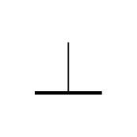

- ✅ A. 接地
- 　 B. 天线
- 　 C. 电阻
- 　 D. 二极管

> 答案：**A**

**107. （单选｜4.3.1｜LK0498）** 附图中的电路元器件符号代表：

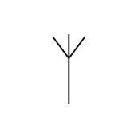

- ✅ A. 天线
- 　 B. 接地
- 　 C. 电阻
- 　 D. 二极管

> 答案：**A**

**108. （单选｜4.3.1｜LK0499）** 附图中的电路元器件符号代表：

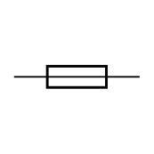

- ✅ A. 熔断器
- 　 B. 电容
- 　 C. 电阻
- 　 D. 二极管

> 答案：**A**

**109. （单选｜4.3.1｜LK0500）** 附图中的电路元器件符号代表：

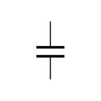

- ✅ A. 电容器
- 　 B. 熔断器
- 　 C. 电阻
- 　 D. 二极管

> 答案：**A**

**110. （单选｜4.3.1｜LK0501）** 附图中的电路元器件符号代表：

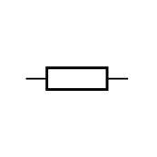

- ✅ A. 电阻
- 　 B. 电容器
- 　 C. 熔断器
- 　 D. 压电晶体

> 答案：**A**

**111. （单选｜4.3.1｜LK0502）** 附图中的电路元器件符号代表：

- ✅ A. 二极管
- 　 B. 电容器
- 　 C. 线圈
- 　 D. 电阻

> 答案：**A**

**112. （单选｜4.3.1｜LK0503）** 附图中的电路元器件符号代表：

- ✅ A. 线圈
- 　 B. 二极管
- 　 C. 电容器
- 　 D. 电阻

> 答案：**A**

**113. （单选｜4.3.1｜LK0504）** 附图中的电路元器件符号代表：

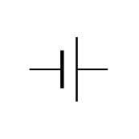

- ✅ A. 电池
- 　 B. 二极管
- 　 C. 线圈
- 　 D. 电阻

> 答案：**A**

**114. （单选｜4.3.1｜LK0505）** 附图中的电路元器件符号代表：

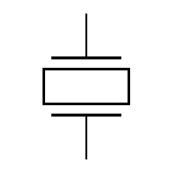

- ✅ A. 压电晶体
- 　 B. 电池
- 　 C. 二极管
- 　 D. 电阻

> 答案：**A**

**115. （单选｜4.3.1｜LK0506）** 附图中的电路元器件符号代表：

- ✅ A. 稳压二极管
- 　 B. 压电晶体
- 　 C. 发光二极管
- 　 D. 电阻

> 答案：**A**

**116. （单选｜4.3.1｜LK0507）** 附图中的电路元器件符号代表：

- ✅ A. 发光二极管
- 　 B. 稳压二极管
- 　 C. 压电晶体
- 　 D. 电阻

> 答案：**A**

**117. （单选｜4.3.1｜LK0508）** 附图中的电路元器件符号代表：

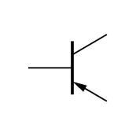

- ✅ A. PNP双极型晶体管
- 　 B. NPN双极型晶体管
- 　 C. 结型场效应晶体管
- 　 D. 绝缘栅场效应晶体管

> 答案：**A**

**118. （单选｜4.3.1｜LK0509）** 附图中的电路元器件符号代表：

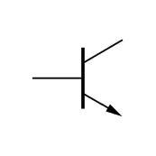

- ✅ A. NPN双极型晶体管
- 　 B. PNP双极型晶体管
- 　 C. 结型场效应晶体管
- 　 D. 绝缘栅场效应晶体管

> 答案：**A**

**119. （单选｜4.3.1｜LK0510）** 附图中的电路元器件符号代表：

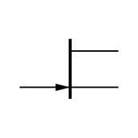

- ✅ A. 结型场效应晶体管
- 　 B. PNP双极型晶体管
- 　 C. NPN双极型晶体管
- 　 D. 绝缘栅场效应晶体管

> 答案：**A**

**120. （单选｜4.3.1｜LK0511）** 附图中的电路元器件符号代表：

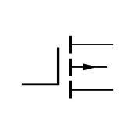

- ✅ A. 绝缘栅场效应晶体管
- 　 B. 结型场效应晶体管
- 　 C. PNP双极型晶体管
- 　 D. NPN双极型晶体管

> 答案：**A**

**121. （多选｜4.3.2｜LX）** 按制造材料细分，常见的电阻有：
- ✅ A. 碳膜电阻
- ✅ B. 金属膜电阻
- ✅ C. 线绕电阻
- 　 D. 阻尼电阻

> 答案：**A、B、C**

**122. （单选｜4.3.2｜LK0590）** 在组装业余收发信机所用的元器件中，标有额定耗散功率的通常是：
- ✅ A. 线绕电阻
- 　 B. 薄膜电容
- 　 C. 晶体管
- 　 D. 集成电路

> 答案：**A**

**123. （单选｜4.3.2｜LK0577）** 电阻的“额定功率”是指：
- ✅ A. 该电阻正常工作所能承受的最大功率
- 　 B. 维持该电阻正常工作所需的最小功率
- 　 C. 该电阻接入电路必然消耗的功率
- 　 D. 该电阻可为电路提供的最大功率

> 答案：**A**

**124. （单选｜4.3.2｜LK0587）** 表面贴装元器件（surface-mount devices）广泛应用于业余无线电作品。其规格参数 0402、0603、0805、1206等是指：
- ✅ A. 元器件的长和宽（单位：毫米或 0.1英寸）
- 　 B. 容量值（单位：微法）
- 　 C. 电阻值（单位：千欧）
- 　 D. 电感值（单位：微亨）

> 答案：**A**

**125. （单选｜4.3.2｜LK0578）** 某电阻上的色环依次为棕、橙、橙、黑。其阻值为：
- ✅ A. 13千欧
- 　 B. 3.7千欧
- 　 C. 4.7兆欧
- 　 D. 250欧

> 答案：**A**

**126. （单选｜4.3.2｜LK0579）** 某电阻上的色环依次为黄、白、红、银。其阻值为：
- ✅ A. 4.9千欧
- 　 B. 49.2欧
- 　 C. 4.7兆欧
- 　 D. 390千欧

> 答案：**A**

**127. （单选｜4.3.2｜LK0580）** 某电阻上的色环依次为银、黑、橙、橙、棕。其阻值为：
- ✅ A. 133欧
- 　 B. 13千欧
- 　 C. 4.7兆欧
- 　 D. 130千欧

> 答案：**A**

**128. （单选｜4.3.2｜LK0581）** 某贴片电阻上的印字为 2R7。其阻值为：
- ✅ A. 2.7欧
- 　 B. 27欧
- 　 C. 0.27欧
- 　 D. 7欧网络电阻，两支装

> 答案：**A**

**129. （单选｜4.3.2｜LK0582）** 某贴片电阻上的印字为 3802。其阻值为：
- ✅ A. 38.0千欧
- 　 B. 208千欧
- 　 C. 3.8千欧
- 　 D. 3.802千欧

> 答案：**A**

**130. （多选｜4.3.2｜LK0582）** 制作工作电压较高的电路应当关注元器件的耐压。这可以提高电路的安全性。要确保所用电阻的耐压，可供借鉴的经验有：
- ✅ A. 咨询厂商，选用额定耐压较高的产品；或，尝试选用封装尺寸较大一些的
- ✅ B. 如果所选产品不能满足设计要求，可将多支电阻串联使用
- 　 C. 尽量选用比较高级的产品，例如金属膜电阻就比碳膜的好
- 　 D. 当所选产品不满足设计要求时，可将多支电阻并联起来用

> 答案：**A、B**

**131. （多选｜4.3.2｜LK1149）** 电位器是一种触点端与电阻体滑动接触的三端电阻元件。其在电路中可以用作：
- ✅ A. 可调分压器
- ✅ B. 可变电阻
- 　 C. 可调变压器
- 　 D. 可变电纳

> 答案：**A、B**

**132. （单选｜4.3.2｜LK1150）** 以下哪种元件可以用来实现音量调节功能？
- ✅ A. 电位器
- 　 B. 变压器
- 　 C. 调制器
- 　 D. 解调器

> 答案：**A**

**133. （多选｜4.3.2｜LK1151）** 电容器由彼此绝缘的两个电极构成。若按制造材料细分，常见电容器包括：
- ✅ A. 陶瓷电容
- ✅ B. 电解电容
- ✅ C. 有机薄膜电容
- 　 D. 线间电容

> 答案：**A、B、C**

**134. （单选｜4.3.2｜LX）** 我们经常使用的独石电容是一种：
- ✅ A. 多层陶瓷电容
- 　 B. 镀银云母电容
- 　 C. 卷绕涤纶电容
- 　 D. 高频瓷介电容

> 答案：**A**

**135. （多选｜4.3.2｜LK0589）** 在组装业余收发信机所用的元器件中，标有额定耐压的通常是：
- ✅ A. 电解电容
- ✅ B. 钽电容
- ✅ C. 熔丝
- 　 D. 电感线圈

> 答案：**A、B、C**

**136. （多选｜4.3.2｜LX）** 在自制电路作品时，爱好者们经常将容量约为 1-100μF的电解电容替换为同等容量的贴片陶瓷电容。后者的优点是：
- ✅ A. 体积更小
- ✅ B. 频率特性更好
- ✅ C. 没有极性
- ✅ D. 故障率更低

> 答案：**A、B、C、D**

**137. （单选｜4.3.2｜LK0640）** 电路图中，若电解电容器的容量未标注单位，则默认为：
- ✅ A. 法拉
- 　 B. 毫法拉
- 　 C. 皮法拉
- 　 D. 微法拉

> 答案：**A**

**138. （单选｜4.3.2｜LK0641）** 电路图中，若用大于 1的整数或小数标注非电解电容器的容量，则单位缺省为：
- ✅ A. 皮法拉
- 　 B. 微法拉
- 　 C. 法拉
- 　 D. 毫法拉

> 答案：**A**

**139. （单选｜4.3.2｜LK0642）** 如果在电路图中或实际元件上看到用 3位数字标明的非电解电容器的容量时应读为：
- ✅ A. 前两位表示容量基数，后一位表示基数后面应加上几个 0，单位为皮法拉
- 　 B. 实际容量为该三位数字乘以 1000，单位为皮法拉
- 　 C. 实际容量为该三位数字除以 1000，单位为法拉
- 　 D. 前一位表示容量基数，第二位表示基数后面应加上几个 0，第三位表示误差等级，容量的单位为皮法拉

> 答案：**A**

**140. （单选｜4.3.2｜LK0643）** 如果在电路图中或实际元件上看到用 3位数字标明的阻值时应读为：
- ✅ A. 前两位表示阻值基数，后一位表示基数后面应加上几个 0，单位为欧姆
- 　 B. 实际阻值为该三位数字乘以 100，单位欧姆
- 　 C. 实际阻值为该三位数字除以 100，单位欧姆
- 　 D. 前一位表示阻值基数，第二位表示基数后面应加上几个 0，第三位表示误差等级，阻值的单位为千欧姆

> 答案：**A**

**141. （单选｜4.3.2｜LK0644）** 如果在电路图中或实际元件上看到用 2至 3位数字和一个字母（例如 8R2、2K7、1M5）标明的阻值时应读为：
- ✅ A. 将字母用作小数点，与数字一起读作阻值的基数。字母 R、K 或 M 表明阻值的单位为欧姆、千欧或兆欧
- 　 B. 把所有数字挑出来连在一起乘以 100，单位为欧姆
- 　 C. 把所有数字挑出来连在一起，再根据字母 R、K或M来认定单位为欧姆、千欧或兆欧
- 　 D. 字母前的数字表示阻值基数，字母后的数字表示误差等级，字母 R、K或 M表示单位为欧姆、千欧或兆欧

> 答案：**A**

**142. （单选｜4.3.2｜LK0645）** 电路图中，若用小于 1的小数标注非电解电容器的容量，则单位缺省为
- ✅ A. 微法拉
- 　 B. 皮法拉
- 　 C. 法拉
- 　 D. 毫法拉

> 答案：**A**

**143. （单选｜4.3.2｜LK0592）** 在业余收发信机中用来阻断直流或者为交流信号提供旁路的元件是：
- ✅ A. 电容
- 　 B. 电阻
- 　 C. 电感
- 　 D. 二极管

> 答案：**A**

**144. （单选｜4.3.2｜LK1038）** 业余自制电路作品时，爱好者们常将一个大容量电容与一个或若干个小容量电容相并联，共同用作放大器的旁路电容或是供电线路中的滤波电容。这样做主要考虑的是：
- ✅ A. 在工作频率较低时，大容量电容起主要作用。随着频率升高，大容量电容的损耗变得不可忽略，而此时小容量电容开始发挥作用。这可以拓展电路的工作带宽
- 　 B. 防止大容量电容因日久漏液而逐渐损失容量。事先加个小容量电容可以提升保险系数
- 　 C. 利用电容器并联则容量相加的原理获取更为准确的容量值，以利精准旁路，精确滤波
- 　 D. 利用电容器并联则耐压相加的原理，整体提高电路，特别是车载电路的过压耐受能力

> 答案：**A**

**145. （单选｜4.3.2｜LK0584）** 设将一个电容量为 1000微法的电容器跨接在电路上，不会严重影响该电路工作或不至引发安全风险的做法为：
- ✅ A. 跨接在 13.8伏直流电源的输出端上
- 　 B. 跨接在 HF收发信机的天线插座两端
- 　 C. 跨接在阻抗为 8欧姆的扬声器两端
- 　 D. 跨接在 220伏交流电源的插座两端

> 答案：**A**

**146. （多选｜4.3.2｜LX）** 哪种元件由线圈制成？
- ✅ A. 电感器
- ✅ B. 电抗器
- 　 C. 电容器
- 　 D. 电阻器

> 答案：**A、B**

**147. （多选｜4.3.2｜LK1152）** 电感的种类繁多。在射频电路中常见的有：
- ✅ A. 空芯电感
- ✅ B. 磁芯电感
- 　 C. 分布电感
- 　 D. 寄生电感

> 答案：**A、B**

**148. （单选｜4.3.2｜LX）** 电感的品质因数 Q是电感量与损耗电阻之比。关于 Q值，以下描述正确的是：
- ✅ A. 电感的 Q值过低带来功率损失并会影响电路的其他相关特性
- 　 B. 电感的 Q值过低影响射频功率，但是不影响电路的其他特性
- 　 C. 电感的 Q值与 LC谐振回路的 Q值无关。后者才是真正的 Q
- 　 D. 电感量确定，则 Q值已笃定。二者为正比关系

> 答案：**A**

**149. （单选｜4.3.2｜LK0670）** 用适当磁性材料制作的磁芯电感，损耗小于同等电感量的空心电感。这是因为：
- ✅ A. 加入磁芯后可用较短的导线达成所需的电感量，减少导线电阻引致的发热损耗
- 　 B. 磁芯比空气更容易散热，电感的发热损耗由此降低
- 　 C. 磁芯可将原来损耗的能量反射回导线
- 　 D. 加入磁芯可改善导线趋肤效应引致的局部电流密度增大问题，从而降低热损耗

> 答案：**A**

**150. （单选｜4.3.2｜LK0583）** 设将一个电感值为 100微亨的线圈跨接在电路上，不会严重影响该电路工作或不至引发安全风险的做法为：
- ✅ A. 跨接在 HF收发信机的天线插座两端
- 　 B. 跨接在 220伏交流电源的插座两端
- 　 C. 跨接在 13.8伏直流电源的输出端上
- 　 D. 跨接在阻抗为 8欧姆的扬声器两端

> 答案：**A**

**151. （多选｜4.3.2｜LK0638）** 小明用电压为 4.2伏的低电压电池和几个无源元件做电路实验。在连接电路时，他感觉双手被意外出现的高电压击了一下。如果元件如下，则可能产生高电压的有：
- ✅ A. 电源变压器的绕组
- ✅ B. 继电器的衔铁线圈
- 　 C. 大容量电解电容器
- 　 D. 碳化硅高压二极管

> 答案：**A、B**

**152. （多选｜4.3.2｜LK1153）** 开关是利用通、断两种状态对电路实施控制的一种电子零件。下列可用作开关的有：
- ✅ A. 按钮开关
- ✅ B. 继电器
- ✅ C. 晶体管
- 　 D. 电位器

> 答案：**A、B、C**

**153. （单选｜4.3.2｜LX）** 单刀双掷（SPDT）开关是我们常用的一种开关元件。“单刀双掷”是指什么？
- ✅ A. 将某个电路选择接入另外两个电路中的一个
- 　 B. 很明显，就是接通或断开一个电路
- 　 C. 很明显，就是接通或断开两个电路
- 　 D. 将两个电路选择接入其分别对应的另外两个电路中的一个

> 答案：**A**

**154. （单选｜4.3.2｜LX）** 以下哪种元件可以保护电路中的其他元件免受过电流的冲击？
- ✅ A. 熔断器
- 　 B. MOS管
- 　 C. 电子管
- 　 D. 电容

> 答案：**A**

**155. （多选｜4.3.2｜LK0591）** 在组装业余收发信机所用的元器件中，标有额定电流的通常是：
- ✅ A. 熔断器
- ✅ B. 开关
- ✅ C. 继电器
- 　 D. 压电晶体

> 答案：**A、B、C**

**156. （多选｜4.3.2｜LK1154）** 业余无线电作品中的熔断器常为玻璃或陶瓷封装的保险丝管，是用来增强电路安全性的。关于这类熔断器的使用，可供借鉴的经验有：
- ✅ A. 选用保险丝管应当关注额定工作电压、额定工作电流和熔断速度
- ✅ B. 将大电流保险丝管装于管座内，以防熔断时爆裂，损伤周边元件
- ✅ C. 尽量将供电线路保险丝的管座固定于机箱背板，以简化维修工作
- 　 D. 为熔断器安装射频滤波器，以防熔断时打火，干扰周边业余电台

> 答案：**A、B、C**

**157. （多选｜4.3.2｜LK1155）** 继电器是一种具有电气隔离能力的开关，常用来以小功率低压电控制大功率电路或高压电路。在业余无线电作品中，继电器也用来控制射频电路的通断或切换信号路径。关于继电器的应用，可供借鉴的经验有：
- ✅ A. 选用继电器时应关注触点的额定耐压和额定工作电流
- ✅ B. 用继电器控制收发转换，应在发射机待机后再行切换
- ✅ C. 选用切换信号的继电器，应关注其导通小信号的能力
- 　 D. 自制 HF或 VHF设备时，应尽量选用微波射频继电器

> 答案：**A、B、C**

**158. （单选｜4.3.2｜LK0636）** 如果利用开关器件来控制继电器的衔铁线圈通电与否，例如是将线圈接在三极管的集电极电路中，则可能发生的情况是：
- ✅ A. 在三极管关断的瞬间，集电极可能承受远高于电源电压的高电压冲击
- 　 B. 在三极管导通的瞬间，集电极可能承受远高于电源电压的高电压冲击
- 　 C. 在三极管关断的瞬间，集电极可能承受远大于导通电流的大电流冲击
- 　 D. 在三极管导通的瞬间，集电极可能承受远大于导通电流的大电流冲击

> 答案：**A**

**159. （单选｜4.3.2｜LK0637）** 如果利用开关器件来控制继电器的衔铁线圈通电与否，则线圈的两端需要并联一个小容量电容器或是一个反向偏置的二极管。其作用是：
- ✅ A. 吸收继电器线圈在电路关断瞬间感应出的反向电动势以保护开关器件
- 　 B. 消除继电器触点通断时产生的火花干扰
- 　 C. 减少通过开关器件的工作电流
- 　 D. 减少继电器的磨损

> 答案：**A**

**160. （单选｜4.3.2｜LK0639）** 若用继电器控制直流负载，我们有时需要在继电器的触点两端并联一个小容量电容。其作用是：
- ✅ A. 消除继电器触点通断时因拉弧而产生的电磁干扰
- 　 B. 吸收继电器线圈在电路关断瞬间感应出的反向电动势以保护开关器件
- 　 C. 减少通过开关器件的工作电流
- 　 D. 减少继电器的磨损

> 答案：**A**

**161. （多选｜4.3.2｜LK0646）** 电磁感应现象是指置于变化磁场中的导体产生感应电动势的现象。应用场景包括：
- ✅ A. 变压器
- ✅ B. 发电机
- ✅ C. 交流异步电动机
- ✅ D. 无线电通信

> 答案：**A、B、C、D**

**162. （单选｜4.3.2｜LK0647）** 电磁学术语“互感现象”是指：
- ✅ A. 两个回路电流变化，通过磁场耦合而相互产生感应电动势的现象
- 　 B. 连接在一起的两个元器件的阻抗相互阻碍流过对方的电流的现象
- 　 C. 两个带电部件的电场相互叠加的现象
- 　 D. 两个不同频率的电磁波在空气中叠加，相互混频产生干扰的现象

> 答案：**A**

**163. （单选｜4.3.2｜LK0666）** 为什么变压器中的铁芯要由截面积大，导磁率高的多片矽钢片堆叠构成，而不像继电器中的衔铁那样使用整体铁芯？
- ✅ A. 堆叠的矽钢片彼此绝缘，可降低涡流损耗
- 　 B. 将矽钢片堆叠可降低变压器的非线性失真
- 　 C. 矽钢片堆叠工艺可简化变压器的组装难度
- 　 D. 整体铁芯制成的变压器易松动，会有震动

> 答案：**A**

**164. （多选｜4.3.2｜LX）** 理想变压器初、次级绕组的匝数比决定变压器的电压变比。假设一个理想变压器的初级和次级绕组分别为 1100匝和 110匝，将初级接入电压为 220V的交流电源并在次级并联一个 22欧的电阻，则以下结论正确的是：（电压和电流均为有效值）
- ✅ A. 次级电压为 22伏
- ✅ B. 次级电流为 1安
- ✅ C. 初级阻抗为 2.2千欧
- 　 D. 变压器功耗为 22瓦

> 答案：**A、B、C**

**165. （多选｜4.3.2｜LX）** 理想变压器初、次级绕组的匝数比决定变压器的电压变比。假设一个理想变压器的初级和次级绕组分别为 120匝和 1800匝，将初级接入电压为 220V的交流电源并在次级并联一个 4.5千欧的电阻，则以下结论正确的是：（电压和电流均为有效值）
- ✅ A. 次级电压为 3300伏
- ✅ B. 初级电流为 11安
- ✅ C. 初级阻抗为 20欧
- 　 D. 变压器功耗为 2.42千伏安

> 答案：**A、B、C**

**166. （多选｜4.3.2｜LX）** 在射频电路中，变压器的用途之一是完成阻抗变换。某个绕制于铁氧体磁环上的高频变压器，初、次级绕组的匝数分别为 3匝和 6匝。在该变压器的设计工作频率和负载阻抗范围内，以下结论正确的是：
- ✅ A. 该变压器可用作 1:4或 4:1阻抗变换器。用作后者时需将初次级互换
- ✅ B. 该变压器可用作 1:2或 2:1电压变换器。用作后者时需将初次级互换
- ✅ C. 该变压器可用作带阻抗变换功能的倒相器。用法是调换初级或者次级的线序
- 　 D. 该变压器可用来匹配天线，可将天线阻抗中的电抗成分按比例变为电阻成分

> 答案：**A、B、C**

**167. （单选｜4.3.2｜LX）** 如果一副天线的阻抗为 450欧，我们要用怎样匝数比的变压器才能将之变换为 50欧？
- ✅ A. 3比 1
- 　 B. 9比 1
- 　 C. 450比 1
- 　 D. 50比 1

> 答案：**A**

**168. （多选｜4.3.2｜LX）** 传输线变压器是结合传输线理论设计制作的一种射频变压器，已广泛应用于业余无线电作品。例如，用双绞线在磁环上穿绕数匝即可制成 1:4阻抗变换器。这种变压器的优点是：
- ✅ A. 可在很宽频带内实现阻抗匹配
- ✅ B. 可制成平衡-不平衡转换器
- ✅ C. 可制成功率合成与分配网络
- 　 D. 可实现整数倍率的倍频与分频

> 答案：**A、B、C**

**169. （单选｜4.3.3｜LK0668）** 在频率为数十兆赫的射频电路中用实心导线作连线会有下列现象：
- ✅ A. 电流集中在导线表层，导线内部没有电流
- 　 B. 导线截面各处的电流密度均匀分布
- 　 C. 导线外层和内层都有电流，但两者方向相反
- 　 D. 表层的电流沿导线方向流动，内层电流形成螺旋状涡流

> 答案：**A**

**170. （单选｜4.3.3｜LK0667）** 同样材料、同样直径、同样长度的实心铜线和空心铜管，在交流电路中的发热损耗情况为：
- ✅ A. 在低频率下实心铜线损耗较小，在高频率下两者损耗一样
- 　 B. 在低频率下实心铜线损耗较大，在高频率下两者损耗一样
- 　 C. 不同频率下两者的发热损耗不便比较，具体取决于散热条件
- 　 D. 在任何频率下两者的损耗都一样

> 答案：**A**

**171. （多选｜4.3.3｜LK0634）** 一个电容器，在 50Hz频率下测得容抗为 100欧姆。推断其在 5MHz下的容抗应为 0.001欧姆，但实测值却显著偏大。这是因为：
- ✅ A. 随着频率升高，电容器引线的感抗变得不可忽略
- ✅ B. 随着频率升高，电容器的介质损耗逐渐增加
- 　 C. 所用仪器的频率特性欠佳
- 　 D. 计算容抗的公式在高频率下不再适用

> 答案：**A、B**

**172. （单选｜4.3.3｜LK0635）** 一个电感线圈，在 50Hz频率下测得感抗为 10欧姆。推断其在 5MHz下的感抗应为 1兆欧，但实测值却显著偏小。这是因为：
- ✅ A. 随着频率升高，线圈的匝间分布电容变得不可忽略
- 　 B. 所用仪器的频率特性欠佳
- 　 C. 计算感抗的公式在高频率下不再适用
- 　 D. 电感线圈导线损耗导致非线性失真

> 答案：**A**

**173. （多选｜4.3.4｜LK0585）** 下列哪些属于有源器件？
- ✅ A. 硅整流二极管
- ✅ B. 肖特基二极管
- ✅ C. 场效应三极管
- ✅ D. 双极型三极管

> 答案：**A、B、C、D**

**174. （单选｜4.3.4｜LK1159）** 以下哪种元器件只允许单方向的电流流动？
- ✅ A. 二极管
- 　 B. 蓄电池
- 　 C. 变压器
- 　 D. 继电器

> 答案：**A**

**175. （单选｜4.3.4｜LK1164）** 二极管的两个电极分别叫什么？
- ✅ A. 分别叫正极和负极，有时亦称阳极和阴极
- 　 B. 分别叫源极和漏极，有时亦称注入极和释出极
- 　 C. 分别叫阴极和屏极，有时亦称发射极和接收极
- 　 D. 分别叫门极和基极，有时亦称触发极和控制极

> 答案：**A**

**176. （单选｜4.3.4｜LK1163）** 如何根据外观识别半导体二极管的负极？
- ✅ A. 器件封装上靠近负极的位置通常印有环或线标记
- 　 B. 器件负极上通常标有“负极”或“Cathode”字样
- 　 C. 器件负极的引脚通常较正极引脚长 20%左右
- 　 D. 器件负极通常靠近键标，并与相邻引脚连有灯丝

> 答案：**A**

**177. （单选｜4.3.4｜LK1165）** LED是哪种器件的缩写？
- ✅ A. 发光二极管
- 　 B. 液晶显示器
- 　 C. 阴极射线管
- 　 D. 束射四极管

> 答案：**A**

**178. （单选｜4.3.4｜LK1170）** 在下列器件中，能够用作指示灯的是：
- ✅ A. LED
- 　 B. BJT
- 　 C. TVS
- 　 D. SCR

> 答案：**A**

**179. （单选｜4.3.4｜LK0723）** 将发光二极管接到直流电源上需要注意什么？
- ✅ A. 正向连接并串联限流电阻
- 　 B. 反向连接并串联限流电阻
- 　 C. 正反向无所谓，但是都须并联限流电阻
- 　 D. 应当正向直接连接到直流电源上

> 答案：**A**

**180. （单选｜4.3.4｜LK1168）** 下列哪种部件可以把交变电变成脉动直流电？
- ✅ A. 二极管整流器
- 　 B. 电源变压器
- 　 C. 比较放大器
- 　 D. 射极输出器

> 答案：**A**

**181. （单选｜4.3.4｜LX）** 硅整流二极管的正向导通压降大约为：
- ✅ A. 0.7伏
- 　 B. 0.3伏
- 　 C. 数十毫伏
- 　 D. 1000伏

> 答案：**A**

**182. （单选｜4.3.4｜LK0338）** 阅读电路图或运行计算机电路仿真时，如果看到符号“BJT”，则为：
- ✅ A. 双极型三极管
- 　 B. 双栅场效应三极管
- 　 C. 结型场效应三极管
- 　 D. 双基极二极管

> 答案：**A**

**183. （单选｜4.3.4｜LK0415）** 场效应晶体管的三个基本电极是：
- ✅ A. 源极、栅极、漏极
- 　 B. 阴极、栅极、屏极（板极）
- 　 C. 发射极、基极、集电极
- 　 D. 阴极、门极、阳极

> 答案：**A**

**184. （单选｜4.3.4｜LK0414）** 双极型三极管的三个基本电极是：
- ✅ A. 发射极、基极、集电极
- 　 B. 阴极、栅极、屏极（板极）
- 　 C. 源极、栅极、漏极
- 　 D. 阴极、门极、阳极

> 答案：**A**

**185. （单选｜4.3.4｜LK0413）** 电子三极管的三个基本电极是：
- ✅ A. 阴极、栅极、屏极（板极）
- 　 B. 发射极、基极、集电极
- 　 C. 源极、栅极、漏极
- 　 D. 阴极、门极、阳极

> 答案：**A**

**186. （单选｜4.3.4｜LK0724）** 电子三极管至少应有几个引脚？
- ✅ A. 4个
- 　 B. 2个
- 　 C. 3个
- 　 D. 5个

> 答案：**A**

**187. （单选｜4.3.4｜LK0729）** 描述场效应晶体管放大能力的最常用参数、单位及符号是：
- ✅ A. 互导（跨导）；单位为毫安/伏；符号为“gm”
- 　 B. 电流放大倍数；没有单位；符号为“β”
- 　 C. 互导（跨导）；单位为“倍”；符号为“A”
- 　 D. 电压放大倍数；没有单位；符号为“k”

> 答案：**A**

**188. （单选｜4.3.4｜LK0730）** 描述双极型晶体管放大能力的最常用参数、单位及符号是：
- ✅ A. 电流放大倍数；没有单位；符号为“β”
- 　 B. 互导（跨导）；单位为毫安/伏；符号为“gm”
- 　 C. 互导（跨导）；单位为“倍”；符号为“A”
- 　 D. 电压放大倍数；没有单位；符号为“k”

> 答案：**A**

**189. （单选｜4.3.4｜LK0728）** 描述电子三极管放大能力的最常用参数、单位及符号是：
- ✅ A. 互导（跨导）； 单位为毫安/伏；符号为“gm”
- 　 B. 电流放大倍数；没有单位；符号为“β”
- 　 C. 互导（跨导）；单位为“倍”；符号为“A”
- 　 D. 电压放大倍数；没有单位；符号为“k”

> 答案：**A**

**190. （单选｜4.3.4｜LK0731）** 若将器件上起控制作用的电极按输入阻抗由低到高排列，则可以是：
- ✅ A. 双极型晶体管的基极、结型场效应管的栅极、绝缘栅场效应管的栅极
- 　 B. 双极型晶体管的基极、绝缘栅场效应管的栅极、结型场效应管的栅极
- 　 C. 绝缘栅场效应管的栅极、双极型晶体管的基极、结型场效应管的栅极
- 　 D. 结型场效应管的栅极、双极型晶体管的基极、绝缘栅场效应管的栅极

> 答案：**A**

**191. （多选｜4.3.4｜LK1158）** 下列哪种元器件可用来实现以较小的电流控制较大电流的功能？
- ✅ A. 晶体管
- ✅ B. 继电器
- 　 C. 电阻
- 　 D. 电池

> 答案：**A、B**

**192. （单选｜4.3.4｜LK1160）** 下列哪种元器件既可以用作电子开关又可以制成放大器来使用？
- ✅ A. 晶体管
- 　 B. 电位器
- 　 C. 单刀双掷开关
- 　 D. 电压表

> 答案：**A**

**193. （单选｜4.3.4｜LK1172）** 集成电路是指：
- ✅ A. 将一个电路的大量元器件集成于单个晶片上制成的器件
- 　 B. 由多个继电器组合而成的具有逻辑运算能力的电路
- 　 C. 由多个电阻或电容组合而成的具有微分或积分功能的电路
- 　 D. 由多个绕组构成的基于变压器原理的功率合成电路

> 答案：**A**

**194. （多选｜4.3.4｜LK1016）** 理想运算放大器的基本概念是：
- ✅ A. 在不加负反馈的情况下，也就是开环工作时，其放大倍数为无穷大
- ✅ B. 这种放大器具有正、负两种极性的输入端，并且输入阻抗为无穷大
- 　 C. 所谓理想，其实就是是指内部噪声等于零的共发射极晶体管放大器
- 　 D. 所谓理想，其实就是是指输出电压幅度不设上限的场效应管放大器

> 答案：**A、B**

**195. （单选｜4.3.4｜LX）** 集成运算放大器属于什么类型的集成电路？
- ✅ A. 模拟集成电路
- 　 B. 单片微波集成电路
- 　 C. 数字集成电路
- 　 D. 可编程数字逻辑阵列

> 答案：**A**

**196. （单选｜4.3.4｜LK0588）** 业余无线电作品中常见的一些集成电路，例如运算放大器和微处理器等，有时会在所标型号之后附加字母尾缀，例如 SIP、DIP、SOT、SOP、SSOP、QFP等。它们用来说明：
- ✅ A. 器件的封装形式
- 　 B. 器件的工作温度范围
- 　 C. 器件的输入输出电平范围
- 　 D. 器件的工作频率范围

> 答案：**A**

## 4.6　测量仪表与 dB 增益

**197. （单选｜4.6.1｜LK0479）** 用万用表的直流电压档测量正负对称的方波电压（占空比为 1:1）。所得读数为：
- ✅ A. 零值
- 　 B. 该电压的最大值
- 　 C. 该电压最大值的 1/2
- 　 D. 该电压最大值的 2倍

> 答案：**A**

**198. （单选｜4.6.1｜LK0480）** 如果用磁电式万用表的交流电压档测量正负对称的方波电压（占空比为 1:1），其指针所示的电压读数：
- ✅ A. 大于该电压的峰值
- 　 B. 为该电压的峰值
- 　 C. 为该电压的峰-峰值
- 　 D. 为该电压的平均值

> 答案：**A**

**199. （单选｜4.6.1｜LK0481）** 用指针式万用表的直流电压档测量最小值为 0的方波电压（占空比为 1:1），得到的读数是该电压的：
- ✅ A. 峰值的 1/2，亦为有效值
- 　 B. 零值
- 　 C. 峰值
- 　 D. 峰-峰值

> 答案：**A**

**200. （单选｜4.6.1｜LK1198）** 用万用表的电阻档测量一个电路。最开始，电表指示电路的阻值很小。但是随着测量时间的延长，测量值却变得越来越大。这是因为：
- ✅ A. 这个电路两端可能存在一个很大的电容
- 　 B. 万用表出了故障
- 　 C. 这个电路两端可能存在一个很大的电感
- 　 D. 这个电路中存在一个周期性的交流电压

> 答案：**A**

**201. （多选｜4.6.1｜LK0484）** 测量一个电解电容器是否完好应当使用：
- ✅ A. 指针式万用表的电阻档
- ✅ B. 数字万用表的电容测试档（如果仪表具备该功能）
- 　 C. 任意一种万用表的电流档
- 　 D. 蓄电池充电器并配合进行短路放电实验

> 答案：**A、B**

**202. （单选｜4.6.1｜LK0491）** 用指针式万用电表的电阻档测量一个常用元件，表笔第一次连接时表针挥动了一下，但很快回到零点。断开表笔重新连接，表针却不再有任何指示。正确的推论是：
- ✅ A. 该元件可能是一个电解电容器
- 　 B. 该元件肯定是一支损坏了的电阻
- 　 C. 万用表的准确度肯定有问题
- 　 D. 万用表的电池肯定电量不足了

> 答案：**A**

**203. （单选｜4.6.1｜LK0492）** 指针式万用表的电压档有个“欧姆/伏（每伏欧姆）”指标。越大的每伏欧姆数越说明：
- ✅ A. 测量电压时电表对电路工作状态的影响小
- 　 B. 测量电压时电表对电路工作状态的影响大
- 　 C. 可以耐受的电压过载能力强
- 　 D. 可以耐受的电压过载能力弱

> 答案：**A**

**204. （单选｜4.6.1｜LK0493）** 用数字万用表的直流电压档测量电路两点间某个等幅音频信号的电压，发现读数不为零。交换两支表笔之后再测，所得读数的极性反转。正确的推论是：
- ✅ A. 音频信号上叠加有直流成分
- 　 B. 音频信号含有丰富的谐波
- 　 C. 万用表的频率响应太差
- 　 D. 表笔导线间的分布电容影响了测量

> 答案：**A**

**205. （单选｜4.6.2｜LK0715）** 下列几种图表中，最容易用来表达和解释 PSK调制原理的是：
- ✅ A. 相位矢量图
- 　 B. 波形图
- 　 C. 频谱图
- 　 D. 频谱瀑布图

> 答案：**A**

**206. （单选｜4.6.2｜LK0716）** 下列几种图表中，最容易用来表达和解释模拟 FM调制原理的是：
- ✅ A. 频谱图
- 　 B. 波形图
- 　 C. 相位矢量图
- 　 D. 星座图和眼图

> 答案：**A**

**207. （单选｜4.6.2｜LK0717）** 下列几种图表中，最容易用来表达和解释 SSB调制原理的是：
- ✅ A. 频谱图
- 　 B. 波形图
- 　 C. 相位矢量图
- 　 D. 频谱瀑布图

> 答案：**A**

**208. （单选｜4.6.2｜LK0718）** 下列几种图表中，最容易用来表达和解释 RTTY调制原理的是：
- ✅ A. 频率-时间曲线
- 　 B. 功率-时间曲线
- 　 C. 波形图
- 　 D. 相位矢量图

> 答案：**A**

**209. （单选｜4.6.2｜LK0719）** 下列几种图表中，最容易用来表达和解释 SSTV调制原理的是：
- ✅ A. 频率-时间曲线
- 　 B. 功率-时间曲线
- 　 C. 波形图
- 　 D. 相位矢量图

> 答案：**A**

**210. （单选｜4.6.2｜LK0720）** 下列几种图表中，最容易用来表达和解释 A、B、C类放大器工作点的差别的是：
- ✅ A. 波形图
- 　 B. 频谱图
- 　 C. 相位矢量图
- 　 D. 频谱瀑布图

> 答案：**A**

**211. （单选｜4.6.2｜LK0722）** 下列几种图表中，最容易用来表达和解释 LC振荡器温度漂移程度的是：
- ✅ A. 频谱瀑布图
- 　 B. 频谱图
- 　 C. 相位矢量图
- 　 D. 波形图

> 答案：**A**

**212. （单选｜4.6.3｜LK0614）** 图示电路为业余无线电爱好者常用的简易场强表。各部件的作用分别为：

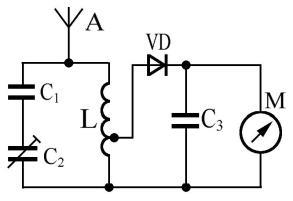

- ✅ A. A-接收电波，C1、C2、L-谐振选频，VD-检波，C3-旁路滤波，M-指示
- 　 B. A-接收电波，C1、C2旁路滤波，L-升压，VD-放大，C3-隔直流，M-指示
- 　 C. A-整流，C1、C2-隔直流，L-放大，VD-滤波，C3-谐振，M-指示
- 　 D. A-接收电波，C1、C2高频旁路，L-放大，VD-开关，C3-耦合，M-指示

> 答案：**A**

**213. （单选｜4.6.3｜LK0700）** 用一副臂长约 10cm的小偶极天线并联一个晶体二极管和直流微安表，做一个简单的射频场强表。关于选用硅二极管还是锗二极管，正确的考虑应当是：
- ✅ A. 锗、硅二极管的起始导通电压分别为 0.3V和 0.7V。选用锗二极管时场强表更为灵敏
- 　 B. 所有二极管都具有同样的单向导电特性。采用锗、硅二极管的效果完全相同
- 　 C. 硅二极管的反向击穿电压比较高。选用硅管可以延长仪表的使用寿命
- 　 D. 无关锗或硅二极管，这种电路过于简单，无法工作

> 答案：**A**

**214. （多选｜4.6.3｜LK1184）** 在使用网络分析仪或天线分析仪测量电缆和天线的时候，需要使用校准件，包括：
- ✅ A. 50欧姆假负载接头
- ✅ B. 开路接头
- ✅ C. 短路接头
- 　 D. 0dBm参考振荡器

> 答案：**A、B、C**

**215. （单选｜4.6.3｜LX）** 为自己的 FM电台选择驻波比表应注意什么问题？
- ✅ A. 频率范围和功率量程
- 　 B. 最好可以在低于-40摄氏度的环境里使用
- 　 C. 最好可以在高于 90摄氏度的环境里使用
- 　 D. 适用于振幅恒定的 FM信号

> 答案：**A**

**216. （单选｜4.6.3｜LX）** 如果用驻波比表测量发射机的输出功率，你应将仪表装在哪里？
- ✅ A. 在发射机与馈线之间
- 　 B. 在 13.8V电源输出端和电源线之间
- 　 C. 在电源线和电台的电源输入端之间
- 　 D. 在馈线和天线的馈电点之间

> 答案：**A**

**217. （单选｜4.6.4｜LK0540）** 一个放大器具有 20dB的信号增益，其意义是：
- ✅ A. 放大器把相当于输入信号的 100倍的能量从电源转移到了负载
- 　 B. 放大器产生了相当于输入信号的 100倍的能量并将之传向负载
- 　 C. 放大器把输入信号的能量放大了 100倍
- 　 D. 放大器把输入信号的能量放大了 99倍

> 答案：**A**

**218. （单选｜4.6.4｜LK0541）** 射频信号通过某电路时产生了 20dB的损耗。这部分被损耗的能量：
- ✅ A. 被电路转化为其他形式的能量，比如发热耗散或以无线电波的形式辐射到了其他地方
- 　 B. 在电路中消失了
- 　 C. 返回了信号源
- 　 D. 一部分在电路中消失了，另一部分返回了信号源

> 答案：**A**

**219. （单选｜4.6.4｜LK0542）** 某电路输出信号功率是输入信号功率的 100倍。该电路的增益为：
- ✅ A. 20dB
- 　 B. 10dB
- 　 C. 100dB
- 　 D. 1dB

> 答案：**A**

**220. （单选｜4.6.4｜LK0543）** 某电路输出信号功率是输入信号功率的 100万倍。该电路的增益为：
- ✅ A. 60dB
- 　 B. 100dB
- 　 C. 99万 dB
- 　 D. 100万 dB

> 答案：**A**

**221. （单选｜4.6.4｜LK0544）** 某电路输出信号功率是输入信号功率的 5倍。该电路的增益约为：
- ✅ A. 7dB
- 　 B. 3.5dB
- 　 C. 5dB
- 　 D. 14dB

> 答案：**A**

**222. （单选｜4.6.4｜LK0545）** 某电路输入信号功率是输出信号功率的一半。该电路的增益约为：
- ✅ A. 3dB
- 　 B. -3dB
- 　 C. 0.5dB
- 　 D. -0.5dB

> 答案：**A**

**223. （单选｜4.6.4｜LK0546）** 某电路输出信号电压是输入信号电压的 100倍。该电路的增益为：
- ✅ A. 40dB
- 　 B. 10dB
- 　 C. 100dB
- 　 D. 20dB

> 答案：**A**

**224. （单选｜4.6.4｜LK0547）** 某电路输出信号电压是输入信号电压的 1万倍。该电路的增益为：（“x＾m”表示“x的m次方”）
- ✅ A. 80dB
- 　 B. 10,000dB
- 　 C. 9,999dB
- 　 D. 10＾4dB

> 答案：**A**

**225. （单选｜4.6.4｜LK0548）** 某电路输出信号电压是输入信号电压的 10倍。该电路的增益约为：
- ✅ A. 20dB
- 　 B. 7dB
- 　 C. 14dB
- 　 D. 15dB

> 答案：**A**

**226. （单选｜4.6.4｜LK0549）** 某电路输入信号电压是输出信号电压的一半。该电路的增益约为：
- ✅ A. 6dB
- 　 B. -6dB
- 　 C. -3dB
- 　 D. 3dB

> 答案：**A**

**227. （单选｜4.6.4｜LK0550）** 某电路输出信号功率是输入信号功率的 1/100。该电路的增益为：
- ✅ A. -20dB
- 　 B. -10dB
- 　 C. -100dB
- 　 D. 100dB

> 答案：**A**

**228. （单选｜4.6.4｜LK0551）** 某电路输出信号功率是输入信号功率的百万分之一。该电路的增益为：
- ✅ A. -60dB
- 　 B. -100dB
- 　 C. 990,000dB
- 　 D. -1,000,000dB

> 答案：**A**

**229. （单选｜4.6.4｜LK0552）** 某电路输出信号功率是输入信号功率的 1/5。该电路的增益约为：
- ✅ A. -7dB
- 　 B. 3.5dB
- 　 C. -5dB
- 　 D. -14dB

> 答案：**A**

**230. （单选｜4.6.4｜LK0553）** 某电路输出信号功率是输入信号功率的一半。该电路的增益约为：
- ✅ A. -3dB
- 　 B. 3dB
- 　 C. 0.5dB
- 　 D. -0.5dB

> 答案：**A**

**231. （单选｜4.6.4｜LK0554）** 某电路输出信号电压是输入信号电压的 1/100。该电路的增益为：
- ✅ A. -40dB
- 　 B. -10dB
- 　 C. -100dB
- 　 D. -20dB

> 答案：**A**

**232. （单选｜4.6.4｜LK0555）** 某电路输出信号电压是输入信号电压的万分之一。该电路的增益为：（“x＾m”表示“x的m次方”）
- ✅ A. -80dB
- 　 B. -10,000dB
- 　 C. 1/10,000dB
- 　 D. 10＾-4dB

> 答案：**A**

**233. （单选｜4.6.4｜LK0556）** 某电路输出信号电压是输入信号电压的 1/10。该电路的增益约为：
- ✅ A. -20dB
- 　 B. -7dB
- 　 C. -14dB
- 　 D. 0.143dB

> 答案：**A**

**234. （单选｜4.6.4｜LK0557）** 某电路输出信号电压是输入信号电压的一半。该电路的增益约为：
- ✅ A. -6dB
- 　 B. 6dB
- 　 C. 3dB
- 　 D. -3dB

> 答案：**A**

**235. （多选｜4.6.4｜LK0558）** 若信号依次通过增益为 x dB、y dB和 z dB的三个电路，则总增益为：（“x＾m”表示“x的m次方”）
- ✅ A. (x + y + z) dB
- ✅ B. 10＾((x + y + z) / 10) 倍
- 　 C. (x × y × z) dB
- 　 D. 10＾((x × y × z) / 10) 倍

> 答案：**A、B**

**236. （多选｜4.6.4｜LK0559）** 若信号通过增益为 x dB的电路之后被功率分配器等分为两路，则每路增益为：（“x＾m”表示“x的m次方”）
- ✅ A. (x - 3) dB
- ✅ B. 10＾((x - 3) / 10) 倍
- 　 C. (x / 2) dB
- 　 D. 10＾((x / 2) / 10) 倍

> 答案：**A、B**

**237. （多选｜4.6.4｜LK0560）** 接收机的信号强度表（S表）标有 1至 9的度盘分度，分度间隔为 6dB。某电台以 15W的功率发射时，S表读数为 S9。现在，该电台减小功率并再次发射，S表的读数降至 S4。该台的当前发射功率约为：
- ✅ A. 15mW
- ✅ B. -18.2dBW
- 　 C. 0.5W
- 　 D. -3dBW

> 答案：**A、B**

**238. （多选｜4.6.4｜LK0561）** 接收机的信号强度表（S表）标有 1至 9的度盘分度，分度间隔为 6dB。某电台以 100W的功率发射时，S表读数为 S8。现在，该电台减小功率并再次发射时 S表的读数降至 S5。此时该台的发射功率约为：
- ✅ A. 1.58W
- ✅ B. 2dBW
- 　 C. 5.56W
- 　 D. 7.45dBW

> 答案：**A、B**

**239. （多选｜4.6.4｜LK0562）** 功率为 0dBm的射频信号通过增益为 23dB的电路后，输出功率为：
- ✅ A. 23dBm
- ✅ B. 200mW
- ✅ C. -7dBW
- 　 D. 3.16V

> 答案：**A、B、C**

**240. （多选｜4.6.4｜LK0563）** 功率为 0dBμ的射频信号通过增益为 36dB的电路后，输出功率为：
- ✅ A. 6dBm
- ✅ B. 4mW
- ✅ C. -24dBW
- 　 D. 447mV

> 答案：**A、B、C**

**241. （多选｜4.6.4｜LK0564）** 功率为 0dBW的射频信号通过增益为-36dB的电路后，输出功率为：
- ✅ A. -6dBm
- ✅ B. 0.25mW
- ✅ C. 24dBμ
- 　 D. 112mV

> 答案：**A、B、C**

**242. （多选｜4.6.4｜LK0565）** 功率为-133dBm的射频信号通过增益为 60dB的电路后，输出功率为：
- ✅ A. -73dBm
- ✅ B. -43dBμ
- ✅ C. -103dBW
- 　 D. 50μV

> 答案：**A、B、C**

